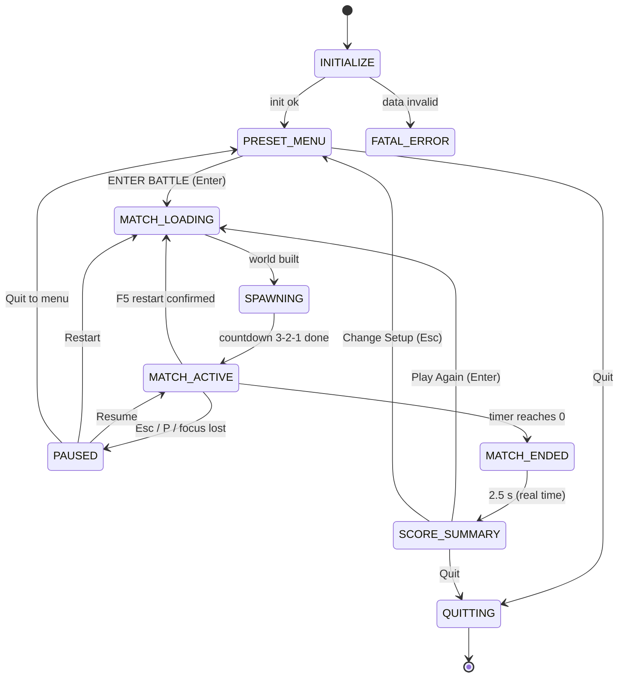
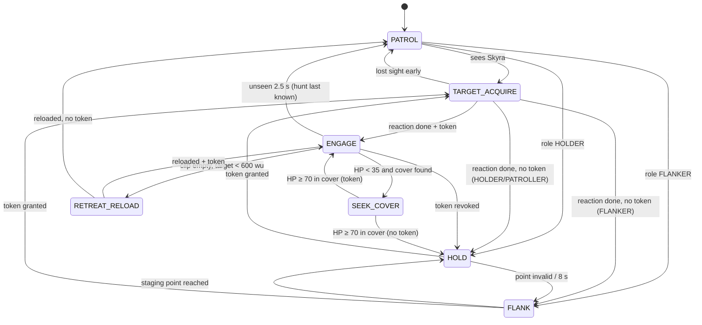

# SKYRA — Technical Game Architecture & Specification

| Field | Value |
|---|---|
| Document | Skyra Technical Game Architecture & Specification (TGAS) |
| Version | 1.0.0 |
| Date | 2026-09-29 |
| Source brief | `Ref_Docs/Skyra.md` (owner's concept & requirements) |
| Primary reader | Autonomous AI coding agent that generates the complete, runnable codebase from an empty repository |
| Secondary reader | Project owner (review, tuning, playtesting) |
| Status | Approved for implementation |

---

## 0. How to Use This Document

### 0.1 Contract

This document is the **build contract** for Skyra. An autonomous agent MUST be able to build the complete game from it without asking questions. Every system has: a default architecture, exact numbers, algorithms (formulas or pseudocode), data schemas, and verification criteria.

Normative keywords follow RFC 2119: **MUST / MUST NOT** (mandatory), **SHOULD / SHOULD NOT** (strong default; deviation requires a recorded reason), **MAY** (optional).

### 0.2 Order of precedence (when two statements appear to conflict)

1. Section 10 "Definition of Done" and its test catalog.
2. The data appendices (Appendix A–F). They are the numeric source of truth.
3. Body text of Sections 1–9.
4. The Architectural Flexibility Clause (§2.6) governs every permitted deviation.

If a genuine contradiction remains, the agent MUST pick the interpretation that keeps the game playable and the tests green, then record it in `docs/DEVIATIONS.md` (§2.6.4).

### 0.3 Conventions (apply everywhere)

| Topic | Convention |
|---|---|
| Distance unit | **wu** (world unit). 1 wu = 1 screen pixel at 1920×1080 with scope 1x. |
| Tile | 64 × 64 wu. Map = 120 × 60 tiles = **7680 × 3840 wu**. |
| Axes | Origin = top-left of the map. **+x right, +y down** (Godot convention). Gravity points to +y. |
| Angles | Radians in code, degrees in tables. Aim angle `θ = atan2(dy, dx)`; `θ = 0` points right; positive θ rotates clockwise on screen (because +y is down). |
| Time | Seconds. Fixed simulation step `dt = 1/60 s`. |
| Character position | **Feet anchor** = bottom-centre of the character's AABB. |
| Tile → world | Tile `(col,row)` covers `x ∈ [64·col, 64·col+64)`, `y ∈ [64·row, 64·row+64)`. |
| Socket → world | Socket in tile `(col,row)` = feet position `(64·col + 32, 64·(row+1))` (standing on the floor below that tile). |
| Helpers | `move_toward(a,b,d)` moves `a` toward `b` by at most `d`. `exp_smooth(cur, tgt, λ, dt) = cur + (tgt − cur)·(1 − e^(−λ·dt))`. `lerp`, `clamp`, `sign` have their usual meaning. |
| IDs | Lowercase `snake_case` strings (`ak47`, `west_hangar`). Display names are UI-only. |
| Magic numbers | Every tunable gameplay number lives in `data/*.json` (Appendix A–F). Code MUST NOT hard-code gameplay numbers. |
| Colours | Hex sRGB `#RRGGBB`, alpha given separately (0–1). |

### 0.4 Glossary

| Term | Meaning |
|---|---|
| **Sim** | Pure-logic match simulation (no nodes, no rendering). Deterministic for a given seed and input stream. |
| **View** | Godot nodes that draw the Sim state (interpolated). Views never mutate the Sim. |
| **InputFrame** | Per-tick intent of one character (move, jet, aim, fire…). Humans produce it from devices; bots from their brain. The same CharacterMotor consumes both. |
| **Scope S** | Visibility multiplier of the equipped weapon, `1.0 ≤ S ≤ 5.0` (§3.10). |
| **Token** | Attack permission issued by the Pacing Director. Only token holders may attack the human (§5.4). |
| **Socket** | Predefined map location: spawn (`P##`), weapon drop (`W##`), Rocket Boost (`B##`). |
| **Loose weapon** | A weapon lying on the ground after a drop or death (not on a socket). |
| **Frag Pack** | Socket item giving +2 Frag grenades (auto-collected). |
| **Stealth** | Post-respawn window (2.0 s) during which bots cannot perceive the human and the human cannot be damaged. |
| **Updraft** | Air cells (`^`) that push characters upward (vertical shafts). |
| **One-way** | Catwalk/grate tiles (`=`): solid only when landing on them from above. |
| **Trauma** | Camera-shake energy 0–1 (§3.10.6). |
| **Soak test** | Headless accelerated simulation of a full match used for automated verification (§10). |

---

## 1. Executive Summary & Core Game Loop

### 1.1 Game identity

| Aspect | Specification |
|---|---|
| Title | **Skyra** |
| Tagline | "Jetpacks. Ten weapons. One sky outpost." |
| Genre | 2D side-view jetpack arena shooter (Mini Militia / Doodle Army 2 inspired), single player vs bots, fully offline. |
| Perspective & look | Orthographic 2D with "2.5D" depth: multi-layer parallax sky, depth-shaded tiles, additive light glows, crisp vector characters. |
| Player | One human named **"Skyra"**. |
| Opponents | 3, 5 or 7 bots named **Alpha, Beta, Gamma, Delta, Theta, Phi, Chi** (in that order of creation). Bots attack only the human, never each other. |
| Modes | **Mini Post** — normal deathmatch, all weapons. **Sniper Post** — only the Black Arrow (M93BA) sniper and Frag grenades. |
| Map | One handcrafted map: **Outpost Skyra** (§6). |
| Match | Timed deathmatch, 5–10 minutes (default 7). Unlimited respawns. Score = bots killed by Skyra. |
| Business model | None. No ads, accounts, telemetry, network calls or purchases. |

**Design pillars (in priority order)**

1. **Instant play** — from launch, pressing **Enter** on the preset screen starts a match with defaults (Mini Post, 5 bots, 7 minutes).
2. **Smooth feel** — fixed 60 Hz simulation with render interpolation; ≥ 60 FPS; responsive jetpack and mouse aim.
3. **Readable and exciting** — distinct character silhouettes and colours, recognisable real-world weapon shapes, juicy FX, a unique sound for every weapon.
4. **Fair pressure** — the AI Director lets at most 2 bots attack at once; respawn stealth; spawn anti-camping.
5. **Minimal settings** — one preset screen with 3 choices, one gear icon for controls/audio/display.

**Out of scope for v1**: online/LAN multiplayer, gamepads (the InputMap design allows adding them later), progression/unlocks, extra maps, map editor, destructible terrain, mobile builds.

### 1.2 Target platform, hardware and budgets

| Item | Requirement |
|---|---|
| OS | Ubuntu 22.04+ x86_64 (reference: **Ubuntu 26.04 LTS**). X11 or Wayland session (XWayland acceptable). |
| Reference machine | Asus TUF Gaming A15 — AMD Ryzen 7 7445HS (6C/12T), 16 GB RAM, NVIDIA RTX 3050 4 GB + Radeon 740M iGPU. |
| Frame rate | **≥ 60 FPS at 1920×1080 on the Radeon 740M iGPU**; uncapped/VSync to display refresh (e.g. 144 Hz) on the RTX 3050. |
| Simulation | Fixed 60 Hz. Average Sim tick ≤ 2.0 ms, p99 ≤ 4.0 ms with 7 bots in combat. |
| Render CPU | ≤ 3.0 ms per frame for view updates (interpolation, FX, HUD). |
| Memory | ≤ 400 MB RSS, ≤ 300 MB VRAM. |
| Startup | Cold start to preset menu ≤ 3.0 s when the SFX cache exists (first launch ≤ 6.0 s while synthesizing audio). |
| Menu → play | MATCH_LOADING ≤ 1.5 s, then the 3-second countdown. |
| Input latency | Human input sampled every tick; worst case 1 tick + 1 frame. |
| Controls | Keyboard + mouse only (defaults in §8.7). |
| Distribution size | Target ≤ 150 MB; **hard limit 1 GB**. |
| Screen | Any 16:9 / 16:10 resolution ≥ 1280×720; reference 1920×1080 laptop panel; fullscreen by default. |

### 1.3 Game flow state machine

```
enum GameState { INITIALIZE, PRESET_MENU, MATCH_LOADING, SPAWNING, MATCH_ACTIVE, PAUSED, MATCH_ENDED, SCORE_SUMMARY, QUITTING, FATAL_ERROR }
```



**Transition table (authoritative)**

| # | From | Trigger | To | Side effects |
|---|---|---|---|---|
| T1 | (boot) | `Main._ready()` | INITIALIZE | Create CanvasLayers, parse CLI (§9.9). |
| T2 | INITIALIZE | all init tasks complete | PRESET_MENU | Show preset menu with defaults. If CLI `--autostart`, go to MATCH_LOADING with the CLI MatchConfig instead. If `--selftest`/`--soak`, run the test harness (§10) instead of the menu. |
| T3 | INITIALIZE | data validation error | FATAL_ERROR | Full-screen message with the failing file/field; log to `user://logs/skyra.log`; any key quits with exit code 2. |
| T4 | PRESET_MENU | "ENTER BATTLE" button or Enter | MATCH_LOADING | Build `MatchConfig{mode, bot_count, duration_s, rng_seed = randi()}`. |
| T5 | PRESET_MENU | Esc then confirm, or "Quit" | QUITTING | Save settings (only if dirty). |
| T6 | MATCH_LOADING | world build finished | SPAWNING | Loading overlay fades out (0.25 s). |
| T7 | SPAWNING | 3.0 s countdown elapsed | MATCH_ACTIVE | Unfreeze all characters, start match timer, play `ui.countdown.go`. |
| T8 | MATCH_ACTIVE | `pause` action, or window focus lost | PAUSED | `get_tree().paused = true`; Ambient bus low-pass on; mouse visible. |
| T9 | PAUSED | "Resume" / `pause` action | MATCH_ACTIVE | Reverse T8; mouse confined + hidden. |
| T10 | PAUSED | "Restart Match" | MATCH_LOADING | Tear down world; same config, new seed. |
| T11 | MATCH_ACTIVE | `restart_match` (F5) pressed, then F5/Enter within 3 s | MATCH_LOADING | As T10. The first F5 shows the prompt "Restart match? F5/Enter = yes · Esc = no". |
| T12 | PAUSED | "Quit to Menu" | PRESET_MENU | Tear down world; keep last MatchConfig in memory (not on disk) to pre-select it. |
| T13 | MATCH_ACTIVE | match timer ≤ 0 | MATCH_ENDED | Stop damage & input; `Engine.time_scale = 0.25` for 1.2 s real time; banner "TIME!"; `ui.match.end_horn`. |
| T14 | MATCH_ENDED | 2.5 s real time after T13 | SCORE_SUMMARY | Restore `time_scale = 1`; build MatchSummary. |
| T15 | SCORE_SUMMARY | "Play Again" / Enter | MATCH_LOADING | Same config, new seed. |
| T16 | SCORE_SUMMARY | "Change Setup" / Esc | PRESET_MENU | Pre-select last config. |
| T17 | any | window close request | QUITTING | Save settings if dirty; `get_tree().quit(0)`. |

**Per-state responsibilities**

| State | Responsibilities | Input handled | Exit condition |
|---|---|---|---|
| INITIALIZE | Load settings (§8.9) → apply InputMap & audio volumes & window mode; load + validate `data/*.json`; build audio buses; load or synthesize SFX (progress bar); pre-build vector-art textures; warm shaders. | none | all tasks done / fatal error |
| PRESET_MENU | Preset screen (§8.2); settings overlay (gear). | UI | ENTER BATTLE / Quit |
| MATCH_LOADING | Parse map → TileGrid, NavGrid, sockets, zones; build MapRenderer chunks, background, decor; create CharacterStates (human id 0, bots ids 1..N); fill weapon sockets; reset MatchRules, Director, RocketBoostManager; pre-warm each particle preset once off-screen. | none | done (target ≤ 1.5 s) |
| SPAWNING | Initial spawn selection (§6.7); camera snaps to Skyra; countdown overlay 3-2-1-FIGHT (1.0 s per number, `ui.countdown.beep` each). Characters frozen; aim allowed. | aim only | 3.0 s |
| MATCH_ACTIVE | Run the tick pipeline (§1.4). | all gameplay | timer, pause, restart |
| PAUSED | Pause menu (§8.5). Sim frozen. | UI | resume/restart/quit |
| MATCH_ENDED | Slow-motion freeze, "TIME!" banner, final stats snapshot. | none | 2.5 s real time |
| SCORE_SUMMARY | Summary screen (§8.5.3). | UI | buttons |

### 1.4 In-match loop: Input → Physics → AI → Scoping → Render → HUD

The Sim advances in `_physics_process` at exactly 60 Hz (`Engine.physics_ticks_per_second = 60`). Rendering runs in `_process` at display rate and interpolates. A single orchestrator (`MatchSim.step(dt)`) calls subsystems **in this fixed order** (never rely on Godot node order):

```
MatchSim.step(dt):                                   # 60 Hz, only in MATCH_ACTIVE (SPAWNING runs a reduced step: 1.1 + camera only)
  # ── 1. INPUT ──────────────────────────────────────────────────────────────
  1.1  human_frame = HumanInput.build_frame()        # edge-triggered presses latched since last tick; aim = mouse→world
  1.2  bot_frames  = BotBrain.last_frames            # produced by step 3 of the PREVIOUS tick (1-tick AI latency, by design)
  # ── 2. PHYSICS & COMBAT ───────────────────────────────────────────────────
  2.1  StatusEffects.step(dt)                        # stealth/invuln/boost/burn timers; burn damage → DamageQueue
       Respawns.step(dt)                             # expired respawn timers → SpawnSelector → character_spawned
  2.2  for c in characters (id order, human first): CharacterMotor.step(c, frame[c], dt)
  2.3  for c in characters: WeaponLogic.step(c, frame[c], dt)   # switch/reload/fire/throw → projectiles, beams, flames, grenades
  2.4  ProjectileSystem.step(dt)                     # move + collide all projectiles → DamageQueue, bounces, ExplosionQueue
  2.5  BeamSystem.step(dt)                           # active PHASR beams → DamageQueue
  2.6  ExplosionSystem.flush()                       # ExplosionQueue → DamageQueue + knockback
  2.7  DamageSystem.flush()                          # apply damage in creation order; deaths → KillEvents, drops, respawn timers
  2.8  PickupResolver.step(); WeaponSocketManager.step(dt); RocketBoostManager.step(dt); LooseWeapons.step(dt)
  2.9  MatchRules.step(dt)                           # timer, health regen, streak windows, stats
  # ── 3. AI ─────────────────────────────────────────────────────────────────
  3.1  PacingDirector.step(dt)                       # internally throttled to 4 Hz
  3.2  for bot in bots: Perception.update → BotBrain.think → PathFollower.steer → AimModel.update → bot.next_frame
  3.3  NavGrid.process_queue(max_searches = 2)
  # ── dispatch ──────────────────────────────────────────────────────────────
  4.0  SimEvents.flush_to(EventBus)                  # listeners only ever see fully-completed ticks

_process(delta):                                     # every rendered frame
  # ── 4. SCOPING ────────────────────────────────────────────────────────────
  GameCamera.update(delta)                           # scope zoom + look-ahead + shake + clamp (§3.10)
  # ── 5. RENDER ─────────────────────────────────────────────────────────────
  α = Engine.get_physics_interpolation_fraction()
  every View draws lerp(prev_state, curr_state, α); FxManager consumes queued FX requests
  # ── 6. HUD ────────────────────────────────────────────────────────────────
  HudModel.snapshot(sim) → HUD widgets (continuous values); event-driven widgets already updated by EventBus
```

Rules:

- `prev_pos` of every character/projectile MUST be copied at the start of 2.2/2.4 so the Views can interpolate.
- Damage is **queued** during 2.1–2.6 and applied only in 2.7. A character killed in tick *n* still fires projectiles already spawned in tick *n* (fair trades).
- The AI reads the post-physics state of tick *n* and its InputFrames are consumed in tick *n+1*.
- In PAUSED the Sim does not step. In MATCH_ENDED only Views/particles keep animating (time-scaled).

### 1.5 Randomness, determinism and time

| RNG stream | Seed | Used by |
|---|---|---|
| `rng_spawn` | `rng_seed ^ 0x51A1` | spawn selection |
| `rng_loot` | `rng_seed ^ 0x10C7` | weapon socket rolls, Rocket Boost socket choice & delays |
| `rng_combat` | `rng_seed ^ 0xC0B7` | spread, pellet jitter, flame puffs |
| `rng_ai` | `rng_seed ^ 0xA1A1` | all bot decisions, aim error, reaction times |
| `rng_fx` | `Time.get_ticks_usec()` | cosmetic only (MUST NOT influence the Sim) |

Each stream is a separate `RandomNumberGenerator`. With the same seed and the same human InputFrame sequence, two runs of the Sim MUST produce identical results (test S-02, §10). Wall-clock time MUST NOT be read inside the Sim.

---

## 2. Tech Stack & Engine Evaluation

### 2.1 Requirements that drive the choice

1. Native Linux, 60+ FPS on an iGPU, small distributable (≤ 1 GB hard limit).
2. First-class 2D: camera zoom, particles, shaders, text/UI widgets, audio buses, input remapping.
3. **Autonomous code generation friendliness**: plain-text sources, stable well-documented API, few binary/editor-only artefacts.
4. Headless execution for automated tests on the developer machine.
5. Runtime audio synthesis (procedural SFX) and runtime vector rasterization (procedural art).

### 2.2 Candidate evaluation

Scores 1 (poor) – 5 (excellent). Weighted total out of 100.

| Candidate | Linux perf (20) | 2D feature set (20) | Codegen friendliness (20) | Size & packaging (15) | Headless tests (10) | Audio buses & synthesis (10) | Ecosystem (5) | **Total** | Verdict |
|---|---|---|---|---|---|---|---|---|---|
| **Godot 4.x + GDScript** | 4 | 5 | 4 | 4 (≈ 70–90 MB) | 5 | 5 | 5 | **89** | **Selected** |
| Godot 4.x + C# | 5 | 5 | 4 | 3 (+ .NET runtime) | 4 | 5 | 4 | 87 | Viable alternative |
| Raylib 5 (C/C++) | 5 | 2 (no UI/particles) | 4 | 5 (< 10 MB) | 3 | 4 | 4 | 77 | Viable, much more hand-written infra |
| LÖVE 11.5 (Lua) | 4 | 3 | 4 | 5 (≈ 10 MB AppImage) | 3 | 4 | 3 | 76 | Viable, UI hand-made |
| Rust + Bevy 0.1x | 5 | 3 | 2 (fast API churn, slow builds) | 4 | 4 | 3 | 4 | 70 | Not recommended |
| Electron + Phaser 3 (TS) | 3 | 4 | 5 | 1 (≥ 200 MB Chromium) | 3 | 4 | 5 | 70 | **Rejected** (bloat rule) |
| Pygame-CE 2.5 (Python) | 2 (CPU zoom scaling) | 2 | 5 | 3 (PyInstaller 40–80 MB) | 4 | 3 | 4 | 63 | Not recommended |
| Python Arcade 3.x | 3 | 3 | 3 (2.x→3.x API churn) | 3 | 3 | 2 | 3 | 58 | Not recommended |

### 2.3 Recommendation: Godot 4 (GDScript), code-first

**Engine**: Godot **4.4.1-stable minimum**; the agent SHOULD use the newest stable **4.x** release available when the project starts and record it in `tools/godot_version.txt`. Godot 3.x MUST NOT be used.

Why Godot 4 fits Skyra specifically:

| Skyra need | Godot 4 feature used |
|---|---|
| Scope zoom 1x–5x with smooth lerp | `Camera2D.zoom` + custom smoothing (§3.10) |
| Crisp vector art at every zoom level | `Image.load_svg_from_string()` (ThorVG) + mipmaps; `CanvasItem.draw_*` with antialiased strokes |
| Juicy FX | `CPUParticles2D` presets, `canvas_item` shaders, additive blending |
| Sound buses Master/SFX/Ambient/UI | `AudioServer` buses + effects (low-pass, reverb, limiter) |
| Procedural audio | `AudioStreamWAV` built from generated PCM (`PackedByteArray`) |
| Remappable controls | `InputMap` actions with `InputEventKey.physical_keycode` / `InputEventMouseButton` |
| Menus, sliders, spin wheel | `Control` nodes + a code-built `Theme` |
| Linux build | One command export, single binary with embedded PCK |
| Automated tests | `--headless` mode, exit codes via `get_tree().quit(code)` |

**Code-first rule (mandatory)**: the only scene file is `src/main.tscn` (one `Node` with `main.gd`). Every other node tree is assembled in GDScript at runtime. This removes hand-written `.tscn` files, the most common failure point for autonomous generation. Exact content of `src/main.tscn`:

```
[gd_scene load_steps=2 format=3]

[ext_resource type="Script" path="res://src/main.gd" id="1_main"]

[node name="Main" type="Node"]
script = ExtResource("1_main")
```

**Physics decision**: Godot's physics bodies are **not** used for gameplay. Skyra uses its own deterministic tile-grid physics (§3.1–3.5): AABB-vs-tile movement, DDA raycasts, sub-stepped circle movers. Reasons: exact control of feel, determinism, trivial headless testing, portability under the Flexibility Clause, and no tunnelling at 7000 wu/s.

**Rendering method**: `mobile` renderer (Vulkan; supports 2D MSAA and HDR-2D glow) with automatic fallback to `gl_compatibility` when Vulkan is unavailable. All glow effects MUST also work without HDR (additive glow sprites), so the game looks correct on either renderer.

**GDScript guardrails** (common Godot 3→4 mistakes the agent MUST avoid):

| Use (Godot 4) | Never (Godot 3) |
|---|---|
| `await get_tree().create_timer(t).timeout` | `yield(...)` |
| `@export`, `@onready`, `@tool` | `export`, `onready`, `tool` keywords |
| `signal_name.connect(callable)` / `emit()` | `connect("sig", obj, "method")` string form |
| `FileAccess.open()`, `DirAccess.open()` | `File.new()`, `Directory.new()` |
| `JSON.parse_string()`, `JSON.stringify()` | `JSON.parse()` result object |
| `AudioStreamWAV` | `AudioStreamSample` |
| `Time.get_ticks_msec()` | `OS.get_ticks_msec()` |
| `super()` / `super.method()` | `.method()` |
| Typed code: `var hp: float = 100.0`, `Array[CharacterState]`, `PackedVector2Array` | untyped, `PoolVector2Array` |
| `Node.PROCESS_MODE_ALWAYS` | `pause_mode` |
| `DisplayServer.window_set_mode()` | `OS.window_fullscreen` |
| Autoload scripts (`EventBus`, `Log`, `Data`, `Settings`, `Audio`) declare **no** `class_name` (or a different one) | `class_name EventBus` inside the script registered as autoload `EventBus` (name-clash load error) |

### 2.4 Project configuration (`project.godot`)

| Setting path | Value |
|---|---|
| `application/config/name` | `"Skyra"` |
| `application/run/main_scene` | `"res://src/main.tscn"` |
| `application/config/icon` | `"res://icon.svg"` |
| `application/config/use_custom_user_dir` | `true` |
| `application/config/custom_user_dir_name` | `"skyra"` (→ `~/.local/share/skyra/` for logs & caches; settings go to `~/.config/skyra/`, §8.9) |
| `application/run/max_fps` | `0` (uncapped; VSync governs) |
| `display/window/size/viewport_width` / `viewport_height` | `1920` / `1080` |
| `display/window/size/mode` | `2` (maximized; runtime applies fullscreen from settings) |
| `display/window/stretch/mode` | `"canvas_items"` |
| `display/window/stretch/aspect` | `"expand"` |
| `display/window/vsync/vsync_mode` | `1` (enabled; runtime applies settings) |
| `physics/common/physics_ticks_per_second` | `60` |
| `physics/common/max_physics_steps_per_frame` | `8` |
| `physics/common/physics_interpolation` | `false` (Skyra interpolates itself, §1.4) |
| `rendering/renderer/rendering_method` | `"mobile"` |
| `rendering/rendering_device/fallback_to_opengl3` | `true` |
| `rendering/anti_aliasing/quality/msaa_2d` | `2` (4×) |
| `rendering/2d/snap/snap_2d_transforms_to_pixel` | `false` |
| `rendering/textures/canvas_textures/default_texture_filter` | `2` (Linear Mipmap — vector art is rasterized with mipmaps and drawn at 0.447–1.0 zoom) |
| `rendering/environment/defaults/default_clear_color` | `Color(0.055, 0.106, 0.302)` (#0E1B4D) |
| `audio/driver/mix_rate` | `44100` |
| `input_devices/pointing/emulate_touch_from_mouse` | `false` |
| `debug/gdscript/warnings/untyped_declaration` | `1` (warn) |
| `autoload` | `EventBus="*res://src/core/event_bus.gd"`, `Log="*res://src/core/log.gd"`, `Data="*res://src/core/data_registry.gd"`, `Settings="*res://src/config/settings_store.gd"`, `Audio="*res://src/audio/audio_manager.gd"` (in this order) |

The agent MUST NOT define gameplay actions in `project.godot`'s `[input]` section; all actions are registered at runtime from `data/input/default_bindings.json` + the user's settings (§8.7–8.9).

### 2.5 Toolchain on Ubuntu (reproducible)

| Task | Command / file | Notes |
|---|---|---|
| Install engine | `tools/setup_godot.sh` downloads `Godot_v${V}-stable_linux.x86_64.zip` from `https://github.com/godotengine/godot/releases/download/${V}-stable/`, unzips to `tools/bin/godot`, `chmod +x`, verifies `tools/bin/godot --version` starts with `${V}`. `V` read from `tools/godot_version.txt`. | ≈ 60 MB download. `tools/bin/` is git-ignored. |
| Run the game | `tools/bin/godot --path .` | |
| Run all tests | `tools/bin/godot --headless --path . -- --selftest` | Exit code 0 = pass. MUST finish ≤ 30 s. |
| Soak test | `tools/bin/godot --headless --path . -- --soak=180 --seed=1234 --bots=7 --mode=mini_post` | MUST finish ≤ 30 s. |
| Generate SFX files | `tools/bin/godot --headless --path . -- --gen-sfx` | Writes `assets/audio/generated/*.wav` (§7.9). |
| Export templates (one-time) | `tools/install_export_templates.sh` → `~/.local/share/godot/export_templates/${V}.stable/` | Large (≈ 1 GB) download: **run by the owner, never inside automated checks**. |
| Linux build | `tools/build_linux.sh` → `tools/bin/godot --headless --path . --export-release "Linux" build/linux/Skyra.x86_64` | Needs export templates. |
| Package | `tools/make_appimage.sh` (optional, uses `appimagetool` if present) and `tools/install_local.sh` (copies binary to `~/.local/share/skyra/`, installs `skyra.desktop` + icon). | |

**Execution-limit rule for the agent on the owner's machine**: every automated command the agent runs MUST complete in ≤ 30 s (tests, soak, SFX generation, linting). Long downloads/exports are owner-initiated. No background processes may be left running.

### 2.6 Architectural Flexibility Clause

#### 2.6.1 Authorisation

The agent is **explicitly authorised** to adapt or substitute implementation details, libraries, algorithms, node structures or even the engine when it finds a more performant, modern or cleaner approach — **provided the Invariant Contract (2.6.2) holds** and the change is recorded (2.6.4). Examples of pre-approved substitutions:

- Using `AStarGrid2D` instead of the hand-written A* (§5.7) if direction-dependent costs are approximated by per-cell weights.
- Replacing `CPUParticles2D` with `GPUParticles2D` or a custom `MultiMesh` particle system.
- Baking map chunks to textures instead of immediate `_draw()` calls.
- Using GDScript static typing features, typed dictionaries or `@abstract` (if the engine version supports them).
- Choosing the Godot C#, Raylib, LÖVE or Bevy stack instead of Godot GDScript (see 2.6.5).

#### 2.6.2 Invariant Contract (MUST NOT change)

1. Every behaviour and number in the data appendices (A–F) and the formulas of §3–§5 (±15 % tuning drift allowed only per 2.6.3).
2. The map blueprint (§6.4), socket IDs/positions (§6.6) and tile semantics (§6.3).
3. Game states and transitions (§1.3), tick order (§1.4), bot FSM states (§5.3) and Director guarantees (§5.4).
4. Weapon IDs, display names, mode loadouts and drop tables (§4).
5. Input action names and default bindings (§8.7); settings path and JSON schema (§8.9).
6. EventBus event names and payload semantics (§9.4).
7. The Definition of Done (§10).
8. Platform rules: native Linux executable; **no Electron/Chromium/WebView runtimes**; no network access at runtime; no telemetry/ads; only permissive licences (MIT, BSD, Zlib, Apache-2.0, OFL, CC0, CC-BY with attribution); ≥ 60 FPS on the reference iGPU; ≤ 1 GB.

#### 2.6.3 Tuning drift

Numeric values MAY be changed by at most ±15 % when an automated test or soak statistic shows a gameplay problem (e.g. average human life < 8 s in soak). Every change MUST be made in `data/*.json` (never in code) and recorded in `docs/DEVIATIONS.md`.

#### 2.6.4 Recording deviations

`docs/DEVIATIONS.md` entries use this template:

```
## DEV-<nnn>: <short title>
- Section(s): §x.y
- Change: <what was replaced/adjusted>
- Reason: <measured or concrete reason>
- Invariants checked: <list from 2.6.2>
- Tests: <test IDs proving behaviour is unchanged>
```

#### 2.6.5 Stack substitution map (if the agent leaves Godot)

| Skyra concept | Godot 4 (default) | Raylib 5 (C/C++) | LÖVE 11.5 (Lua) | Bevy (Rust) |
|---|---|---|---|---|
| Fixed tick + interpolation | `_physics_process` + `get_physics_interpolation_fraction()` | manual accumulator loop | `love.update` accumulator | `FixedUpdate` schedule + `Time<Fixed>::overstep_fraction()` |
| Camera zoom/offset | `Camera2D` | `Camera2D` struct | `love.graphics.scale/translate` | `OrthographicProjection.scale` |
| Vector art raster | `Image.load_svg_from_string` | `nanosvg` | `love.graphics.polygon` + `lyte`/meshes | `bevy_svg` or `lyon` |
| Particles | `CPUParticles2D` | custom pool | `love.graphics.newParticleSystem` | `bevy_hanabi` or custom |
| Shaders | `canvas_item` shader | GLSL `LoadShader` | `love.graphics.newShader` | `Material2d` WGSL |
| Audio buses | `AudioServer` buses | per-sound volume groups (mixer struct) | per-source volume groups | `bevy_kira_audio` tracks |
| Procedural audio | `AudioStreamWAV` | `LoadSoundFromWave` | `love.sound.newSoundData` | `kira` static sound from frames |
| UI | `Control` + `Theme` | `raygui` + custom | custom immediate-mode UI | `bevy_ui` |
| Input remap | `InputMap` | own action table | own action table | `leafwing-input-manager` |
| Settings path | `OS.get_config_dir()` | `$XDG_CONFIG_HOME` / `~/.config` | same | `dirs::config_dir()` |
| Headless tests | `--headless -- --selftest` | test binary | `love . --selftest` with null window | `cargo test` |

All data files (`data/*.json`), the map grid and the tests' expected values remain identical under any stack.

---

## 3. Core Mechanics & Physics Engine Specifications

All values below are defaults from `data/tuning.json` (Appendix A). Integration is **semi-implicit Euler**: `v += a·dt` first, then `p += v·dt`. Automated tests accept ±3 % against the analytic values quoted here.

### 3.1 World and tile collision model

The world is a 120 × 60 tile grid (§6.4). Each tile has a type with a collision rectangle in **tile-local** coordinates `(x, y, w, h)` and flags:

| Char | Tile type | Collision rect (local) | Blocks characters | Blocks projectiles & LOS | Other flags |
|---|---|---|---|---|---|
| `.` | `AIR_EXTERIOR` | – | no | no | sky backdrop |
| `:` | `AIR_INTERIOR` | – | no | no | interior backdrop, reverb zone |
| `^` | `UPDRAFT` | – | no | no | interior backdrop, upward force (§3.6) |
| `#` | `ROCK` | (0, 0, 64, 64) | yes | yes | surface = rock |
| `M` | `METAL` | (0, 0, 64, 64) | yes | yes | surface = metal |
| `C` | `CRATE` | (0, 0, 64, 64) | yes | yes | surface = wood |
| `h` | `HALF` (sandbags) | (0, 32, 64, 32) | yes | yes (inside its rect only) | surface = sand; step-up-able |
| `=` | `ONE_WAY` (grate catwalk) | (0, 0, 64, 16) | only when landing from above (§3.7) | **no** (bullets, beams, flames, saws, rockets and LOS pass) | surface = metal; grenades land on it |
| `P` `W` `B` | socket markers | – | no | no | parsed as air; backdrop = `AIR_INTERIOR` if any 4-neighbour is `:` or `^`, else `AIR_EXTERIOR` |

**World bounds**: `x < 0`, `x ≥ 7680`, `y ≥ 3840` behave as `ROCK`. `y < 0` is an invisible solid ceiling. Bounds block projectiles (they are destroyed, no ricochet) and LOS.

**Required TileGrid queries** (all O(1) or O(cells touched)):

| Function | Returns |
|---|---|
| `tile_at(col, row) -> int` | tile type (out of bounds → `ROCK`) |
| `cell_of(p: Vector2) -> Vector2i` | `floor(p / 64)` |
| `solid_rects_in(aabb: Rect2, include_one_way: bool) -> Array[Rect2]` | world-space collision rects overlapping `aabb` |
| `is_updraft(p: Vector2) -> bool` | tile at `p` is `UPDRAFT` |
| `surface_at(p) -> int` | `ROCK / METAL / WOOD / SAND` for footsteps & impact FX |
| `raycast(a, b, mask) -> RayHit` | DDA traversal (§3.1.1) |

#### 3.1.1 Grid raycast (Amanatides–Woo DDA)

Used for bullets, beams, LOS, explosions exposure, laser sights, bot perception and muzzle occlusion.

```
raycast(a: Vector2, b: Vector2, mask) -> RayHit{hit: bool, t: float in [0,1], point, normal: Vector2, tile: int}
  d = b - a; if d.length() < 1e-4: return no-hit
  cell = floor(a / 64); step = (sign(d.x), sign(d.y))
  tMax.x = (d.x != 0) ? ((cell.x + (step.x > 0 ? 1 : 0)) * 64 - a.x) / d.x : INF   (same for y)
  tDelta = (d.x != 0 ? 64 / abs(d.x) : INF, d.y != 0 ? 64 / abs(d.y) : INF)
  last_axis = NONE
  loop:
    tile = tile_at(cell)
    if tile is FULL-SOLID (ROCK/METAL/CRATE or out of bounds) and mask.solids:
        t_entry = (last_axis == X) ? tMax.x - tDelta.x : (last_axis == Y) ? tMax.y - tDelta.y : 0
        normal  = (last_axis == X) ? Vector2(-step.x, 0) : (last_axis == Y) ? Vector2(0, -step.y) : -d.normalized()
        return hit(t_entry, a + d * t_entry, normal, tile)
    if tile == HALF and mask.solids:  test segment vs world rect of the half tile (slab method); if hit → return it
    if tile == ONE_WAY and mask.one_way: test segment vs its 16-wu rect only when d.y > 0 and a.y <= rect.top; if hit → return
    if tMax.x < tMax.y: if tMax.x > 1: break; cell.x += step.x; tMax.x += tDelta.x; last_axis = X
    else:               if tMax.y > 1: break; cell.y += step.y; tMax.y += tDelta.y; last_axis = Y
  return no-hit
```

Masks: `MASK_PROJECTILE = {solids}`, `MASK_LOS = {solids}`, `MASK_GRENADE = {solids, one_way}` (grenades use the circle mover instead, §4.5.3), `MASK_LASER = {solids}`.

#### 3.1.2 Shape helpers (`src/physics/shapes.gd`)

- `segment_vs_aabb(a, b, rect) -> {hit, t, point, normal}` — slab method; used for projectile-vs-character.
- `circle_vs_aabb(c, r, rect) -> {hit, penetration: Vector2}` — closest point test; used by circle movers.
- `closest_point_on_aabb(p, rect) -> Vector2` — explosions.
- `point_in_rect(p, rect) -> bool`.

### 3.2 Character body

| Property | Standing | Crouched |
|---|---|---|
| AABB (w × h), anchored at feet | 44 × 84 | 44 × 60 |
| Head zone (top part of AABB) | 24 | 20 |
| Shoulder pivot (aim origin) relative to feet | (0, −56) | (0, −38) |
| Centre (perception target, explosions) | (0, −42) | (0, −30) |
| Pickup reach centre | centre | centre |

Characters **do not collide with each other** (Mini Militia style). A character's AABB is only used for terrain collision and hit detection.

### 3.3 Horizontal movement

| Constant | Value | Meaning |
|---|---|---|
| `run_speed` | 420 wu/s | max grounded speed |
| `crouch_speed` | 210 wu/s | max crouched speed |
| `air_speed` | 460 wu/s | max airborne speed |
| `ground_accel` | 3000 wu/s² | accelerating in input direction (0 → 420 in 0.14 s) |
| `ground_turn_accel` | 5400 wu/s² | input opposes velocity (+420 → −420 in 0.156 s) |
| `ground_friction` | 3600 wu/s² | no input (420 → 0 in 0.117 s) |
| `air_accel` | 1500 wu/s² | airborne with input |
| `air_drag` | 350 wu/s² | airborne without input (momentum mostly preserved) |
| `moving_threshold` | 60 wu/s | `abs(vel.x)` above this counts as "moving" for spread and animation |

```
max_v  = crouching ? crouch_speed : (grounded ? run_speed * boost.run : air_speed * boost.air)
target = frame.move_x * max_v                     # move_x ∈ {-1, 0, +1}
if grounded:
    a = frame.move_x == 0 ? ground_friction
      : (sign(frame.move_x) != sign(vel.x) and abs(vel.x) > 1) ? ground_turn_accel : ground_accel
else:
    a = frame.move_x == 0 ? air_drag : air_accel * boost.air_accel
vel.x = move_toward(vel.x, target, a * dt)
```

Knockback may push `|vel.x|` above `max_v`; the formula above then decelerates it at `a`.

### 3.4 Jump, gravity, dive and terminal velocity

| Constant | Value | Derived |
|---|---|---|
| `gravity` | 1800 wu/s² | |
| `terminal_velocity` | 1100 wu/s | reached after 0.61 s of free fall |
| `jump_velocity` | 560 wu/s | apex height = 560²/(2·1800) = **87.1 wu**, time to apex 0.311 s (clears a 64-wu step) |
| `coyote_s` | 0.08 s | may still jump this long after leaving a ledge |
| `jump_buffer_s` | 0.10 s | a jet press this early before landing still jumps |
| `jet_delay_after_jump_s` | 0.12 s | holding jet after a ground jump engages the jetpack after this delay |
| `dive_gravity_mult` | 1.4 | airborne + `crouch` held = dive (faster fall, cancels updraft) |
| `dive_terminal` | 1300 wu/s | |

The `jetpack` action doubles as **jump**: pressing it while grounded (or within coyote time) performs a free jump; continuing to hold it engages the jetpack after 0.12 s. Pressing it while already airborne engages the jetpack immediately.

### 3.5 Jetpack thrust and fuel

| Constant | Value |
|---|---|
| `thrust` | 3300 wu/s² upward (net upward accel with gravity = **1500 wu/s²**) |
| `max_rise` | 520 wu/s (upward speed cap while jetting) |
| `fuel_max` | 100 |
| `fuel_burn_per_s` | 28 → **3.57 s** of continuous thrust per tank |
| `recharge_delay_s` | 0.6 s after thrust stops |
| `recharge_ground_per_s` | 40 (empty → full grounded: 0.6 + 2.5 = **3.1 s**) |
| `recharge_air_per_s` | 12 (gliding/falling) |
| `recharge_updraft_per_s` | 30 (inside `^` cells, not thrusting) |
| `unlock_threshold` | 15 (after a burnout the jetpack is locked until fuel ≥ 15) |

```
since_jump_t += dt
jumped_now = false
if frame.jet_pressed: jump_buffer_t = jump_buffer_s else: jump_buffer_t = max(0, jump_buffer_t - dt)
coyote_t = grounded ? coyote_s : max(0, coyote_t - dt)
if jump_buffer_t > 0 and coyote_t > 0:
    vel.y = -jump_velocity; grounded = false; coyote_t = 0; jump_buffer_t = 0; since_jump_t = 0; jumped_now = true
jet_active = frame.jet_held and not grounded and not jet_locked and fuel > 0 and since_jump_t >= jet_delay_after_jump_s
in_updraft = tile_grid.is_updraft(pos + centre_offset)
diving     = not grounded and frame.crouch

ay = gravity * (diving ? dive_gravity_mult : 1)
if in_updraft and not diving: ay -= updraft.lift
if jet_active:                ay -= thrust * boost.thrust
vel.y += ay * dt

rise_cap = jet_max_rise * boost.rise
if in_updraft and not diving: rise_cap = jet_active ? updraft.jet_rise_cap * boost.rise : updraft.rise_cap
if jet_active or (in_updraft and not diving): vel.y = max(vel.y, -rise_cap)
vel.y = min(vel.y, diving ? dive_terminal : terminal_velocity)

if jet_active:
    fuel -= fuel_burn_per_s * boost.fuel_burn * dt;  recharge_delay_t = recharge_delay_s
else:
    recharge_delay_t -= dt
    if recharge_delay_t <= 0:
        fuel += (grounded ? recharge_ground_per_s : in_updraft ? recharge_updraft_per_s : recharge_air_per_s) * dt
fuel = clamp(fuel, 0, fuel_max)
if fuel <= 0 and not jet_locked: jet_locked = true; emit jetpack_burnout
if jet_locked and fuel >= unlock_threshold: jet_locked = false
```

`since_jump_t` starts at 99 so a character that walks off a ledge can jet instantly.

**Jetpack curve (hover start, `vy = 0`, jet held, no updraft, no boost)**

| t (s) | vy (wu/s) | Height gained (wu) | Fuel |
|---|---|---|---|
| 0.000 | 0 | 0 | 100.0 |
| 0.100 | −150 | 7.5 | 97.2 |
| 0.200 | −300 | 30.0 | 94.4 |
| 0.347 | −520 (cap) | 90.1 | 90.3 |
| 1.000 | −520 | 429.7 | 72.0 |
| 2.000 | −520 | 949.7 | 44.0 |
| 3.000 | −520 | 1469.7 | 16.0 |
| 3.571 | −520 → burnout | **1767.0** | 0.0 |

A full tank climbs ≈ 27.6 tiles, more than any vertical traverse on Outpost Skyra without an intermediate ledge (§6.8).

**Audio/visual coupling**: `jetpack_state_changed(id, active, burnout)` drives the hiss loop, twin exhaust particles and the HUD fuel gauge (§7, §8.4).

### 3.6 Updraft zones (`^` tiles)

Updrafts fill the three vertical shafts (§6.2). A character whose **centre** is in a `^` cell gets:

| Constant | Value | Effect |
|---|---|---|
| `updraft.lift` | 2100 wu/s² upward | net +300 wu/s² upward without jetpack → free elevator ride |
| `updraft.rise_cap` | 380 wu/s | cap without jetpack (a 33-row shaft takes ≈ 6.2 s) |
| `updraft.jet_rise_cap` | 680 wu/s | cap with jetpack (net 3600 wu/s² → the same shaft in ≈ 3.2 s) |
| Dive (hold `crouch` while airborne) | cancels lift | the only way to descend a shaft |
| Fuel | recharges at 30/s while not thrusting | shafts are refuelling highways |

Grenades, loose weapons and flame puffs are also lifted: grenades and loose weapons receive `−1200 wu/s²` (net +600 down, so they still sink slowly), flame puffs `−600 wu/s²`. Bullets, slugs, saws, rockets and beams are unaffected.

### 3.7 One-way platforms, crouch, drop-through and step-up

- **One-way landing rule**: a moving-down character lands on a `=` tile only if its feet were at or above the tile top at the start of the step (`old_feet_y ≤ top + 0.5`) and `drop_through_t ≤ 0`. Moving up or sideways, one-way tiles are ignored.
- **Drop-through**: pressing/holding `crouch` while grounded on a one-way tile sets `drop_through_t = 0.25 s` and `grounded = false`. Crouching is therefore impossible on catwalks (by design).
- **Crouch**: `grounded and frame.crouch and not on one-way`. Height 60, speed 210, spread × weapon `crouch_spread_mult`. Standing up requires headroom (AABB at height 84 must not overlap a solid); otherwise the character stays crouched.
- **Step-up**: while grounded and moving horizontally into a solid whose top is at most `step_up_height = 34` wu above the feet (only `HALF` tiles qualify), and the raised AABB is free, the character is lifted onto it instead of stopping.

### 3.8 AABB mover (`src/physics/aabb_mover.gd`)

Characters move at most 1300 · (1/60) ≈ 21.7 wu per tick (< tile/2), so axis-separated resolution without sweeping is tunnel-free.

```
move(c, delta: Vector2):
  # ---- X axis
  if delta.x != 0:
    box = aabb(c.pos.x + delta.x, c.pos.y, c.height)
    rects = grid.solid_rects_in(box, include_one_way=false)
    if rects.is_empty(): c.pos.x += delta.x
    else:
      r = rects nearest in the direction of motion
      if c.grounded and (c.pos.y - r.position.y) <= step_up_height and free(aabb(c.pos.x + delta.x, r.position.y, c.height)):
        c.pos = Vector2(c.pos.x + delta.x, r.position.y)                 # step up
      else:
        c.pos.x = (delta.x > 0) ? r.position.x - half_w - 0.01 : r.end.x + half_w + 0.01
        c.vel.x = 0; c.hit_wall = true
  # ---- Y axis
  old_feet = c.pos.y
  new_feet = c.pos.y + delta.y
  if delta.y > 0:                                                             # falling / moving down
    top = +INF
    for r in grid.solid_rects_in(aabb(c.pos.x, new_feet, c.height), false): top = min(top, r.position.y)
    if c.drop_through_t <= 0:
      for r in grid.one_way_rects_in_x_range(c.pos.x - half_w, c.pos.x + half_w):
        if old_feet <= r.position.y + 0.5 and new_feet >= r.position.y: top = min(top, r.position.y); ow_candidate = r
    if top < +INF: c.pos.y = top; landing_speed = c.vel.y; c.vel.y = 0; c.grounded = true
                   c.ground_is_one_way = (ow_candidate != null and ow_candidate.position.y == top and no solid top == top)
    else:          c.pos.y = new_feet; c.grounded = false
  elif delta.y < 0:                                                           # rising
    rects = grid.solid_rects_in(aabb(c.pos.x, new_feet, c.height), false)
    if rects.is_empty(): c.pos.y = new_feet
    else: c.pos.y = max_bottom(rects) + c.height + 0.01; c.vel.y = 0           # head bonk
    c.grounded = false
  c.drop_through_t = max(0, c.drop_through_t - dt)
```

Because gravity is applied every tick, a grounded character always has a small positive `delta.y`, so "grounded" is re-established each tick by the landing branch. A landing with `landing_speed > 700` emits `character_landed` with a dust FX; any landing emits a footstep-surface event.

**Loose weapons** use the same mover with an AABB of 40 × 20, gravity 1800, ground friction 2400 wu/s², no input.

### 3.9 Knockback

`apply_impulse(c, dir, magnitude)`: `c.vel += dir.normalized() * magnitude`; then if `c.vel.length() > knockback_speed_cap (1400)` scale it down to 1400. If the resulting `vel.y < -150` and the character is grounded, set `grounded = false`. Explosion directions get an upward bias: `dir = (target_centre − blast_centre).normalized(); dir.y = min(dir.y, −0.3); dir = dir.normalized()`.

### 3.10 Dynamic camera and scope system

#### 3.10.1 Definition of "scope"

Each weapon has a fixed scope factor `S` (the owner's rule: every weapon is always used at its maximum zoom). **Baseline: Magnum = 1x.** Skyra defines **`S` = multiplier of visible map area**: with `S = 5` the player sees 5× as much of the battlefield as with the Magnum. The camera achieves it with two cooperating mechanisms:

1. **Zoom-out**: `Camera2D.zoom = Vector2.ONE / sqrt(S)` (linear view size grows with `√S`; characters stay ≥ 44.7 % of their 1x size, so they remain readable on a 1366×768 laptop panel).
2. **Aim look-ahead**: the camera shifts toward the mouse cursor by `lookahead(S) = 0.25 + 0.1375·(S − 1)` of the half-view (0.25 at 1x … 0.80 at 5x). The player's own character always stays on screen (≥ 10 % from the edge at 5x).

Mini Militia orders its guns roughly pistol/SMG/shotgun/flamer (low) < rifles < rocket < laser < M93BA (highest). Skyra keeps that order on its 1x–5x scale:

| Weapon | S | `zoom` | Visible area at 1920×1080 design (wu) | Look-ahead | Max reach toward cursor, horizontal / vertical (wu) | Character size vs 1x |
|---|---|---|---|---|---|---|
| Magnum, Pump, Blaze | 1.0 | 1.000 | 1920 × 1080 | 0.2500 | 1200 / 675 | 100 % |
| Hornet, Buzzsaw | 1.5 | 0.816 | 2352 × 1323 | 0.3188 | 1551 / 872 | 81.6 % |
| Kalash | 2.0 | 0.707 | 2715 × 1527 | 0.3875 | 1884 / 1060 | 70.7 % |
| Bazooka | 2.5 | 0.632 | 3036 × 1708 | 0.4563 | 2210 / 1243 | 63.2 % |
| Phaser | 3.0 | 0.577 | 3326 × 1871 | 0.5250 | 2536 / 1426 | 57.7 % |
| Black Arrow | 5.0 | 0.447 | 4293 × 2415 | 0.8000 | **3864** / 2173 | 44.7 % |

`tuning.scope_model = "area"` is the default. The alternative `"linear"` (zoom = 1/S, capped at 0.35) exists only for experimentation and MUST NOT be the shipped default.

#### 3.10.2 Camera update (every rendered frame, `GameCamera.update(delta)`)

```
S_target   = human alive ? human.active_weapon.scope : S_at_death
zoom_tgt   = 1 / sqrt(S_target)                       # death cam multiplies by death_zoom_in (1.15)
zoom       = exp_smooth(zoom, zoom_tgt, zoom_lambda = 6.0, delta)        # 95 % in 0.5 s
vp         = get_viewport().get_visible_rect().size   # design units (≥ 1920×1080 with "expand")
half_view  = vp * 0.5 / zoom
m          = get_viewport().get_mouse_position()      # screen/design coords
n          = ((m - vp * 0.5) / (vp * 0.5)).clamp(-1, 1)
n          = (n.length() < deadzone 0.08) ? Vector2.ZERO : n
S_now      = 1 / (zoom * zoom)                        # effective scope while zoom lerps
la         = lookahead_base 0.25 + lookahead_per_scope 0.1375 * (S_now - 1)
focus      = human_render_pos + Vector2(0, aim_height = -48)
target     = focus + n * half_view * la
target.x   = clamp(target.x, half_view.x, 7680 - half_view.x)
target.y   = clamp(target.y, half_view.y, 3840 - half_view.y)
cam_pos    = exp_smooth(cam_pos, target, pos_lambda = 10.0, delta)       # 95 % in 0.3 s
camera.global_position = cam_pos
camera.zoom            = Vector2(zoom, zoom)
camera.offset          = shake_offset(); camera.rotation = shake_rotation()
```

Look-ahead is computed from the cursor's **screen** position, never its world position, which prevents the "camera chases the cursor forever" feedback loop.

**Aim** uses world coordinates: `aim_world = world_view.get_global_mouse_position()`; `aim_dir = (aim_world − shoulder).normalized()`.

#### 3.10.3 Special camera behaviours

| Event | Behaviour |
|---|---|
| Weapon switch / pickup | New `S_target`; zoom glides over ≈ 0.5 s. |
| Human death | Camera stays on the death position; zoom target × 1.15 (slight zoom-in); screen desaturates to 0.8 over 0.4 s; look-ahead disabled. |
| Human respawn | Hard cut: `cam_pos = target` and `zoom = zoom_tgt` (no lerp) + white flash (alpha 0.35 → 0 over 0.15 s) + desaturation 0 over 0.2 s. |
| SPAWNING countdown | Camera snapped to the human, look-ahead active (aim allowed). |
| Pause | Camera frozen. |

#### 3.10.4 Crosshair and scope reticles

Drawn by the HUD at the mouse screen position (the OS cursor is hidden during play, `Input.MOUSE_MODE_CONFINED_HIDDEN`).

- Spread ring radius (px) = `max(6, |mouse_screen − muzzle_screen| · tan(current_spread))` so the ring shows the true cone at the cursor distance.
- Reticle per weapon: Magnum small cross; Hornet/Kalash 4-tick dynamic cross; Pump circle showing the pellet cone; Blaze arc of ±7° at 360 wu; Phaser diamond; Bazooka circle + dashed splash radius (220 wu converted to px); Buzzsaw ring with 8 rotating teeth; Black Arrow full scope reticle with mil-dots and a range read-out in metres (1 m = 32 wu, e.g. "112 m").
- **Laser sight (Black Arrow)**: a 2-px (screen) line `#FF3355` α 0.55 from the muzzle to the first solid hit (`MASK_LASER`) or 7000 wu, with a 4-px dot at the end. Bots holding the Black Arrow show their laser at α 0.35 while in TARGET_ACQUIRE or ENGAGE and aiming at the human — a deliberate, fair telegraph.
- Grenade preview: while `throw_grenade` is held, draw the predicted arc (dotted, 1.2 s simulated with the grenade circle mover including 1 bounce).

#### 3.10.5 Camera clamp and letterboxing

The camera never shows outside `[0, 7680] × [0, 3840]`. At every supported aspect ratio the 5x view (≈ 4293 × 2415 wu at 16:9) is smaller than the map, so no letterboxing is needed.

#### 3.10.6 Screen shake (trauma model)

`trauma ∈ [0, 1]`; `shake = trauma²`; offset = `shake_max_offset (18 wu) · shake · (N₁(t), N₂(t))`, rotation = `shake_max_rot_deg (1.2°) · shake · N₃(t)`, where `Nᵢ` are independent `FastNoiseLite` simplex noises sampled at `t · noise_hz (22)`. Trauma decays at 1.6 /s.

| Source (human perspective) | Trauma added |
|---|---|
| Human fires a weapon | weapon `camera_trauma` per shot (continuous weapons: `camera_trauma · dt` per tick while firing) |
| Human takes damage | `0.12 + amount / 250` |
| Explosion at distance `d` from the human | `0.6 · clamp(1 − d / 900, 0, 1)` |
| Hard landing (`landing_speed > 900`) | 0.10 |
| Rocket Boost collected | 0.20 |

### 3.11 Rocket Boost power-up

#### 3.11.1 Spawn manager (`src/pickups/rocket_boost_manager.gd`)

```
enum BoostPhase { WAITING, SPAWNING_IN, AVAILABLE, DESPAWNING }
```

| Rule | Value |
|---|---|
| Sockets | exactly two: **B01 "Beacon Crown"** (top of the Spire) and **B02 "Reactor Heart"** (bottom of the Reactor Pit), §6.6 |
| Simultaneous boosts | **at most 1** in SPAWNING_IN or AVAILABLE at any time (hard invariant, test T-BOOST-01) |
| First spawn | 45.0 s after MATCH_ACTIVE starts |
| Next spawn | `uniform(35.0, 50.0)` s (`rng_loot`) after the previous boost was collected or despawned |
| Socket choice | first time 50/50; afterwards the other socket with probability 0.7, the same one with 0.3 |
| SPAWNING_IN | 0.6 s beam-down animation; cannot be collected yet |
| AVAILABLE | up to 30.0 s on the ground, then DESPAWNING (0.4 s fade) |
| Collection | human only (`bots_can_collect = false`), automatic when the distance between the human centre and the pickup centre (socket feet + (0, −40)) ≤ 56 wu |
| Buff duration | 10.0 s; ends early on death |

State transitions: `WAITING --timer--> SPAWNING_IN --0.6 s--> AVAILABLE --collected--> WAITING(new delay)`; `AVAILABLE --30 s--> DESPAWNING --0.4 s--> WAITING(new delay)`.

#### 3.11.2 Buff effects (multipliers, Appendix A `rocket_boost.mult`)

| Parameter | Multiplier | Result |
|---|---|---|
| Run speed | × 1.35 | 567 wu/s |
| Air speed | × 1.4 | 644 wu/s |
| Air acceleration | × 1.4 | 2100 wu/s² |
| Jet thrust | × 1.5 | 4950 wu/s² (net 3150 upward) |
| Max rise speed | × 1.45 | 754 wu/s |
| Fuel burn | × 0 | infinite jetpack while boosted |

#### 3.11.3 FX / audio / HUD states

| State | Visual | Audio | HUD |
|---|---|---|---|
| SPAWNING_IN | vertical cyan beam from the top of the screen (0.6 s), ring shockwave on landing | `sfx.boost.spawn` sting (UI bus, non-positional) | toast "ROCKET BOOST deployed — Beacon Crown / Reactor Heart" (3 s); off-screen indicator appears |
| AVAILABLE | red-orange rocket capsule with fins hovering 40 wu above the socket, bobbing ±6 wu at 0.8 Hz, rotating cyan hexagonal ring, pulsing additive glow radius 60 wu | `sfx.boost.idle_loop` (positional, max distance 2600) | off-screen indicator with distance in metres |
| COLLECTED / active buff | orange-blue afterburner jets replace normal exhaust, speed lines when `vel.length() > 450`, 3 afterimages (α 0.3/0.2/0.1, 0.05 s apart), orange rim glow on the character | `sfx.boost.pickup` sweep, then `sfx.boost.active_loop` (pitch `1.0 + vel.length() / 2000`) | circular timer next to the health bar ("BOOST 7.4") |
| Last 2.0 s of buff | glow flickers at 8 Hz | active loop pitch glides down to 0.8 | timer turns red |
| Expire | puff of smoke from the jetpack | `sfx.boost.expire` | timer disappears |
| DESPAWNING | capsule fades and shrinks over 0.4 s | – | indicator removed |

### 3.12 Health, damage, regeneration and status effects

| Constant | Value |
|---|---|
| `max_health` | 100 (human and bots) |
| `regen_delay_s` | 4.0 s after the last damage taken |
| `regen_per_s` | 15 HP/s |
| `kill_credit_window_s` | 5.0 s |
| `bot_to_human_mult` | 0.85 (bots deal 85 % damage to Skyra) |
| Burn (from Blaze) | 10 DPS for 3.0 s, applied in 0.25-s ticks (2.5 per tick); a new flame hit refreshes the duration (no stacking) |

**Damage event creation** (at hit time): `amount = base_damage × falloff(distance) × (headshot ? headshot_mult : 1) × pierce_mult`. Headshot = the hit point's y lies within the head zone of the target's current AABB (top 24 wu standing / 20 wu crouched). Pellets, flames, saws and explosions never headshot (`headshot_mult = 1`).

Falloff: `falloff(d) = 1` if `d ≤ start`; `lerp(1, min_mult, (d − start)/(end − start))` if `start < d < end`; `min_mult` at `d ≥ end` (projectiles expire at `range`).

**DamageSystem.flush() rules** (applied in creation order):

1. Skip if the target is not ALIVE, or `invuln_t > 0`.
2. Skip if source team = BOT and target team = BOT (bots never harm bots, including their own explosions).
3. If source = target (human only): keep only explosive damage, multiplied by the explosion's `self_damage_mult` (0.5).
4. If source team = BOT and target = human: `amount *= bot_to_human_mult`.
5. `health -= amount`; `regen_delay_t = regen_delay_s`; if the source is an enemy, set `last_enemy_damager = source`, `last_enemy_damage_time = now`; update stats; emit `character_damaged`.
6. If `health ≤ 0`: kill. Killer = source if enemy; else `last_enemy_damager` if within `kill_credit_window_s`; else the victim (suicide). Emit `character_killed(KillEvent)`; drop the held weapon (§4.10.4); start the respawn timer; clear burn/boost.

**Regeneration**: every tick, if ALIVE and `regen_delay_t ≤ 0`: `health = min(max_health, health + regen_per_s·dt)`.

### 3.13 Player lifecycle, respawn, stealth and invulnerability

```
enum LifeState { ALIVE, DEAD }      # per character; stealth/invulnerability are timers on ALIVE characters
```

| Step | Human "Skyra" | Bots |
|---|---|---|
| Death | `life_state = DEAD`, `respawn_t = 2.0 s`, death cam, respawn overlay "Respawning in 2.0 · Eliminated by Beta [Kalash]", input ignored except pause/restart | `life_state = DEAD`, `respawn_t = 3.0 s`, derez FX |
| Respawn | at `respawn_t = 0`: SpawnSelector (§6.7) → full health, fuel 100, mode spawn loadout (Magnum or Black Arrow) + grenades, burn/boost cleared | same, bot spawn rules |
| Materialize | 0.35 s vertical reveal effect; **controllable immediately** | same |
| Protection | `stealth_t = 2.0 s` **and** `invuln_t = 2.0 s` | none (bots always spawn outside the human's view) |

The first human spawn of a match also receives the 2.0-s stealth, starting when MATCH_ACTIVE begins.

**While `stealth_t > 0`** (human only):

- `Perception.can_see(bot, human)` and `can_hear(...)` return **false** for every bot.
- Bots currently targeting the human drop the target within the same AI tick: FSM → PATROL, `last_known_pos` cleared (they do not camp the spawn).
- Projectiles, beams, flames and explosions **ignore** the human (pass through; no damage, no knockback).
- The Director is in RESPAWN_GRACE (no attack tokens).
- Firing does **not** break stealth (owner requirement: a guaranteed 2 s). `respawn.stealth_breaks_on_fire` MAY be added as a disabled-by-default tuning flag.

**Visual (character shader, all rig parts share one `ShaderMaterial`)** — uniforms and exact behaviour:

| Uniform | Driven by | Effect |
|---|---|---|
| `stealth` (0–1) | 1 while `stealth_t > 0`, eased to 0 over 0.2 s at the end | colour = `mix(base, #39E6FF, 0.55·stealth)` + scanlines `0.15·stealth·(0.5 + 0.5·sin(UV.y·120 − TIME·20))`; alpha × `mix(1, 0.45, stealth)`; horizontal shimmer offset `0.004·stealth·sin(UV.y·40 + TIME·12)` |
| `stealth_time_left` | `stealth_t` | when < 0.5 s, alpha additionally blinks at 8 Hz between ×1.0 and ×0.6 |
| `reveal` (0–1) | materialize, 0 → 1 over 0.35 s | pixels with `UV.y < 1 − reveal` are discarded; a 0.05-UV band at the edge is drawn in `#E6FFFF` (scan edge) |
| `hit_flash` (0–1) | 1 on damage, 0 after 0.06 s | colour = `mix(colour, white, hit_flash)` |
| `burn` (0–1) | 1 while burning | colour += `#FF7A1A · 0.35 · (0.5 + 0.5·sin(TIME·18))` |

HUD shows a "CLOAKED" badge with a 2-s radial countdown next to the health bar while stealth is active; `sfx.stealth.end` (soft chime) plays when it ends.

---

## 4. Combat, Weapon Systems & Projectile Mathematics

### 4.1 Simplified pronounceable naming scheme

Mini Militia names read like code words ("M93BA", "PHASR", "SMAW"). Skyra uses short, effortless names that still point at the real weapon. Internal IDs stay technical; **only display names appear in the UI**.

| Internal ID | Original / real-world basis | Skyra name | Say it | Why this name |
|---|---|---|---|---|
| `magnum` | Mini Militia Magnum hand-cannon | **Magnum** | MAG-num | Already a plain word; the default sidearm |
| `mp5` | MP5 submachine gun | **Hornet** | HOR-net | Buzzing rapid fire, small sting per bullet |
| `ak47` | AK-47 Kalashnikov | **Kalash** | ka-LASH | Common nickname of the Kalashnikov |
| `shotgun` | Pump-action shotgun | **Pump** | PUMP | Its signature pump action |
| `m93ba` | Zastava **M93 Black Arrow** (M93BA) | **Black Arrow** | BLACK AR-row | The rifle's real name, spelled out |
| `flamethrower` | Flamethrower | **Blaze** | BLAZE | One syllable, instantly "fire" |
| `phasr` | PHASR laser rifle | **Phaser** | FAY-zer | "PHASR" with the vowel put back |
| `rocket_launcher` | SMAW rocket launcher | **Bazooka** | ba-ZOO-ka | Universal name for a shoulder rocket launcher |
| `saw_gun` | Saw Gun (rotary saw launcher) | **Buzzsaw** | BUZZ-saw | Describes the flying spinning blade |
| `frag_grenade` | Hand grenade | **Frag** | FRAG | Standard slang for a fragmentation grenade |
| `frag_pack` | (socket item) | **Frag Pack** | FRAG pack | +2 Frags |

### 4.2 Weapon parameter matrix

Values are copied from `data/weapons.json` (Appendix B), which is authoritative. Damage is per projectile unless stated. "Trauma" is camera shake per shot (per second for continuous weapons).

**4.2.1 Identity & handling**

| ID | Display name | Class | Fire mode | Delivery | Scope | Switch (s) | Bot range (wu) |
|---|---|---|---|---|---|---|---|
| `magnum` | **Magnum** | PISTOL | SEMI | PROJECTILE (BULLET) | 1x | 0.2 | 300–1100 |
| `mp5` | **Hornet** | SMG | AUTO | PROJECTILE (BULLET) | 1.5x | 0.2 | 200–900 |
| `ak47` | **Kalash** | RIFLE | AUTO | PROJECTILE (BULLET) | 2x | 0.25 | 400–1400 |
| `shotgun` | **Pump** | SHOTGUN | PUMP | PROJECTILE (PELLET) | 1x | 0.3 | 0–420 |
| `m93ba` | **Black Arrow** | SNIPER | BOLT | PROJECTILE (SLUG) | 5x | 0.4 | 900–3600 |
| `flamethrower` | **Blaze** | FLAMER | CONTINUOUS | FLAME (FLAME_PUFF) | 1x | 0.3 | 0–320 |
| `phasr` | **Phaser** | ENERGY | CONTINUOUS | HITSCAN_BEAM (NONE) | 3x | 0.25 | 500–2200 |
| `rocket_launcher` | **Bazooka** | LAUNCHER | SEMI | PROJECTILE (ROCKET) | 2.5x | 0.45 | 450–1600 |
| `saw_gun` | **Buzzsaw** | SPECIAL | SEMI | PROJECTILE (SAW_BLADE) | 1.5x | 0.25 | 250–1000 |

**4.2.2 Damage & ammunition**

| ID | Damage | Pellets | Headshot × | Interval (s) | RPM | Clip | Spawn reserve | Max reserve | Reload | Ammo drain /s | Falloff (start→end, min×) |
|---|---|---|---|---|---|---|---|---|---|---|---|
| `magnum` | 34 | 1 | 1.5 | 0.3 | 200 | 7 | ∞ | ∞ | 1.3 s | – | 1400→2400, 0.6× |
| `mp5` | 10 | 1 | 1.4 | 0.075 | 800 | 30 | 120 | 180 | 1.6 s | – | 900→1900, 0.55× |
| `ak47` | 16 | 1 | 1.5 | 0.11 | 545 | 30 | 90 | 150 | 2 s | – | 1600→2800, 0.65× |
| `shotgun` | 15 | 8 | 1 | 0.85 | 71 | 6 | 24 | 36 | 0.25 s + 0.45 s/shell | – | 250→950, 0.25× |
| `m93ba` | 100 | 1 | 2 | 1.25 | 48 | 5 | 20 | 30 | 2.6 s | – | none |
| `flamethrower` | 3 /puff | 1 | 1 | 0.04 | 25 puffs/s | 100 | 200 | 300 | 2.2 s | 20 | none |
| `phasr` | 75 DPS | 1 | 1.25 | 0 | cont. | 100 | 200 | 300 | 2.2 s | 25 | none |
| `rocket_launcher` | 25 direct (+blast) | 1 | 1 | 0.9 | 67 | 2 | 6 | 8 | 2.4 s | – | none |
| `saw_gun` | 20 (45 armed) | 1 | 1 | 0.45 | 133 | 6 | 18 | 24 | 2 s | – | none |

**4.2.3 Ballistics, spread & feel**

| ID | Speed (wu/s) | Accel / max | Gravity | Range (wu) | Radius | Pierce | Bounces | Spread base° | Bloom/shot° | Max bloom° | Recovery °/s | Move +° | Air +° | Crouch × | Knockback | Trauma |
|---|---|---|---|---|---|---|---|---|---|---|---|---|---|---|---|---|
| `magnum` | 3600 | – | 0 | 2400 | 0 | 0 | 0 | 1.2 | 2.5 | 7 | 18 | 1 | 2 | 0.7 | 60 | 0.1 |
| `mp5` | 3200 | – | 0 | 1900 | 0 | 0 | 0 | 2 | 0.5 | 5.5 | 22 | 0.5 | 1.2 | 0.7 | 20 | 0.03 |
| `ak47` | 3800 | – | 0 | 2800 | 0 | 0 | 0 | 1.6 | 1.2 | 8 | 14 | 1.5 | 2.5 | 0.7 | 35 | 0.06 |
| `shotgun` | 2800 | – | 0 | 950 | 0 | 0 | 0 | 9 | 0 | 0 | 0 | 1 | 2 | 0.8 | 45 | 0.3 |
| `m93ba` | 7000 | – | 0 | 7000 | 0 | 2 (×0.7) | 0 | 0 | 0 | 0 | 0 | 3 | 4 | 0.5 | 150 | 0.25 |
| `flamethrower` | 720 | – | -200 | 360 | 10 | all chars | 0 | 7 | 0 | 0 | 0 | 0 | 0 | 1 | 0 | 0.25 |
| `phasr` | instant | – | 0 | 3400 | 0 | all chars | 0 | 0.25 | 0 | 0 | 0 | 0 | 0 | 1 | 0 | 0.1 |
| `rocket_launcher` | 520 | 1800 / 1300 | 0 | 3731 | 8 | 0 | 0 | 0.5 | 0 | 0 | 0 | 1 | 1.5 | 1 | blast 950 | 0.35 |
| `saw_gun` | 1500 | – | 0 | 3300 | 14 | 2 (×1) | 4 | 1 | 0 | 0 | 0 | 0.8 | 1.2 | 1 | 60 | 0.08 |

**4.2.4 Explosives & status**

| Source | Radius (wu) | Max dmg (centre) | Min dmg (edge) | Knockback (centre, wu/s) | Self-damage × | Other |
|---|---|---|---|---|---|---|
| Bazooka rocket | 220 | 110 | 20 | 950 | 0.5 | +25 direct-hit bonus to the character struck; bots never fire when the target is < 280 wu away |
| Frag grenade | 260 | 120 | 15 | 1000 | 0.5 | fuse 3.0 s from release; throw speed 1150 wu/s + 50 % of thrower velocity; restitution 0.45, tangential friction 0.80, rests below 40 wu/s |
| Blaze burn | – | 10 DPS | – | – | – | 3.0 s, 0.25-s ticks, refresh on new hit, no stacking |

**4.2.5 Time-to-kill sanity table** (100 HP, body shots, no falloff; bots deal ×0.85 to Skyra)

| Weapon | DPS | Shots to kill | TTK (s) | Notes |
|---|---|---|---|---|
| Magnum | 113 | 3 | 0.60 | 2 headshots kill |
| Hornet | 133 | 10 | 0.68 | low recoil, steady |
| Kalash | 145 | 7 | 0.66 | bots need 8 hits on Skyra |
| Pump | 141 | 1 (all 8 pellets ≤ 250 wu) | 0.00 | 120 dmg point blank |
| Black Arrow | 80 | 1 | 0.00 | bot body shot on Skyra = 85 (survivable), bot headshot = 170 |
| Blaze | 75 + 10 burn | – | ≈ 1.18 | continuous |
| Phaser | 75 | – | 1.33 | continuous beam, pierces |
| Buzzsaw | 44 direct / 100 armed | 5 / 3 | 1.80 / 0.90 | rewards bank shots |
| Bazooka | – | 1 direct (25 + 110) | 0.00 | splash |

### 4.3 Per-weapon behaviour specifications

Each weapon's art spec is in §7.4, its audio cues in §7.8.

1. **Magnum** (`magnum`, default Mini Post sidearm). Semi-automatic hand-cannon; one shot per click (press buffer 0.12 s). **Infinite reserve** (HUD shows `∞`), so a player is never unarmed in Mini Post. Heavy muzzle flash (6-point star, 34 wu), bright yellow tracer (width 3, length 72). Bloom +2.5° per shot punishes spam; recovers 18°/s.
2. **Hornet** (`mp5`). Full-auto SMG, 800 RPM, very low recoil (bloom 0.5°/shot, trauma 0.03). Small flash, thin tracers (width 2). Best while strafing/flying at close-mid range.
3. **Kalash** (`ak47`). Full-auto rifle, 545 RPM, high damage, **medium spread** that blooms to 8° under sustained fire — rewards short bursts. Orange bakelite magazine silhouette.
4. **Pump** (`shotgun`). 8 pellets evenly spaced across ±9° (+1° moving, +2° airborne, ×0.8 crouched) with ±1.5° random jitter each. After each shot a 0.35-s pump animation plays inside the 0.85-s interval. **Per-shell reload**: 0.25 s start + 0.45 s per shell; pressing fire with ≥ 1 shell loaded interrupts the reload. Pellets knock back 45 wu/s each (a point-blank blast shoves a target 360 wu/s).
5. **Black Arrow** (`m93ba`). Bolt-action sniper; slug at 7000 wu/s. **Perfect accuracy when standing still and grounded** (0°), +3° while moving, +4° airborne, ×0.5 crouched. **Armour-piercing**: passes through up to 2 characters (×0.7 damage after each) and through one-way catwalks; stopped by solid tiles. Laser sight (§3.10.4). Bolt cycle sound 0.5 s after each shot. Long white-hot tracer that lingers 0.25 s. Scope 5x.
6. **Blaze** (`flamethrower`). Continuous stream of flame puffs (§4.7). Fuel magazine of 100 units, 20 units/s (5 s continuous). Each puff deals 3 damage once per target and applies Burn. Puffs rise slightly (buoyancy), die on solid tiles (spawning smoke), pass through catwalks. A pilot light flickers at the nozzle while held.
7. **Phaser** (`phasr`). Continuous laser beam (Mini Militia's PHASR: low damage per hit but continuous, long range). 0.08-s warm-up, then a hitscan beam each tick up to 3400 wu: 75 DPS to **every** character along the beam (pierces), ×1.25 when the beam crosses a head zone; stopped by solid tiles; passes catwalks. Energy magazine 100, 25/s (4 s). Beam: white 3-wu core + cyan 12-wu additive glow + sparks at the end point; coils on the gun pulse with ammo level.
8. **Bazooka** (`rocket_launcher`). Rocket launches at 520 wu/s and accelerates at 1800 wu/s² to 1300 wu/s (slow, heavy, dodge-able). Explodes on the first solid tile or eligible character, or after 3.0 s. Magazine 2. The red warhead is visible in the tube while loaded and hidden after firing until reload completes. Backblast smoke puff behind the shooter. Human self-damage 50 % (rocket jumps possible).
9. **Buzzsaw** (`saw_gun`). Fires a spinning saw blade (radius 14, 1500 wu/s, no gravity, spins 1440°/s). **Bank-shot mechanic** (from Mini Militia, where a head-on saw is weak and angled ricochets kill): a blade deals 20 before its first wall bounce and **45 after** ("armed" — it glows orange). Up to 4 bounces (perfect reflection, speed ×0.95 per bounce), then it shatters on the 5th contact. Pierces up to 2 characters; the same character can be hit again after 0.3 s. Lifetime 2.2 s. Never hits its owner.
10. **Frag** (`frag_grenade`). Separate from the 2 weapon slots. Hold `throw_grenade` to show the trajectory preview; release to throw (a quick tap throws immediately). Fuse 3.0 s from release. Bounces with restitution 0.45 and 80 % tangential friction; comes to rest on floors below 40 wu/s. A red LED blinks with a period shrinking linearly from 0.5 s to 0.08 s as the fuse runs out. Lands on catwalks. Carry: Mini Post spawn 2 / max 4; Sniper Post spawn 3 / max 5. Throw cooldown 0.6 s.

### 4.4 Spread, bloom and recoil model

```
moving   = abs(vel.x) > moving_threshold (60)
spread°  = (spread_base + bloom + (moving ? move_spread_add : 0) + (grounded ? 0 : air_spread_add))
           × (crouching ? crouch_spread_mult : 1)
per shot: bloom = min(max_bloom, bloom + bloom_per_shot)
per tick: bloom = max(0, bloom − bloom_recovery_dps · dt)
shot angle = aim_angle + deg_to_rad(clamp(rng_combat.randfn(0, spread°/2), −spread°, +spread°))
```

- Pump uses the even-spacing pattern of §4.3 instead of the Gaussian.
- **Recoil** is visual + camera: the weapon sprite slides back `recoil_kick_wu` along its barrel and rotates up 4°, recovering in 0.08 s; camera trauma per the matrix. Mouse aim is never forcibly moved.
- **Muzzle point** = `shoulder + aim_dir · arm_length (18) + rotate(weapon.muzzle_offset, aim_angle)`; muzzle offsets are in §7.4.

### 4.5 Projectile system (`src/weapons/projectile_system.gd`)

Pooled, struct-of-arrays or pooled `RefCounted` objects; **capacity 512** (oldest non-grenade projectile is recycled when full). Kinds: `BULLET, PELLET, SLUG, ROCKET, SAW_BLADE, FLAME_PUFF, GRENADE`.

**Eligibility rule** (who a projectile/beam/flame/explosion can affect):

| Owner | Can hit the human | Can hit bots |
|---|---|---|
| Human | only own explosions (self-damage ×0.5) | yes |
| Bot | yes (unless stealth/invulnerable) | **never** (passes through all bots, including its owner) |

Non-explosive projectiles never hit their owner. A stealthed/invulnerable human is not eligible (projectiles pass through).

#### 4.5.1 Straight-line kinds (BULLET, PELLET, SLUG)

```
step_straight(p):
  p.prev_pos = p.pos
  seg_end = p.pos + p.vel * dt
  remaining = p.range - p.travelled
  expire = false
  if (seg_end - p.pos).length() >= remaining: seg_end = p.pos + p.dir * remaining; expire = true
  wall = grid.raycast(p.pos, seg_end, MASK_PROJECTILE)        # one-way ignored
  limit = wall.hit ? wall.t : 1.0
  hits = [(t, c, point) for c in eligible(p) if (h = segment_vs_aabb(p.pos, seg_end, c.aabb)).hit and h.t <= limit], sorted by t
  for (t, c, point) in hits:
      if c.id in p.hit_ids: continue
      d = p.travelled + t * |seg_end - p.pos|
      amount = p.damage * falloff(d) * (is_head(c, point) ? p.headshot_mult : 1) * p.pierce_mult
      queue_damage(c, p.owner, p.weapon_id, amount, point, p.dir, headshot)
      apply_impulse(c, p.dir, p.knockback)
      p.hit_ids.add(c.id)
      if p.pierces_left > 0: p.pierces_left -= 1; p.pierce_mult *= p.pierce_damage_mult; continue
      despawn(p, point, IMPACT_CHARACTER); return
  if wall.hit: despawn(p, wall.point, IMPACT_SURFACE(wall.tile), wall.normal); return
  p.travelled += (seg_end - p.pos).length(); p.pos = seg_end
  near_miss_check(p)
  if expire: despawn(p, p.pos, FIZZLE)
```

`near_miss_check`: for bot-owned projectiles only, once per projectile: if the distance from the human's centre to the segment is < 64 wu and the human was not hit → emit `near_miss` (whiz sound, Director intensity).

#### 4.5.2 ROCKET

`speed = min(max_speed, speed + accel·dt)`; `vel = dir · speed`; test the segment against tiles (`MASK_PROJECTILE`) and eligible character AABBs inflated by the rocket radius (8). First contact → if a character was struck, queue the +25 direct-hit damage for it, then `ExplosionSystem.queue(contact_point, rocket params)`. Age ≥ 3.0 s → explode in place. Smoke trail puff every 0.02 s (FX only).

#### 4.5.3 Circle movers (GRENADE, SAW_BLADE, FLAME_PUFF)

```
substeps = max(1, ceil(|vel| * dt / max(8, radius)));  sdt = dt / substeps
repeat substeps:
  vel += field_accel(kind, pos) * sdt          # GRENADE: +1800 y (−1200 in updraft); FLAME_PUFF: −200 y (−600 in updraft) and vel *= exp(−1.8·sdt); SAW: none
  pos += vel * sdt
  for r in grid.solid_rects_in(circle_aabb(pos, radius), include_one_way = (kind == GRENADE and vel.y > 0 and prev_bottom <= r.top)):
      pen = circle_vs_aabb(pos, radius, r); if not pen.hit: continue
      n = pen.normal; pos += n * pen.depth                   # push out
      match kind:
        GRENADE:   vn = vel.dot(n)
                   if vn < 0: vel -= (1 + 0.45) * vn * n; vt = vel - vel.dot(n) * n; vel = vel.dot(n) * n + 0.80 * vt
                              if -vn > 80: emit grenade_bounced(pos, -vn)
                   if n.y < -0.7 and vel.length() < 40: vel = ZERO; resting = true
        SAW_BLADE: vel = vel - 2 * vel.dot(n) * n; vel *= 0.95; bounces_left -= 1; armed = true
                   emit projectile_bounced; if bounces_left < 0: despawn(SHATTER); return
        FLAME_PUFF: despawn(SMOKE); return
  characters (eligible, circle vs AABB overlap):
      SAW_BLADE:  if now - last_hit_time[c.id] >= 0.3: damage (armed ? 45 : 20), knockback 60 along vel; last_hit_time[c.id] = now
                  if first time this character: pierces_left -= 1; if pierces_left < 0: despawn; return
      FLAME_PUFF: if c.id not in hit_ids: damage 3, apply Burn(10 DPS, 3 s), hit_ids.add(c.id)
      GRENADE:    ignores characters
age += dt; FLAME_PUFF radius = lerp(10, 36, age / 0.52)
GRENADE: fuse -= dt; if fuse <= 0: explode.   SAW/PUFF: despawn when age ≥ lifetime.
```

`circle_vs_aabb`: `q = closest_point_on_aabb(pos, r)`; `d = pos − q`; if `|d| < radius`: `n = d/|d|`, `depth = radius − |d|`; if the centre is inside the rect, `n` = axis of minimum penetration.

#### 4.5.4 Muzzle occlusion (no shooting through walls)

Before spawning any projectile/beam/flame, raycast from the shoulder to the muzzle (`MASK_PROJECTILE`). If blocked, the shot resolves **at the blocked point**: bullets/pellets/slugs produce a surface impact there; rockets and grenades explode/drop there; flames spawn at the blocked point (and die immediately); beams start there.

### 4.6 Phaser beam algorithm (`src/weapons/beam_system.gd`)

```
each tick for each character c with active weapon = phasr:
  if frame.fire_held and state == IDLE and ammo > 0:
      warmup_t += dt
      if warmup_t < 0.08: beam.charging = true; continue
      beam_time += dt
      dir  = aim_dir.rotated(deg_to_rad(0.25 * sin(TAU * 9 * beam_time)))
      a    = muzzle(c); b = a + dir * 3400
      wall = grid.raycast(a, b, MASK_PROJECTILE); stop = wall.hit ? wall.point : b
      for t in eligible(c) where segment_vs_aabb(a, stop, t.aabb).hit:
          head = segment_vs_aabb(a, stop, head_rect(t)).hit
          queue_damage(t, c, "phasr", 75 * dt * (head ? 1.25 : 1), ...)      # continuous, no knockback
      ammo -= 25 * dt
      beam.points = [a, stop]; beam.active = true; impact FX at stop if wall.hit (throttled to 20 Hz)
  else:
      warmup_t = 0; beam.active = false
```

### 4.7 Flame system (Blaze)

While `fire_held` and fuel > 0 and state IDLE: `emit_accum += dt`; while `emit_accum ≥ 0.04`: spawn one FLAME_PUFF at the muzzle with direction `aim_angle + uniform(−7°, +7°)` and speed `720 + uniform(−60, 60)` plus 30 % of the shooter's velocity; `ammo −= 0.8`; `emit_accum −= 0.04`. Puff physics per §4.5.3 (radius 10 → 36, lifetime 0.52 s, drag 1.8 /s, buoyancy 200 wu/s² upward). Effective reach ≈ 360 wu. Visual colour over life: `#FFFFFF → #FFE066 (0.15) → #FF8A1F (0.45) → #D62828 (0.75) → #2B2B2B α0 (1.0)`; additive blend for the first 60 % of life.

### 4.8 Explosion model (`src/weapons/explosion_system.gd`)

```
explode(centre, R, max_dmg, min_dmg, kb, self_mult, owner, weapon_id):
  for c in alive characters:
      if not explosion_eligible(owner, c): continue          # bot-owned: only the human; human-owned: bots + the human (self)
      q = closest_point_on_aabb(centre, c.aabb); d = centre.distance_to(q)
      if d > R: continue
      probes = [c.aabb top-centre + (0, 4), c.centre, c.aabb bottom-centre − (0, 4)]
      exposure = count(p in probes where not grid.raycast(centre, p, MASK_LOS).hit) / 3.0
      if exposure == 0: continue
      amount = lerp(max_dmg, min_dmg, d / R) * exposure
      queue_damage(c, owner, weapon_id, amount, explosive = true, self_mult = self_mult)
      apply_impulse(c, upward_biased_dir(centre, c.centre), kb * (1 - d / R) * exposure)
  emit explosion(ExplosionEvent)      # FX, audio, camera trauma, decals
```

Explosions do not chain-detonate other grenades in v1.

### 4.9 Weapon state machine (`src/weapons/weapon_logic.gd`)

```
enum WeaponState { IDLE, COOLDOWN, RELOADING, SWITCHING }
enum FireMode    { SEMI, AUTO, PUMP, BOLT, CONTINUOUS }
```

| State | Entry | Per tick | Exit |
|---|---|---|---|
| SWITCHING | weapon becomes active (spawn, Q, 1/2, pickup, auto-switch) | `state_t -= dt`; cannot fire | `state_t ≤ 0` → IDLE (→ RELOADING immediately if clip = 0 and reserve > 0) |
| IDLE | – | trigger check (below); manual reload if `reload_pressed` and clip < clip_size and reserve > 0 | fire → COOLDOWN (non-continuous); reload → RELOADING |
| COOLDOWN | a shot was fired | `state_t -= dt` | `state_t ≤ 0` → IDLE (BOLT/PUMP play their cycle animation inside this window) |
| RELOADING | R, or auto-reload 0.15 s after firing on an empty clip | MAGAZINE: wait `reload_s`, then `take = min(clip_size − clip, reserve)`; `clip += take`; `reserve −= take` (∞ reserve never decreases). PER_SHELL: wait 0.25 s, then every 0.45 s load 1 shell | full / reserve empty → IDLE; switching weapon cancels (magazine progress lost; loaded shells kept); PER_SHELL: fire pressed with clip ≥ 1 → IDLE and fire |

Trigger check in IDLE:

| Fire mode | Fires when | Ammo cost |
|---|---|---|
| SEMI, PUMP, BOLT | `fire_pressed` this tick, or a press buffered within the last 0.12 s | 1 per shot (Pump: 1 shell → 8 pellets) |
| AUTO | `fire_held` | 1 per shot |
| CONTINUOUS | `fire_held` (Blaze: puff accumulator; Phaser: per tick after warm-up) | `ammo_per_second · dt` |

- Firing with an empty clip plays `sfx.weapon.empty_click` once per press and schedules auto-reload.
- **Depleted weapon** (clip = 0 and reserve = 0, never the Magnum): after 0.3 s it is auto-discarded (tossed with a small fade FX) and the other slot becomes active if it holds a weapon. If no weapon remains the character is unarmed (can still throw grenades; HUD shows "NO AMMO — find a weapon").
- Grenade throwing is independent of the weapon state (except it is blocked while SWITCHING).

### 4.10 Inventory and pickup engine

#### 4.10.1 Inventory

- Exactly **2 weapon slots** (`slots[0]`, `slots[1]`) + a grenade counter. `active_slot ∈ {0, 1}`.
- Spawn loadout per mode (§4.12). Slot 2 starts empty.

#### 4.10.2 Controls (defaults, remappable §8.7)

| Action | Default | Behaviour |
|---|---|---|
| `pickup_swap` | **E** | Interact with the nearest item within **72 wu** of the character centre (sockets and loose weapons; nearest wins). |
| `switch_weapon` | **Q**, Mouse Wheel Up/Down | Toggle the active slot (only if the other slot holds a weapon). |
| `weapon_slot_1` / `weapon_slot_2` | **1** / **2** | Select a slot directly. |
| `drop_weapon` | **X** | Drop the active weapon as a loose weapon (refused with a hint if it is the only weapon held). |
| `throw_grenade` | **Mouse Right**, **G** | Hold = preview arc, release = throw. |
| `reload` | **R** | Manual reload. |

#### 4.10.3 Pickup resolution (`PickupResolver`, on `pickup_swap` press)

1. **Frag Pack** items are never picked with E: they are auto-collected on touch (character AABB overlaps the item's 40×40 box) if `grenades < max_grenades`; `grenades = min(max, grenades + 2)`.
2. For a weapon item `w` within 72 wu (nearest):
   1. If a slot is empty → put `w` there, make it active (SWITCHING).
   2. Else if a held weapon has the same ID → **merge ammo**: `held.reserve = min(max_reserve, held.reserve + w.clip + w.reserve)`; the item is consumed.
   3. Else → **swap**: the active weapon is dropped as a loose weapon at the item's position with its exact ammo state; `w` takes the active slot (SWITCHING).
3. Taking an item from a socket starts that socket's respawn timer (§4.11). Emits `weapon_picked_up`.
4. A floating prompt is shown above the nearest valid item: "E  Take Kalash", "E  Swap Magnum ⇄ Kalash", "E  +Ammo Kalash".

#### 4.10.4 Drops on death and loose weapons

- On death, the **active weapon** drops as a loose weapon if it has ammo and is not the Magnum; the other slot is lost.
- Loose weapons: AABB 40 × 20, gravity + ground friction (§3.8), lifted by updrafts (§3.6), despawn after **20 s** (blink the last 3 s), maximum **12** in the world (oldest removed first).
- Bots can pick up loose weapons and socket items (§5.9); bots cannot collect the Rocket Boost.

### 4.11 Weapon sockets and drop distribution

Each `W` socket (16 on the map, §6.6) holds at most one item. Socket tag = `ridge`, `mid` or `bunker` (§6.6).

```
roll_item(socket):
  w = copy(mode.drop_weights)
  if mode.zone_affinity has socket.tag: for k in w: w[k] *= zone_affinity[socket.tag][k]
  for (k, cap) in mode.socket_caps: if count_items_on_sockets(k) >= cap: w[k] = 0
  if socket.last_item != "" and count(w > 0) > 1: w[socket.last_item] = 0          # no immediate repeat
  return weighted_choice(w, rng_loot)
```

| Rule | Mini Post | Sniper Post |
|---|---|---|
| Initial fill | every socket rolls at MATCH_LOADING | same |
| Respawn after pickup | 15.0 s | 10.0 s |
| Stale reroll | item untouched for 60 s is rerolled if no character is within 800 wu | same |
| Caps (items simultaneously on sockets) | Bazooka ≤ 1, Black Arrow ≤ 2 | none |

**Mini Post distribution** (base weights × zone affinity → effective probability per socket tag):

| Item | Base weight | ridge × | mid × | bunker × | P(ridge) | P(mid) | P(bunker) |
|---|---|---|---|---|---|---|---|
| `mp5` (Hornet) | 16 | 0.8 | 1.0 | 1.4 | 12.6 % | 15.4 % | 17.7 % |
| `ak47` (Kalash) | 16 | 1.2 | 1.0 | 0.9 | 19.0 % | 15.4 % | 11.4 % |
| `shotgun` (Pump) | 13 | 0.4 | 1.0 | 2.2 | 5.1 % | 12.5 % | 22.7 % |
| `m93ba` (Black Arrow) | 8 | 2.5 | 1.0 | 0.25 | 19.7 % | 7.7 % | 1.6 % |
| `flamethrower` (Blaze) | 9 | 0.3 | 1.0 | 2.2 | 2.7 % | 8.7 % | 15.7 % |
| `phasr` (Phaser) | 9 | 1.6 | 1.0 | 0.6 | 14.2 % | 8.7 % | 4.3 % |
| `rocket_launcher` (Bazooka) | 6 | 1.0 | 1.3 | 0.5 | 5.9 % | 7.5 % | 2.4 % |
| `saw_gun` (Buzzsaw) | 10 | 0.8 | 1.2 | 1.5 | 7.9 % | 11.6 % | 11.9 % |
| `frag_pack` (Frag Pack) | 13 | 1.0 | 1.0 | 1.2 | 12.8 % | 12.5 % | 12.4 % |

**Sniper Post distribution**: `m93ba` (Black Arrow) weight 60, `frag_pack` weight 40 at every socket (no affinity, no caps). A socket Black Arrow is both a second rifle (instant swap instead of reloading — a classic Mini Militia sniper trick) and an ammo refill (merge rule 4.10.3-2.2).

Socket visual states: pedestal with a coloured holo ring (weapon items: cyan; power weapons Black Arrow/Bazooka/Phaser: gold; Frag Pack: green); item floats 12 wu above the pedestal, bobbing ±4 wu at 0.6 Hz with a ±8° tilt oscillation; empty socket shows a ring that fills clockwise during the respawn countdown.

### 4.12 Mode loadouts and rules

| Rule | Mini Post | Sniper Post |
|---|---|---|
| Spawn slot 1 | Magnum (7 + ∞) | Black Arrow (5 + 20) |
| Spawn slot 2 | empty | empty |
| Spawn grenades / max | 2 / 4 | 3 / 5 |
| Weapons that can appear | Hornet, Kalash, Pump, Black Arrow, Blaze, Phaser, Bazooka, Buzzsaw, Frag Pack | Black Arrow, Frag Pack |
| Bot spawn loadout | same as human | same as human |
| Director bubble / staging ring | 900 wu / 1100–1700 wu | 1400 wu / 1800–3000 wu |

---

## 5. AI Director & Bot Subsystem

### 5.1 Bot identity and personalities

Bots are created in this order and take the first N entries (N = 3, 5 or 7). Human = id 0; bots = ids 1..N. Personality values live in `data/bots.json` (Appendix D).

| id | Name | Archetype | Primary / secondary colour | Visor | Helmet silhouette | Aggression | Accuracy × (lower = better) | Reaction × | Range × | Jet hops/min | Grenade affinity | Weapon preferences (value ×) |
|---|---|---|---|---|---|---|---|---|---|---|---|---|
| 1 | **Alpha** | Striker | `#E63946` / `#2B2D42` | `#FFD6A5` | crest (mohawk fin) | 0.85 | 1.00 | 0.95 | 0.85 | 24 | 0.5 | Kalash 1.3, Pump 1.3, Bazooka 1.2 |
| 2 | **Beta** | Tactician | `#FF8C42` / `#3D2C2E` | `#B8F2E6` | twin antennas | 0.60 | 1.05 | 1.00 | 1.00 | 16 | 0.7 | Kalash 1.3, Phaser 1.2, Hornet 1.1 |
| 3 | **Gamma** | Sharpshooter | `#8AC926` / `#1F3A1F` | `#FFE66D` | round goggles | 0.40 | 0.85 | 1.10 | 1.25 | 10 | 0.3 | Black Arrow 1.5, Phaser 1.3, Kalash 1.1 |
| 4 | **Delta** | Flanker | `#9B5DE5` / `#2A1B3D` | `#F1FAEE` | two horns | 0.70 | 1.10 | 0.90 | 0.80 | 30 | 0.4 | Hornet 1.3, Buzzsaw 1.3, Pump 1.2 |
| 5 | **Theta** | Anchor | `#2EC4B6` / `#123C3A` | `#FFBF69` | dome + halo ring | 0.35 | 0.95 | 1.05 | 1.15 | 8 | 0.6 | Kalash 1.2, Black Arrow 1.3, Bazooka 1.2 |
| 6 | **Phi** | Trickster | `#F15BB5` / `#3B1230` | `#CAFFBF` | cat ears | 0.75 | 1.15 | 0.90 | 0.90 | 36 | 1.0 | Buzzsaw 1.4, Blaze 1.3, Hornet 1.1 |
| 7 | **Chi** | Hunter | `#4D96FF` / `#0F1E3D` | `#FFD166` | spiked crown | 0.80 | 1.00 | 0.85 | 1.00 | 20 | 0.5 | Phaser 1.3, Kalash 1.2, Hornet 1.1 |

The human **Skyra** is visually unique: white armour `#F4F7FB`, gold trims `#FFC53D`, cyan glowing visor `#39E6FF`, a red scarf `#FF4D6D` that flutters (verlet, §7.3), and a swept "fin" helmet.

### 5.2 Bot architecture

Each bot owns a `BotBrain` that produces exactly one `InputFrame` per tick — the same structure the human produces — so bots obey identical movement, weapon and physics rules (no cheating movement).

```
            ┌───────────────── PacingDirector (4 Hz, global) ─────────────────┐
            │ phase, intensity, attack tokens, roles, staging ring, bubble    │
            └──────────────┬──────────────────────────────────────────────────┘
                           │ role / has_token / staging request
Perception (10 Hz) ──► BotBrain FSM (10 Hz think) ──► TacticalQueries (on demand)
     │                        │                              │
     │                        ▼                              ▼
     │                 AimModel (60 Hz)              NavGrid A* (queued, ≤ 2/tick)
     │                        │                              │
     └────────────────────────┴──────► PathFollower (60 Hz) ─┴──► InputFrame (consumed next tick)
```

| Component | Rate | Staggering |
|---|---|---|
| Perception | 10 Hz | bot `i` updates on ticks where `tick % 6 == i % 6` |
| FSM think | 10 Hz | same slot as perception, right after it |
| AimModel, PathFollower | 60 Hz | every tick |
| PacingDirector | 4 Hz | every 15th tick |
| A* searches | queue, ≤ 2 per tick | FIFO; a bot has at most one pending request |

AI CPU budget: ≤ 0.8 ms per tick on average with 7 bots (measured in soak test S-01).

### 5.3 Behaviour state machine

```
enum BotState { DEAD, PATROL, TARGET_ACQUIRE, ENGAGE, SEEK_COVER, RETREAT_RELOAD, FLANK, HOLD }
enum DirectorRole { ATTACKER, FLANKER, HOLDER, PATROLLER }
```

The five combat states required by the design (`PATROL → TARGET_ACQUIRE → ENGAGE → SEEK_COVER → RETREAT_RELOAD`) are extended with two Director-driven positioning states, `FLANK` and `HOLD`, used by bots **without** an attack token.



**Transition table** — evaluated at think rate, top to bottom, first match wins:

| # | From | Condition | To | On enter |
|---|---|---|---|---|
| G1 | any alive | `health ≤ 0` | DEAD | clear path/target; release token (Director) |
| G2 | any alive | human DEAD or `stealth_t > 0` | PATROL | clear `last_known_pos`; stop firing this tick |
| D1 | DEAD | respawned | PATROL | new patrol goal |
| P1 | PATROL | `sees_human` | TARGET_ACQUIRE | `reaction_t = (recently_seen ? 0.12 : uniform(0.27, 0.43)) × reaction_mult` |
| P2 | PATROL | role = FLANKER | FLANK | request flank point |
| P3 | PATROL | role = HOLDER | HOLD | request hidden staging point |
| A1 | TARGET_ACQUIRE | `reaction_t ≤ 0` and `has_token` and `sees_human` | ENGAGE | `t_track = 0` |
| A2 | TARGET_ACQUIRE | `reaction_t ≤ 0` and not `has_token` | FLANK if role = FLANKER else HOLD | – |
| A3 | TARGET_ACQUIRE | not `sees_human` for > 0.5 s | PATROL | goal = `last_known_pos` (investigate) |
| E1 | ENGAGE | not `has_token` | HOLD | stop firing immediately |
| E2 | ENGAGE | `health < 35` and `find_cover()` succeeds | SEEK_COVER | path to cover |
| E3 | ENGAGE | clip = 0 and reserve > 0 and distance < 600 | RETREAT_RELOAD | path away, press reload |
| E4 | ENGAGE | not seen for 2.5 s | PATROL | goal = `last_known_pos` (hunt) |
| C1 | SEEK_COVER | in cover (no LOS from Skyra's centre to the bot's centre) and `health ≥ 70` | ENGAGE if `has_token` else HOLD | – |
| C2 | SEEK_COVER | path failed or 6.0 s elapsed | ENGAGE if `has_token` else HOLD | – |
| R1 | RETREAT_RELOAD | reload finished or 4.0 s elapsed | ENGAGE if `has_token` and target known else PATROL | – |
| F1 | FLANK / HOLD | token granted | TARGET_ACQUIRE | `reaction_t = 0.12 × reaction_mult` if the bot sees Skyra, else path toward Skyra's position |
| F2 | FLANK | staging point reached | HOLD | – |
| F3 | HOLD | point now inside the bubble, or visible to Skyra, or 8 s elapsed | FLANK | new point |
| F4 | FLANK / HOLD | role = PATROLLER | PATROL | – |

**Per-state behaviour**

| State | Movement | Aim | Fire |
|---|---|---|---|
| PATROL | Goal priority: (1) investigate `last_known_pos` if younger than 8 s (look around 1.5 s on arrival); (2) a better weapon item within 1200 wu (§5.9); (3) random patrol point (W/P sockets, zone centroids) ≥ 800 wu away, weight `1/(1 + d/2000)`. New goal on arrival or after 12 s. | movement direction ± 10° sway | never |
| TARGET_ACQUIRE | grounded: stop; airborne: hover | rotate toward Skyra at turn-rate limit | never (reaction delay) |
| ENGAGE | keep distance inside the weapon's bot range × `range_mult`: too far → approach; too close → back off; inside band → strafe (`strafe_dir = ±1`, re-rolled every uniform(0.6, 1.4) s) + random jet hops (Poisson rate `jet_hop_per_min`, only if fuel > 40, duration uniform(0.2, 0.5) s) | AimModel (§5.6) | per fire gate & burst rules |
| SEEK_COVER | path to cover point | toward Skyra if visible | only if `has_token` and LOS, at ×0.5 cadence |
| RETREAT_RELOAD | path to a point 400–700 wu away from Skyra, preferring nodes without LOS | toward Skyra | never; reload pressed |
| FLANK | path to flank staging point (hidden, side/behind Skyra) | movement direction | never (self-defence exception §5.4.6) |
| HOLD | stay on the hidden staging point; small shuffles ±32 wu every 2–3 s; reload; grab items within 300 wu | toward the side where Skyra is | never (self-defence exception) |
| DEAD | – | – | – |

### 5.4 Pacing Director (anti-swarming)

The Director guarantees that bots "come in front of the player a few at a time, not all at once". It is a global, omniscient pacing system (it may read Skyra's true position to place staging points), but **bots themselves only know what their Perception reports** — no bot aims or shoots through walls.

#### 5.4.1 Phases

```
enum PacingPhase { WARMUP, BUILD_UP, PEAK, RELAX, RESPAWN_GRACE }
```

| Phase | Allowed tokens | Staging ring (Mini Post / Sniper Post) | Enter when | Leave when |
|---|---|---|---|---|
| WARMUP | 1 | 1100–1700 / 1800–3000 | MATCH_ACTIVE starts | 5.0 s elapsed → BUILD_UP |
| BUILD_UP | 2 | 1000–1500 / 1600–2600 (closer: pressure builds) | after WARMUP, RELAX or RESPAWN_GRACE | intensity ≥ 0.70 → PEAK |
| PEAK | 2 | 1100–1700 / 1800–3000 | from BUILD_UP | intensity ≥ 0.90, or Skyra HP ≤ 30, or 12 s in PEAK → RELAX |
| RELAX | 1 (lowest-scoring holder loses its token) | 1500–2200 / 2400–3400 (bots back off) | from PEAK | ≥ 6 s in RELAX **and** intensity ≤ 0.45 → BUILD_UP |
| RESPAWN_GRACE | 0 | no staging (all non-attackers become PATROLLER) | Skyra dies | Skyra's stealth ended + 1.0 s → BUILD_UP with tokens capped at 1 for the first 2.5 s |

`max_tokens` is 2 for every bot count (3, 5 or 7) and both modes (`modes.json → director.max_tokens`).

#### 5.4.2 Intensity (0–1)

| Event | Change |
|---|---|
| Skyra takes damage (after multipliers) | `+0.008 × amount` (100 HP of damage = +0.8) |
| Near miss on Skyra (`near_miss` event) | +0.05 |
| Skyra kills a bot | +0.10 |
| No damage to Skyra for 2.5 s | −0.10 per second |
| Skyra dies | set to 0 |

Clamp to [0, 1].

#### 5.4.3 Token scoring

Computed at 4 Hz for every alive bot not in token cooldown:

```
d      = bot.centre.distance_to(human.centre)
score  = 1.2 * (1 − clamp(d / 3000, 0, 1))
       + 0.6 * (bot.sees_human ? 1 : 0)
       + 0.4 * range_fit(bot.active_weapon, d)        # 1 inside bot range band, 0.5 within ±30 %, else 0
       + 0.3 * (bot.health / 100)
       + 0.4 * min(1, time_since_bot_last_had_token / 20)
       + 0.3 * profile.aggression
       + 1.5 * (bot was damaged by Skyra in the last 2.0 s ? 1 : 0)
```

#### 5.4.4 Token lifecycle

| Rule | Value |
|---|---|
| Grant | while `tokens_in_use < allowed(phase)` and no breather: give a token to the highest-scoring eligible bot (ties → lower id) |
| Minimum hold | 4.0 s (not rotated earlier, except on death / phase change / Skyra death) |
| Maximum hold | 12.0 s: if another eligible bot's score ≥ holder score − 0.1, the token rotates to it |
| Cooldown | a bot that lost a token by rotation cannot receive one for 5.0 s |
| Holder dies | token freed; **breather**: no new grant for 1.5 s (reward moment for the player) |
| Skyra dies | all tokens revoked; phase → RESPAWN_GRACE |
| Phase downgrade | tokens above the new allowance are revoked from the lowest-scoring holders |

#### 5.4.5 Roles for non-token bots

Sorted by token score (descending): next 2 → **FLANKER**, next 2 → **HOLDER**, remaining → **PATROLLER**. Example with 7 bots: 2 attackers, 2 flankers, 2 holders, 1 patroller. With 3 bots: 2 attackers, 1 flanker. In RESPAWN_GRACE every non-attacker is PATROLLER (nobody walks to the respawn point).

**Engagement bubble**: a circle of radius 900 wu (Mini Post) / 1400 wu (Sniper Post) around Skyra. Non-token bots get +8 path cost per nav node inside the bubble, and their staging points are always outside it. This keeps non-attackers out of Skyra's immediate space without making them unable to path.

#### 5.4.6 Firing permission

| Bot | May fire at Skyra |
|---|---|
| Token holder | yes, per AimModel fire gate |
| Non-token, "self-defence" | only if damaged by Skyra in the last 1.5 s **and** Skyra within 700 wu **and** LOS; cadence ×2 slower, aim error ×1.6; **at most 1 self-defender at a time** |
| Everyone else | no |

Bot grenades: at most **1 live bot grenade** in the world; per-bot cooldown 10 s; only token holders throw.

#### 5.4.7 Director update (pseudocode)

```
PacingDirector.step(dt):                     # called every tick, logic runs at 4 Hz
  acc += dt; if acc < 0.25: return; acc -= 0.25
  update_intensity(0.25)
  update_phase()                             # §5.4.1 table
  allowed = allowed_tokens(phase)            # WARMUP 1, BUILD_UP/PEAK 2, RELAX 1, GRACE 0, post-grace ramp 1
  for b in bots: b.score = token_score(b)
  revoke tokens from dead bots (start breather 1.5 s if a holder died)
  while holders.size() > allowed: revoke(lowest_score(holders))
  for h in holders: if h.token_t >= 12 and best_candidate().score >= h.score − 0.1: rotate(h, best_candidate())
  while holders.size() < allowed and breather_t <= 0 and best_candidate() != null: grant(best_candidate())
  assign_roles()                             # §5.4.5
  staging_ring = ring_for(phase, mode)
  self_defender = pick_at_most_one_self_defender()
  emit director_phase_changed / bot_token_changed on changes
```

#### 5.4.8 Guarantees (automatically verified, §10)

| ID | Invariant |
|---|---|
| INV-1 | Bots holding a token ≤ `allowed(phase)` ≤ 2 at every tick. |
| INV-2 | Distinct bots that fired at Skyra during any 1.0-s window ≤ `allowed(phase) + 1`. |
| INV-3 | While Skyra's stealth is active: 0 bot shots aimed at Skyra, 0 damage to Skyra, 0 bots with Skyra as a known target. |
| INV-4 | ≤ 1 live bot grenade at any time. |
| INV-5 (statistic) | Time-averaged number of non-token bots inside the bubble ≤ 0.5 over a 180-s soak. |
| INV-6 | Every bot respawn position is ≥ 1400 wu from Skyra and outside Skyra's current view rectangle + 256 wu (unless the fallback of §6.7 was logged). |

### 5.5 Perception

| Aspect | Rule |
|---|---|
| Update | 10 Hz, staggered (§5.2) |
| Vision radius | `1400 × √S_bot` wu (`S_bot` = scope of the bot's active weapon; unarmed = 1) → 1400 (1x), 1715 (1.5x), 1980 (2x), 2214 (2.5x), 2425 (3x), 3130 (5x) |
| Rear penalty | Skyra behind the bot's facing (`sign(dx) ≠ facing`) → radius × 0.6 |
| Line of sight | 3 rays (`MASK_LOS`) from the bot's shoulder to Skyra's head (AABB top + 12), centre, and feet − 10. Visible if **any** ray is clear. Catwalks never block LOS. |
| Hearing | Skyra's shots/explosions within hearing radius set `last_known_pos` = source + uniform offset in a 150-wu disc (no LOS needed). Radii: Magnum/Hornet/Kalash/Pump/Buzzsaw 1800; Black Arrow, Bazooka, explosions 2600; Blaze, Phaser 1200. |
| Memory | `last_known_pos`, `last_seen_time`; forgotten after 8.0 s |
| Stealth | while Skyra is stealthed, `can_see` and `can_hear` return false and memory is wiped |
| Bots vs bots | bots never perceive or target each other |

### 5.6 Aiming and firing model

```
aim_point  = human.centre;  Black Arrow bots: human head (AABB top + 12) with probability 0.35, re-rolled per shot
lead_t     = (weapon is hitscan) ? 0 : dist / projectile_speed      # Blaze uses 720, Bazooka uses 1000
predicted  = aim_point + human.vel * lead_t * 0.7
desired    = (predicted − bot.shoulder).angle()

σ(t_track) = 1.2° + (8.0° − 1.2°) · e^(−t_track / 0.9 s)
σ         += (|human.vel| > 350 ? 1.5° : 0) + (bot airborne ? 1.5° : 0) + 0.5° · max(0, (dist − 1500) / 1000)
σ         *= profile.accuracy_mult × (self_defence ? 1.6 : 1)
every 0.35 s: e_target = clamp(rng_ai.randfn(0, σ), −2σ, +2σ)
e          = exp_smooth(e, e_target, 6.0, dt)                        # smooth wandering error, no jitter
aim_goal   = desired + e
aim_angle  = rotate_toward(aim_angle, aim_goal, max_turn · dt)       # max_turn 420°/s (Black Arrow 300°/s)
t_track   += dt while Skyra is visible; reset to 0 after 0.5 s without LOS
```

**Fire gate**: fire only if `has_token` (or self-defence), LOS is true, `dist ≤ bot.range_max × range_mult × 1.25`, and `|angle_diff(aim_angle, aim_goal)| ≤ fire_gate_deg` (Appendix B `bot.fire_gate_deg`). Bazooka additionally requires `dist ≥ 280` and the predicted impact point ≥ 260 wu from the bot.

**Cadence** (Appendix B `bot.burst_*`, `bot.pause_*`):

| Fire mode | Bot behaviour |
|---|---|
| AUTO | burst of `randi_range(burst_min, burst_max)` shots, then pause `uniform(pause_min, pause_max)` |
| SEMI / PUMP / BOLT | one shot, then pause `uniform(pause_min, pause_max)` (never shorter than the weapon interval) |
| CONTINUOUS | hold for `randi_range(burst_min, burst_max)` ticks, then pause |

**Reaction**: first sight `uniform(0.27, 0.43) × reaction_mult` s; re-acquire (seen within the last 1.5 s) `0.12 × reaction_mult` s.

**Bot grenade throw** (token holders only; §5.4.6 caps): considered once per think tick with probability `0.3 × grenade_affinity` when `350 ≤ dist ≤ 900` and either Skyra is visible and has moved < 100 wu/s for ≥ 1.5 s (camping) or LOS was lost < 2 s ago. Solve the throw angle with `v = 1150`, `g = 1800`, `Δx = target.x − origin.x`, `Δy = origin.y − target.y` (positive when the target is higher):

`tan θ = (v² ∓ √(v⁴ − g·(g·Δx² + 2·Δy·v²))) / (g·|Δx|)` — try the low arc (−) first; simulate the arc with the grenade mover for 3.0 s; accept if it lands within 120 wu of the target without an early block, else try the high arc (+), else do not throw. Apply errors: speed × uniform(0.92, 1.08), angle ± uniform(0, 4°).

### 5.7 Navigation

#### 5.7.1 Nav grid (built once at MATCH_LOADING)

| Term | Definition (tile coordinates) |
|---|---|
| Occupiable node `(x, y)` | `y ≥ 1`, tiles `(x, y)` and `(x, y−1)` are not ROCK/METAL/CRATE/HALF (a 44×84 body fits) |
| Standable | occupiable and tile `(x, y+1)` ∈ {ROCK, METAL, CRATE, HALF, ONE_WAY} |
| Updraft node | tile `(x, y)` is UPDRAFT |
| Edges | 8-neighbour between occupiable nodes; diagonals only when both orthogonal neighbours are occupiable |

On Outpost Skyra this yields 3272 occupiable nodes, all mutually connected (verified by the map validator, §6.10).

**Edge costs** (multiplied by 64; diagonal × 1.414 applied to the larger component):

| Move | Cost factor |
|---|---|
| Horizontal, both nodes standable (walk) | 1.0 |
| Horizontal, any node not standable (fly) | 1.3 |
| Up | 1.8 (updraft node: 0.6) |
| Down | 0.8 (updraft node: 1.6 — must dive; into a ONE_WAY cell: +0.2 drop-through) |
| Node inside Director bubble (non-token bots only) | +8.0 |
| Node within 300 wu of a live grenade | +2.0 |

Heuristic: octile distance × 0.8. A* uses a binary heap, max 4000 expansions; on failure it returns a partial path to the expanded node closest to the goal.

**Repath triggers**: goal changed; every 1.0 s while chasing a moving goal; path blocked; stuck detection.

#### 5.7.2 Path smoothing

From waypoint *i*, skip ahead to the farthest waypoint *j* (≤ 6 nodes ahead) such that three rays (feet + 8, centre, head − 8, `MASK_LOS`) from *i* to *j* are clear and, if *j* is lower than *i* through a ONE_WAY tile, the drop is explicitly kept as a waypoint.

#### 5.7.3 Path follower → InputFrame

```
wp  = feet-space position of the current waypoint:
      standable node → (64x + 32, 64(y+1) − 2);  air node → (64x + 32, 64(y+1) − 20)
dx  = wp.x − pos.x;  dy = wp.y − pos.y          # dy < 0: waypoint is above
move_x = (abs(dx) > 10) ? sign(dx) : 0
jet    = dy < −24                                                     # climb
      or (not grounded and abs(dy) <= 24 and vel.y > 120)             # hover to hold altitude
      or (hit_wall last tick and dy < 0)                              # climb over obstacles
crouch = dy > 40 and (ground_is_one_way or in_updraft)               # drop-through / dive
reached when abs(dx) < 24 and abs(dy) < 40 → advance
refuel mode: fuel < 12 and next 3 waypoints climb → path to nearest standable node, wait until fuel ≥ 70
stuck: moved < 16 wu in 1.5 s while following → repath; 3 consecutive → path to a random node within 5 tiles
```

The AimModel's aim angle is written into the same InputFrame (`aim_world = shoulder + dir · 500`).

### 5.8 Tactical queries (`src/ai/tactical_queries.gd`)

| Query | Candidates | Selection |
|---|---|---|
| `find_cover(bot)` | precomputed cover nodes: standable nodes horizontally adjacent to a solid column ≥ 2 tiles tall, plus all standable interior (`:`) nodes | among the 24 nearest within 900 wu: require no LOS from Skyra's centre to the candidate's centre (3 rays); minimise `euclid(bot, c) − 0.3 · euclid(Skyra, c)` |
| `find_hold_point(bot)` | 40 random standable nodes with distance to Skyra inside the current staging ring | require hidden from Skyra (fallback: allow visible with −1.0 score); score = `−0.002·abs(d − ring_mid) − 1.0·(within 300 wu of another bot's point)` |
| `find_flank_point(bot)` | same sampling | score of hold + `1.0` if `dot((c − Skyra).normalized(), Skyra.aim_dir) < 0.3` (side/behind) + `0.5` if the angle to the nearest attacker around Skyra > 90° |
| `patrol_points` | all 16 W sockets, 16 P sockets and zone centroids (§6.5) | weighted random, ≥ 800 wu away |
| `retreat_point(bot)` | standable nodes 400–700 wu from Skyra, on the bot's side | prefer no LOS; nearest to the bot |

### 5.9 Weapon handling and pickups

- **Weapon value**: `mode_value × profile.weapon_pref[id] (default 1.0)`, where `mode_value = bot.value_mini` or `bot.value_sniper` (Appendix B); 0 if the weapon has no ammo.
- **Pickup decisions** (PATROL, HOLD, FLANK only): consider socket or loose items within 1200 wu whose value exceeds the best held value by ≥ 10, **skipping items that Skyra is closer to than the bot** (bots don't snatch items from under the player). Path there, press `pickup_swap` within 60 wu. Frag Packs are collected when passing within touch range and below max grenades.
- **Weapon switch**: prefer the slot whose bot range band contains the current distance to Skyra; switch cooldown 3.0 s.
- **Reload**: ENGAGE with clip < 25 % and no LOS for 1.0 s → reload; PATROL/HOLD/FLANK → reload whenever clip < clip_size and reserve > 0.
- Bots never press `drop_weapon`.

### 5.10 Bot spawning

Bot spawn selection is defined in §6.7 (≥ 1400 wu from Skyra, outside Skyra's view + 256 wu, spread from other recent bot spawns). Bot respawn delay 3.0 s. On respawn a bot enters PATROL; the Director then assigns its role on the next 4-Hz update.

---

## 6. Creative Map Design & Spatial Layout — "Outpost Skyra"

### 6.1 Concept

**Outpost Skyra** is a relay-and-mining outpost built into a floating mountain above a sunset sea of clouds. At its heart stands the **Skyra Spire**, crowned by the **Beacon Crown** whose rotating light sweeps the sky. Deep below, the **Reactor Heart** pumps hot air up three wind shafts, turning them into jetpack elevators. The mountain is split into a warm **West ("Ember") side** — amber lamps, rust-red metal, the Furnace — and a cool **East ("Frost") side** — teal lamps, steel-blue metal, the Boiler. Collision geometry is **exactly left-right mirrored** (fair lanes, easy to learn); only the art theme differs, which also helps the player know which side they are on.

Design goals:

1. **Five distinct combat spaces** so each weapon has a home: open sky (Black Arrow, Phaser), mid-level decks (Kalash, Hornet, Bazooka), vertical shafts (jetpack dogfights, Buzzsaw bank shots), bunkers (Pump, Blaze), a central reactor arena (everything, Rocket Boost contest).
2. **Vertical loops everywhere**: every area has at least two exits, one of them vertical.
3. **No dead ends, no kill zones, no fall deaths**: world bounds are solid; the map validator proves every open cell is reachable.
4. **Power positions with counters**: the Beacon Crown and Sky Buoys are exposed to every sniper lane; the Reactor Heart is surrounded by catwalks and tunnels.

### 6.2 Tiers and landmarks

| Tier | Rows | Landmarks (west / east) | Combat role | Weapon homes |
|---|---|---|---|---|
| **S — Sky layer** | 0–14 | Beacon Crown (B01) atop the Spire; West/East Sky Buoys (floating grates, W07/W15); West/East Drift Rocks (floating islands, W02/W10); Hawk's Perch / Falcon's Perch plateaus with roofed sniper shelters and sandbag parapets (P01/P09, W01/W09) | long-range sniper duels, Rocket Boost contest on the Crown | Black Arrow, Phaser, Kalash |
| **M — Hangar decks** | 15–29 | West/East Ridge with vent grates (P02/P10); the full-width **Sky Bridge** catwalk (row 15); stepped Terraces (P03/P11); West/East Hangars with roof walkways, crates and sandbags (P04/P12, W04/W12); Spire rooms connected by doors at three heights (P05/P13) | mid-range firefights, jetpack skirmishes | Kalash, Hornet, Bazooka, Buzzsaw |
| **V — Vertical shafts** | 9–51 | **West Updraft** (cols 17–20) and **East Updraft** (cols 99–102) wind shafts with side alcoves (W03/W11); **Spire interior** (cols 56–63) with one-way floors; **Core Shaft** (cols 58–61, rows 31–43) continuing as the reactor updraft column (rows 44–51) | fast vertical rotation, aerial duels, refuelling highways | Hornet, Buzzsaw, Pump |
| **U — Undervault** | 30–49 | West/East Hatches (drop-through into the Barracks); West/East **Barracks** two-level rooms (P06/P14, W05/W13); **Vault Tunnel** linking both Barracks to the Core Shaft; **Drop Chutes** (cols 46–47 / 72–73); **The Furnace** (west, P07, W06) and **The Boiler** (east, P15, W14); **Pipeworks** tunnels | close-quarters duels | Pump, Blaze, Buzzsaw, Hornet |
| **R — Reactor Pit** | 44–55 | **Reactor Heart** housing with the Rocket Boost socket on top (B02); pit catwalks level with the Pipeworks floor (W08/W16); pit floor (P08/P16) | central CQB arena, second Rocket Boost site | Pump, Blaze, Hornet, Bazooka |

### 6.3 Tile legend and collision layers

The tile types, collision rectangles and flags are defined in §3.1. Logical layers used by systems:

| Layer | Contents | Used by |
|---|---|---|
| `SOLID` | `#`, `M`, `C` full rects; `h` half rects | characters, projectiles, beams, flames, LOS, grenades, saws, loose weapons, nav |
| `ONE_WAY` | `=` top 16 wu | characters (landing from above), grenades and loose weapons (falling), nav (standable) |
| `UPDRAFT` | `^` cells | character motor, grenades, flame puffs, loose weapons, nav costs, fuel recharge |
| `INTERIOR` | `:` and `^` cells (and interior-backdrop markers) | backdrop rendering, audio reverb send & ambience |
| `SOCKETS` | `P`, `W`, `B` markers | spawn/pickup systems (cells themselves are air) |

### 6.4 Grid blueprint (authoritative)

`data/maps/outpost_skyra.json` stores the 60 rows below as the `rows` array (row 0 first), each exactly 120 characters. **Extraction rule** for the agent: every line matching the regex `^(\d{2}) \|(.{120})\|$` in the block below is row `int($1)` with content `$2`. The two header lines are column rulers (tens digit, ones digit) and are not data.

```
    000000000011111111112222222222333333333344444444445555555555666666666677777777778888888888999999999900000000001111111111
    012345678901234567890123456789012345678901234567890123456789012345678901234567890123456789012345678901234567890123456789
00 |........................................................................................................................|
01 |........................................................................................................................|
02 |........................................................................................................................|
03 |........................................................................................................................|
04 |.............................................W............................W.............................................|
05 |............................................====........................====............................................|
06 |........................................................................................................................|
07 |..MMMMMMMM.................................................B..................................................MMMMMMMM..|
08 |..M..................................................MMMMM====MMMMM..................................................M..|
09 |..M..............................W....................MM::::::::MM....................W..............................M..|
10 |..M..P....Wh..................######..................MM::::::::MM..................######..................hW....P..M..|
11 |############...................####...................MM::::::::MM...................####...................############|
12 |#############...................##....................::::::::::::....................##...................#############|
13 |##############........................................::::::::::::........................................##############|
14 |###############........P..............................::::::::::::..............................P........###############|
15 |#################====#####============================MM========MM============================#####====#################|
16 |#################^^^^#####............................MM::::::::MM............................#####^^^^#################|
17 |#################^^^^#####..P.........................MM::::::::MM.........................P..#####^^^^#################|
18 |#################^^^^###########......................MM::::::::MM......................###########^^^^#################|
19 |#################^^^^###########......................::::::::::::......................###########^^^^#################|
20 |#################^^^^###########......................::::::::::::......................###########^^^^#################|
21 |#################^^^^###########..............W.......:::P::::P:::.......W..............###########^^^^#################|
22 |#################^^^^###############====MMMMMMMMMMMM==MM========MM==MMMMMMMMMMMM====###############^^^^#################|
23 |#################^^^^###############....M::::::::::M..MM::::::::MM..M::::::::::M....###############^^^^#################|
24 |#################^^^^###############....M::::::::::M..MM::::::::MM..M::::::::::M....###############^^^^#################|
25 |##############:::^^^^###############....M::::::::::M..MM::::::::MM..M::::::::::M....###############^^^^:::##############|
26 |##############:::^^^^###############....::::::::::::..MM::::::::MM..::::::::::::....###############^^^^:::##############|
27 |##############:W:^^^^###############....::::::::::::..::::::::::::..::::::::::::....###############^^^^:W:##############|
28 |#################^^^^###############....::::::::C:::..::::::::::::..:::C::::::::....###############^^^^#################|
29 |#################^^^^###############....::P:C:h:C:::..::::::::::::..:::C:h:C:P::....###############^^^^#################|
30 |#################^^^^#################==##################====##################==#################^^^^#################|
31 |#################^^^^#################::##################^^^^##################::#################^^^^#################|
32 |#################^^^^#################::##################^^^^##################::#################^^^^#################|
33 |#################^^^^#################::##################^^^^##################::#################^^^^#################|
34 |#################^^^^#######::::::::::::::################^^^^################::::::::::::::#######^^^^#################|
35 |#################^^^^#######::::::::::::::################^^^^################::::::::::::::#######^^^^#################|
36 |#################^^^^#######::::W:::::::::################^^^^################:::::::::W::::#######^^^^#################|
37 |#################^^^^:::::::::=====:::::::::::::::::::::::^^^^:::::::::::::::::::::::=====:::::::::^^^^#################|
38 |#################^^^^::::::::::::::::C::::::::::::::::::::^^^^::::::::::::::::::::C::::::::::::::::^^^^#################|
39 |#################^^^^::::::::P:h::::CC::::::::::::::::::::^^^^::::::::::::::::::::CC::::h:P::::::::^^^^#################|
40 |#################^^^^#########################==##########^^^^##########==#########################^^^^#################|
41 |#################^^^^#########################::##########^^^^##########::#########################^^^^#################|
42 |###:::::::::::::#^^^^#########################::##########^^^^##########::#########################^^^^#:::::::::::::###|
43 |###:::::::::::::#^^^^#########################::##########^^^^##########::#########################^^^^#:::::::::::::###|
44 |###:::::::W:::::#^^^^#########################::#:::::::::^^^^:::::::::#::#########################^^^^#:::::W:::::::###|
45 |###:::::=====::::^^^^#########################::#:::::::::^^^^:::::::::#::#########################^^^^::::=====:::::###|
46 |###::::::::::::::^^^^:::::::::::::::::::::::::::::::::::::^^^^:::::::::::::::::::::::::::::::::::::^^^^::::::::::::::###|
47 |###::C:::::::::::^^^^:::::::::::::::::::::::::::::::::::::^^^^:::::::::::::::::::::::::::::::::::::^^^^:::::::::::C::###|
48 |###:PC:::h::::C::^^^^:::::::::::::::::::::::::::::::W:::::^^^^:::::W:::::::::::::::::::::::::::::::^^^^::C::::h:::CP:###|
49 |#################################################======:::^^^^:::======#################################################|
50 |#################################################:::::::::^^^^:::::::::#################################################|
51 |#################################################:::::::::^^^^:::::::::#################################################|
52 |#################################################:::::::::::B::::::::::#################################################|
53 |#################################################::::::::MMMMMM::::::::#################################################|
54 |#################################################::::::::MMMMMM::::::::#################################################|
55 |#################################################::P:::::MMMMMM:::::P::#################################################|
56 |########################################################################################################################|
57 |########################################################################################################################|
58 |########################################################################################################################|
59 |########################################################################################################################|
```

Tile counts (for validation): `#` 3406, `.` 1907, `:` 1197, `^` 348, `=` 148, `M` 134, `C` 18, `h` 8, `P` 16, `W` 16, `B` 2 — total 7200.

### 6.5 Named zones

Zones name areas for UI toasts, ambience and bot tactics. Rects are **tile coordinates, inclusive**. Resolution: the first zone in this table whose rect contains the cell wins.

| # | Zone ID | Display name | Rect(s) `(x0,y0)-(x1,y1)` | Interior | Ambience cue |
|---|---|---|---|---|---|
| 1 | `beacon_crown` | Beacon Crown | (53,0)-(66,8) | no | `amb.wind.high` |
| 2 | `reactor_heart` | Reactor Heart | (56,50)-(63,55) | yes | `amb.reactor.hum` |
| 3 | `reactor_pit` | Reactor Pit | (49,44)-(70,55) | yes | `amb.reactor.hum` |
| 4 | `spire` | Skyra Spire | (54,9)-(65,29) | yes | `amb.interior.hum` |
| 5 | `core_shaft` | Core Shaft | (58,30)-(61,43) | yes | `amb.updraft.whoosh` |
| 6 | `west_updraft` | West Updraft | (17,15)-(20,48); (14,25)-(16,27) | yes | `amb.updraft.whoosh` |
| 7 | `east_updraft` | East Updraft | (99,15)-(102,48); (103,25)-(105,27) | yes | `amb.updraft.whoosh` |
| 8 | `hawks_perch` | Hawk's Perch | (0,0)-(14,14) | no | `amb.wind.high` |
| 9 | `falcons_perch` | Falcon's Perch | (105,0)-(119,14) | no | `amb.wind.high` |
| 10 | `west_ridge` | West Ridge | (15,0)-(25,14) | no | `amb.wind.high` |
| 11 | `east_ridge` | East Ridge | (94,0)-(104,14) | no | `amb.wind.high` |
| 12 | `sky_buoy_w` | West Sky Buoy | (40,0)-(50,6) | no | `amb.wind.high` |
| 13 | `sky_buoy_e` | East Sky Buoy | (69,0)-(79,6) | no | `amb.wind.high` |
| 14 | `drift_rock_w` | West Drift Rock | (28,7)-(37,13) | no | `amb.wind.high` |
| 15 | `drift_rock_e` | East Drift Rock | (82,7)-(91,13) | no | `amb.wind.high` |
| 16 | `west_terraces` | West Terraces | (26,16)-(35,29) | no | `amb.wind.low` |
| 17 | `east_terraces` | East Terraces | (84,16)-(93,29) | no | `amb.wind.low` |
| 18 | `west_hangar` | West Hangar | (36,16)-(53,29) | no | `amb.wind.low` |
| 19 | `east_hangar` | East Hangar | (66,16)-(83,29) | no | `amb.wind.low` |
| 20 | `west_barracks` | West Barracks | (21,30)-(41,40) | yes | `amb.interior.hum` |
| 21 | `east_barracks` | East Barracks | (78,30)-(98,40) | yes | `amb.interior.hum` |
| 22 | `vault_tunnel` | Vault Tunnel | (42,36)-(77,45) | yes | `amb.interior.hum` |
| 23 | `furnace` | The Furnace | (0,41)-(16,49) | yes | `amb.furnace.roar` |
| 24 | `boiler` | The Boiler | (103,41)-(119,49) | yes | `amb.boiler.hiss` |
| 25 | `west_pipeworks` | West Pipeworks | (21,46)-(48,49) | yes | `amb.interior.hum` |
| 26 | `east_pipeworks` | East Pipeworks | (71,46)-(98,49) | yes | `amb.interior.hum` |
| 27 | `sky` | Open Sky | (0,0)-(119,59) | no | `amb.wind.low` |

Zone centroid (for patrol points) = centre of the first rect.

### 6.6 Sockets

World position = feet position `(64·col + 32, 64·(row + 1))`. Every socket cell is air with air above it and a solid or one-way tile below it (validated). Weapon socket tags drive the Mini Post drop affinity (§4.11).

| Socket | Type | Tile (col, row) | World feet (x, y) | Zone | Weapon tag |
|---|---|---|---|---|---|
| P01 | spawn | (5, 10) | (352, 704) | `hawks_perch` | – |
| P02 | spawn | (23, 14) | (1504, 960) | `west_ridge` | – |
| P03 | spawn | (28, 17) | (1824, 1152) | `west_terraces` | – |
| P04 | spawn | (42, 29) | (2720, 1920) | `west_hangar` | – |
| P05 | spawn | (57, 21) | (3680, 1408) | `spire` | – |
| P06 | spawn | (29, 39) | (1888, 2560) | `west_barracks` | – |
| P07 | spawn | (4, 48) | (288, 3136) | `furnace` | – |
| P08 | spawn | (51, 55) | (3296, 3584) | `reactor_pit` | – |
| P09 | spawn | (114, 10) | (7328, 704) | `falcons_perch` | – |
| P10 | spawn | (96, 14) | (6176, 960) | `east_ridge` | – |
| P11 | spawn | (91, 17) | (5856, 1152) | `east_terraces` | – |
| P12 | spawn | (77, 29) | (4960, 1920) | `east_hangar` | – |
| P13 | spawn | (62, 21) | (4000, 1408) | `spire` | – |
| P14 | spawn | (90, 39) | (5792, 2560) | `east_barracks` | – |
| P15 | spawn | (115, 48) | (7392, 3136) | `boiler` | – |
| P16 | spawn | (68, 55) | (4384, 3584) | `reactor_pit` | – |
| W01 | weapon | (10, 10) | (672, 704) | `hawks_perch` | ridge |
| W02 | weapon | (33, 9) | (2144, 640) | `drift_rock_w` | ridge |
| W03 | weapon | (15, 27) | (992, 1792) | `west_updraft` | mid |
| W04 | weapon | (46, 21) | (2976, 1408) | `west_hangar` | mid |
| W05 | weapon | (32, 36) | (2080, 2368) | `west_barracks` | bunker |
| W06 | weapon | (10, 44) | (672, 2880) | `furnace` | bunker |
| W07 | weapon | (45, 4) | (2912, 320) | `sky_buoy_w` | ridge |
| W08 | weapon | (52, 48) | (3360, 3136) | `reactor_pit` | bunker |
| W09 | weapon | (109, 10) | (7008, 704) | `falcons_perch` | ridge |
| W10 | weapon | (86, 9) | (5536, 640) | `drift_rock_e` | ridge |
| W11 | weapon | (104, 27) | (6688, 1792) | `east_updraft` | mid |
| W12 | weapon | (73, 21) | (4704, 1408) | `east_hangar` | mid |
| W13 | weapon | (87, 36) | (5600, 2368) | `east_barracks` | bunker |
| W14 | weapon | (109, 44) | (7008, 2880) | `boiler` | bunker |
| W15 | weapon | (74, 4) | (4768, 320) | `sky_buoy_e` | ridge |
| W16 | weapon | (67, 48) | (4320, 3136) | `reactor_pit` | bunker |
| B01 | boost | (59, 7) | (3808, 512) | `beacon_crown` | – |
| B02 | boost | (60, 52) | (3872, 3392) | `reactor_heart` | – |

Counts: 16 spawn sockets (8 per side), 16 weapon sockets (6 `ridge`, 4 `mid`, 6 `bunker`), 2 Rocket Boost sockets.

### 6.7 Spawn selection (anti-spawn-camping)

`SpawnSelector` uses `rng_spawn`. "Visible from X" = any of the 3 LOS rays (§5.5) from X's shoulder to the socket's centre point (feet − 42) is clear **and** the distance is within X's perception radius (bots) / inside the camera view rectangle (human).

**A. Human respawn**

```
candidates = all P sockets
for s in candidates:
    s.d_min      = min distance from s to every ALIVE bot centre (∞ if none)
    s.seen_by    = number of ALIVE bots that can see s
    s.near_death = s within 1200 wu of Skyra's last death position
tiers = [ (d_min >= 1600 and seen_by == 0 and not near_death),
          (d_min >= 1100 and seen_by == 0),
          (d_min >=  700 and seen_by <= 1),
          (true) ]
for rule in tiers:
    valid = candidates filtered by rule
    if valid not empty:
        score(s) = s.d_min − 600 · s.seen_by + rng_spawn.randf_range(0, 300)
        return random choice among the top 3 valid sockets by score (uniform)
```

**B. Bot respawn**

```
view = Skyra camera view rect in world space, grown by 256 wu on every side (use the current zoom)
candidates = all P sockets not used by another bot spawn in the last 3.0 s
tiers = [ (dist_to_Skyra >= 1400 and not view.has_point(s) and not visible_from_Skyra(s)),
          (dist_to_Skyra >= 1050 and not view.has_point(s)),
          (dist_to_Skyra >=  790),
          (true: farthest socket from Skyra) ]
pick uniformly among the sockets that satisfy the first non-empty tier
log a warning "bot_spawn_fallback tier=N" when tier ≥ 3 (counted by soak test INV-6)
```

While Skyra is DEAD, bot spawns use Skyra's death position as "Skyra".

**C. Initial spawn (SPAWNING state)**

1. Skyra: uniform random P socket.
2. Bots in id order: tier rule B, additionally requiring ≥ 500 wu from every already-placed bot (relax to 0 if impossible).

### 6.8 Flow, routes and sightlines

**Key vertical routes** (full-tank jetpack climb = 1767 wu ≈ 27.6 tiles, §3.5):

| Route | Height | How | Rest points |
|---|---|---|---|
| Canyon floor (row 29) → Sky Bridge (row 15) | 14 rows / 896 wu | jetpack | hangar roof (row 21) |
| Canyon floor → Sky Buoy (row 4) | 25 rows / 1600 wu | jetpack | Sky Bridge, Drift Rock |
| Spire ground room → Beacon Crown | 22 rows / 1408 wu | jetpack through one-way floors at rows 22, 15, crown hatch row 8 | each floor |
| Furnace (row 48) → West Ridge (row 14) | 34 rows / 2176 wu | West Updraft: 6.2 s free ride, 3.2 s with jetpack | alcove (row 27), Barracks tunnel (rows 37–39) |
| Reactor Pit floor (row 55) → Spire ground room (row 29) | 26 rows / 1664 wu | reactor updraft column + Core Shaft | Vault Tunnel junction (rows 37–39) |
| Any shaft downward | – | hold `crouch` to dive against the lift | – |

**Horizontal crossings**: Sky Bridge (row 15) spans the whole map between the ridges (the walkway from West Ridge col 15 to East Ridge col 104, through the Spire top room, is 5760 wu ≈ 14 s of running); the Vault Tunnel + Core Shaft junction links both Barracks; the Pipeworks link both updraft bottoms through the Reactor Pit.

**Sightlines** (measured centre to centre; 5x Black Arrow reach toward the cursor = 3864 wu):

| From | To | Distance (wu) | Clear LOS | Fits one 5x view | Design intent |
|---|---|---|---|---|---|
| Hawk's Perch (P01) | West Drift Rock (W02) | 1793 | yes | yes | perch covers its own sky island |
| Hawk's Perch (P01) | Beacon Crown (B01) | 3461 | yes | yes | perches contest the Crown boost |
| Hawk's Perch (P01) | East Drift Rock (W10) | 5184 | no | no | cross-map duels require advancing |
| Hawk's Perch (P01) | Falcon's Perch (P09) | 6976 | no | no | no perch-to-perch stalemates |
| West Drift Rock (W02) | East Drift Rock (W10) | 3392 | no (Spire top room blocks) | yes | Spire is the central shield |
| West Sky Buoy (W07) | East Sky Buoy (W15) | 1856 | yes | yes | the highest, most exposed duel |
| West Sky Buoy (W07) | Falcon's Perch (P09) | 4433 | yes | no | buoys are visible from far perches only when scoped toward them |
| Beacon Crown (B01) | Falcon's Perch (P09) | 3525 | yes | yes | Crown holder is exposed to both perches |
| West Hangar roof (W04) | East Hangar roof (W12) | 1728 | yes | yes | mid-level rifle lane through the Spire mid doors |
| West Hangar floor (P04) | East Hangar floor (P12) | 2240 | no (crates) | yes | floor lane is broken by cover |

### 6.9 Decor and landmark placement (render-only, no collision)

| Decor | Position (tiles) | Description |
|---|---|---|
| Beacon mast | cols 58–61, rows 3–7 on the Crown | lattice mast, lamp head at row 3 with a rotating light cone (length 900 wu, 18°, period 6 s, additive `#E6FFFF` α 0.25) |
| Neon sign "OUTPOST SKYRA" | Spire front, cols 56–63, rows 10–11 (background layer) | cyan/magenta neon, flicker 1 % chance per second |
| Wind turbines | on each perch shelter roof: col 6 (west) / col 113 (east), mast rows 3–6 | 3 blades, radius 90 wu, 40°/s |
| Buoy balloons | above each Sky Buoy (cols 44–47 / 72–75), rows 1–4 | two striped balloons + cables; buoy bobs visually ±4 wu (collision stays fixed) |
| Hanging chains | under each Drift Rock (cols 31–34 / 85–88), rows 12–14 | swaying (sine ±6°) |
| Hangar signs | "HANGAR W-01" at cols 43–48 row 23 / "HANGAR E-02" at cols 71–76 row 23 | stencil paint on the roof beam |
| Parked dropships | hangar interiors (background) cols 41–50 / 69–78, rows 23–27 | large silhouette with blinking wing lights |
| Updraft fans | shaft bottoms: cols 17–20 row 48, cols 99–102 row 48; Core Shaft mouth: cols 58–61 row 44 | spinning grille (fan speed 360°/s) + rising streak particles along the shaft |
| Reactor core | above the housing, cols 57–62, rows 50–52 (background) | pulsing green `#7CFF6B` sphere (radius 70 wu, pulse 1.2 Hz) + 3 electric arcs every 0.4 s |
| Furnace vats | cols 4–14, rows 42–44 (background) | glowing molten vats `#FF7A1A`, rising embers |
| Boiler pipes | cols 105–115, rows 42–44 (background) | pipes with steam puffs every 2–4 s |
| Interior lamps | every 6 tiles along interior ceilings | warm (west) `#FFB45E` / cool (east) `#6FE7FF` glow sprites radius 120 wu |
| Cloud sea | below/behind the mountain | parallax layers (§7.2) |

### 6.10 Map validation (test T-MAP, run at load in debug builds and in `--selftest`)

1. Exactly 60 rows × 120 characters; only legend characters.
2. Row 59 fully solid; columns 0 and 119 solid from row 11 to row 59.
3. Collision symmetry: for every cell, `collision_class(x, y) == collision_class(119 − x, y)` treating socket markers as air.
4. Socket rule: every `P/W/B` cell is plain air (not `^`), the cell above is air, the cell below is solid or one-way.
5. Socket table ↔ markers: every table entry's cell contains the matching letter and every marker has a table entry (16 P, 16 W, 2 B).
6. Reachability: breadth-first search over occupiable nodes (§5.7.1) from P01 reaches every socket and every occupiable node (expected 3272 nodes, 0 isolated).
7. Every socket lies inside the zone listed for it (§6.5 resolution order).

---

## 7. Audio, Visuals & Zero-Blocker Asset Strategy

### 7.1 Art-source decision (characters, weapons, map, items)

The owner asked for the best option to make characters, bots, weapons and the map look exciting. Options evaluated:

| Option | Look & consistency | Animation | Works across 1x–5x zoom | Licence risk | Available to an offline agent | Size | Verdict |
|---|---|---|---|---|---|---|---|
| **A. Procedural vector "paper-doll" art** (shapes defined in data, rasterized from SVG at load, procedurally animated) | one coherent style; every bot recoloured and re-helmeted from one rig | fully procedural (run, jet, aim, recoil, death shatter) | **crisp at every zoom** (re-rasterized at 2× with mipmaps) | none | yes | < 1 MB | **Primary** |
| B. Open-source sprite packs (Kenney CC0, OpenGameArt) | mixed styles; no side-view jetpack soldiers with aim-rotating arms and swappable guns | frame-based, limited | pixel art shimmers when zoomed out | low if CC0 | only with internet | 5–50 MB | Optional overrides (7.8) |
| C. Commercial packs (itch.io etc.) | good | varies | varies | purchase/licence terms | no | varies | Rejected (not autonomous) |
| D. AI-generated images | inconsistent between frames | poor | raster only | unclear | no | – | Rejected |
| E. Skeletal tools (Spine/DragonBones) + hand art | excellent | excellent | good | tool licences | no (needs editor + artist) | – | Future upgrade path |

**Decision**: Option A is the default and MUST make the game fully playable and attractive with zero external files. Option B is supported through the Asset Override System (§7.8) without code changes. Mini Militia's own sprites or sounds MUST NOT be used (copyrighted).

### 7.2 Art direction — "Neo-vector sky outpost"

- Bold readable silhouettes, chibi-soldier proportions (big helmet, compact body) inspired by Mini Militia's doodle soldiers.
- Every shape has a dark outline `#14161C`, 2.5 wu (characters, weapons, pickups) / 3 wu (tiles), drawn with antialiasing.
- Two-tone cel shading: base fill + a lighter highlight band (top-left) + a darker shade band (bottom-right).
- Saturated accents and **emissive glows** (visors, energy coils, jet flames, reactor, lamps) rendered as additive soft-circle sprites.
- Warm sunset sky behind a cool-shadowed mountain; the West side uses amber lighting, the East side teal.

**Environment palette**

| Token | Hex | Use |
|---|---|---|
| `sky_top` | `#0E1B4D` | sky gradient top |
| `sky_mid` | `#3A4FA3` | sky gradient 45 % |
| `sky_horizon` | `#F29E6D` | sky gradient 78 % |
| `sky_bottom` | `#FFD1A1` | sky gradient bottom |
| `sun` | `#FFE3A3` | sun disc + glow |
| `cloud_light` / `cloud_shade` | `#F6C9B8` / `#C98FA6` | cloud layers |
| `far_island` | `#2B3A78` | distant floating islands |
| `rock` / `rock_hi` / `rock_shade` / `rock_speck` | `#3B3A5A` / `#4E4C74` / `#2A2942` / `#34334F` | `#` tiles |
| `moss` / `moss_hi` | `#5ED1A8` / `#7FE5C0` | exposed rock top edges |
| `metal` / `metal_hi` / `metal_shade` | `#5C6B7A` / `#8FA3B5` / `#36414D` | `M` tiles |
| `metal_west_accent` / `metal_east_accent` | `#B5562B` / `#2F7FA8` | side theming stripes |
| `crate` / `crate_line` / `crate_edge` | `#C0843D` / `#8A5A24` / `#6B4418` | `C` tiles |
| `sandbag` / `sandbag_seam` | `#B9A77A` / `#8C7D57` | `h` tiles |
| `grate` / `grate_line` | `#9AA7B4` / `#6B7682` | `=` catwalks |
| `interior_bg` / `interior_grid` | `#1E2233` / `#262B40` | `:` backdrop |
| `updraft_streak` | `#8FE3FF` (α 0.25) | `^` streaks |
| `hazard_yellow` / `hazard_black` | `#FFD23F` / `#14161C` | stripes on crown & hangar roof edges |
| `lamp_west` / `lamp_east` | `#FFB45E` / `#6FE7FF` | interior lamps |
| `reactor` / `furnace` | `#7CFF6B` / `#FF7A1A` | landmark glows |

**UI palette**

| Token | Hex | Use |
|---|---|---|
| `ui_bg` | `#0B1020` (α 0.80) | overlays |
| `ui_panel` / `ui_stroke` | `#141B34` / `#2E3A6B` | panels, borders |
| `ui_accent` / `ui_accent2` | `#39E6FF` / `#FFC53D` | focus, selected, gold highlights |
| `ui_danger` / `ui_ok` | `#FF4D6D` / `#5EE38A` | low health, success |
| `ui_text` / `ui_subtext` | `#EAF2FF` / `#9FB0D9` | text |

### 7.3 Rendering architecture

**Layers (back to front)**

| z / CanvasLayer | Node | Content |
|---|---|---|
| CanvasLayer −10 | `SkyLayer` | full-screen sky shader (gradient + sun + stars fading in above 20 % height) |
| z −90 | `Parallax/FarIslands` | factor 0.12; silhouettes of 6 floating islands (`far_island`) |
| z −80 | `Parallax/CloudsFar` | factor 0.25; cloud banks drifting +6 wu/s |
| z −70 | `Parallax/CloudsNear` | factor 0.45; wisps α 0.35 drifting +14 wu/s |
| z −40 | `MapBackdrop` | interior backdrops (`:` `^`), background decor (dropships, vats, pipes, neon sign, beacon mast) |
| z −20 | `MapTiles` | solid tiles, catwalks, sandbags, crates (chunked, §7.3.1) |
| z −15 | `Decals` | bullet holes (max 160, fade after 20 s), scorch marks (max 24, fade after 30 s) |
| z 0 | `Pickups` | socket pedestals, items, loose weapons, Rocket Boost |
| z 10 | `Characters` | bots (id order) then Skyra on top |
| z 20 | `Projectiles` | tracers, rockets, saws, grenades, flame puffs, beams |
| z 30 | `FX` | particles, muzzle flashes, shockwaves, glows (additive) |
| z 40 | `Foreground` | updraft streaks in front, foreground wisps near map edges |
| CanvasLayer 5 | `ScreenFX` | full-screen shader: low-health vignette, damage flash, desaturation, respawn white flash |
| CanvasLayer 10 | `HUD` | §8.4 |
| CanvasLayer 20 | `Menus` | preset, settings, pause, summary, loading, countdown |
| CanvasLayer 30 | `DebugOverlay` | F3 |

Parallax is implemented by positioning each layer at `camera_pos × (1 − factor)` (or `Parallax2D` when available); layers repeat horizontally every 4096 wu.

#### 7.3.1 Map renderer

- The tile grid is split into **16 × 16-tile chunks** (8 × 4 = 32 chunks). Each chunk is a `Node2D` that issues its draw calls once in `_draw()` (cached by Godot; culled automatically off-screen).
- Solid cells of the same type are merged with greedy rectangle meshing before drawing base fills.
- Edge treatments per exposed edge (neighbour is non-solid):

| Tile | Base | Top exposed edge | Side exposed edge | Bottom exposed edge | Detail |
|---|---|---|---|---|---|
| ROCK | `rock` | 6-wu `moss` strip + 2-wu `moss_hi` line + grass tufts (3 small triangles every 32 wu, hash-placed) | 4-wu `rock_hi` (left) / `rock_shade` (right) | 5-wu `rock_shade` | 2–4 hash-placed `rock_speck` pebbles per tile; convex outer corners rounded r = 12 |
| METAL | `metal` | 3-wu `metal_hi`; hazard stripes (10-wu, 45°) on the Crown and hangar roof top edges | 3-wu bevel | 3-wu `metal_shade` | rivets r = 2 at 8 wu from corners; side accent stripe 4 wu (west/east colour) every 3rd tile |
| CRATE | `crate` | – | – | – | 3 plank lines + X brace in `crate_line`, border `crate_edge` 3 wu |
| HALF | – | – | – | – | 3 rounded sandbags (ellipses 26×14) in `sandbag` with `sandbag_seam` seams |
| ONE_WAY | 12-wu bar `grate` | – | – | – | cross-hatch `grate_line` every 8 wu; a support bracket every 2 tiles hanging 20 wu |
| `:` / `^` backdrop | `interior_bg` | – | – | – | 32-wu grid lines `interior_grid`; hash-placed pipes (1 per 4 tiles); `^` adds animated streak particles |

Outlines: every exposed edge gets a 3-wu `#14161C` antialiased line.

#### 7.3.2 Shaders (all `shader_type canvas_item`)

| File | Applied to | Uniforms | Behaviour |
|---|---|---|---|
| `character.gdshader` | every character rig part (shared material per character) | `stealth`, `stealth_time_left`, `reveal`, `hit_flash`, `burn` | §3.13 formulas |
| `sky.gdshader` | full-screen ColorRect on SkyLayer | 4 gradient colours, `sun_pos` (0.78, 0.62 screen), `sun_radius` 90 px | vertical gradient; sun disc + soft glow `exp(−d/60)`; hash-based stars above 20 % height with twinkle |
| `screen_fx.gdshader` | full-screen ColorRect on ScreenFX (uses `hint_screen_texture`) | `vignette` (0–1), `damage_flash` (0–1), `desaturate` (0–1), `white_flash` (0–1) | vignette `#FF2244` radial from 0.55 to 1.0 of screen radius; desaturate via luminance mix; flashes are additive |
| `glow_additive.gdshader` | glow sprites | `color`, `intensity` | soft radial falloff `pow(1 − r, 2)`; blend add |
| `updraft.gdshader` | shaft backdrop overlay | `time`, `speed` 1.2 | scrolling vertical streak noise |

`low-health vignette` = `clamp((40 − hp) / 40, 0, 1) × (0.6 + 0.2·sin(TIME·6))`; `damage_flash` = 0.35 on hit decaying at 3 /s.

### 7.4 Procedural characters (paper-doll rig)

All coordinates in wu relative to the **feet anchor**, facing right (+x); `y` negative is up. The rig is flipped horizontally when `aim_dir.x < 0`. Each part is a `Sprite2D` whose texture is rasterized from an SVG string generated from the part definition (`data/art/characters_art.json`) at raster scale `clamp(ceil(2 · screen_height / 1080), 2, 4)` with mipmaps; sprite scale = 1 / raster_scale.

**Parts (draw order back → front)**

| # | Part | Shape | Size (wu) | Pivot / anchor | Fill |
|---|---|---|---|---|---|
| 1 | `rear_leg_upper` | capsule | 16 long × 10 | hip (−3, −30) | `secondary` |
| 2 | `rear_leg_lower` | capsule | 16 × 9 | knee (end of 1) | `secondary` |
| 3 | `rear_boot` | rounded rect r 3 | 15 × 7 (toe +x) | ankle | `#1E2230` |
| 4 | `jetpack` | rounded rect r 4 | 14 × 28, centred (−16, −50) | torso | `#5C6B7A` + 4-wu vertical stripe in `primary`; nozzles 6 × 6 `#2A2F36` at (−19, −36) and (−13, −36) |
| 5 | `rear_arm` | capsule | 20 × 8 | rear shoulder (−4, −57) | `secondary` |
| 6 | `torso` | rounded rect r 7 | 24 × 30, centred (0, −46) | hip | `primary`; chest plate 16 × 12 at (2, −50) = `primary` lightened 25 %; belt 24 × 4 at (0, −32) `secondary`; buckle 4 × 4 `#FFC53D` |
| 7 | `front_leg_upper` | capsule | 16 × 10 | hip (2, −30) | `secondary` lightened 12 % |
| 8 | `front_leg_lower` | capsule | 16 × 9 | knee | `secondary` lightened 12 % |
| 9 | `front_boot` | rounded rect r 3 | 15 × 7 | ankle | `#1E2230` |
| 10 | `head` | circle | r 13 at (2, −71) | neck (1, −61) | `secondary` |
| 11 | `helmet` | circle r 15 at (1, −72) with the lower-front quadrant cut for the visor | – | neck | `primary` |
| 12 | `visor` | rounded rect r 4 | 16 × 9 at (8, −71) | neck | `visor` colour + highlight line (5,−74)→(13,−74) white α 0.6 + additive glow r 18 α 0.35 |
| 13 | `helmet_deco` | per character (below) | – | neck | per character |
| 14 | `weapon` | §7.5 | – | hand = front shoulder + `aim_dir · 18` | – |
| 15 | `front_arm` | capsule | 18 × 9 from front shoulder (2, −56) along aim | front shoulder | `primary`; glove circle r 5 at the hand in `secondary` |

**Helmet decorations** (relative to head centre (2, −71); fill = character's `visor` colour, outlined):

| Character | Decoration |
|---|---|
| Skyra (`skyra_fin`) | swept fin polygon (−10,−12) (4,−16) (−2,−26) (−14,−18) in `#FFC53D` with a white trim line; plus the scarf |
| Alpha (`crest`) | mohawk (−8,−14) (−4,−22) (0,−14) (4,−21) (8,−13) |
| Beta (`twin_antenna`) | lines (−4,−14)→(−8,−28) and (4,−14)→(6,−28), width 2.5, ball tips r 3 |
| Gamma (`goggles`) | two circles r 5 at (−2,−8) and (8,−8) with a 2-wu strap |
| Delta (`horns`) | left (−10,−10) (−18,−22) (−12,−24) (−6,−13); right (10,−10) (16,−24) (10,−22) (5,−13) |
| Theta (`halo_dome`) | ellipse ring rx 14 ry 4 at (0,−24), stroke 2.5, plus a dome bump r 5 at (0,−15) |
| Phi (`cat_ears`) | triangles (−11,−9) (−8,−21) (−2,−12) and (4,−12) (10,−21) (13,−9) |
| Chi (`spike_crown`) | 5 triangular spikes of length 7 on radius 15 at −150°, −120°, −90°, −60°, −30° |

**Skyra's scarf**: 5-point verlet chain anchored at the neck (−3, −60); segment length 9; gravity 400 wu/s²; damping 0.92 per tick; wind force = `−vel · 0.08 + (0, 20·sin(5t))`; drawn as a tapered ribbon (width 7 → 3) in `#FF4D6D` with outline.

**Name tag & mini health bar**: text centred at (0, −106), 18 screen px (world scale `0.9 / zoom`, so it stays readable at 5x), colour = `primary` (Skyra: `#FFC53D`), 3-px `#14161C` outline. Bots show a 48 × 5 health bar under the name for 3 s after taking damage.

**Procedural animation** (φ = run phase; all angles in degrees, positive = rotating the limb forward/down in facing space):

| State | Formula |
|---|---|
| Idle (grounded, `abs(vx) < 60`) | torso y += `1.2·sin(2π·0.8·t)`; head follows ×0.8; legs straight |
| Run (grounded, `abs(vx) ≥ 60`) | `φ += 2π·f·dt`, `f = 1.4 + abs(vx)/260` Hz (3.0 Hz at 420); front thigh `32·sin φ`, rear thigh `32·sin(φ+π)`; knees `20 + 25·max(0, sin(φ + π/2))` (rear uses φ + 3π/2); body bob `−2.5·abs(sin φ)`; rear arm `−24·sin φ`; lean 4° toward motion. Moving opposite to facing: φ decreases (backpedal). |
| Jet (airborne, jet active) | thighs −10°, knees 35°, flutter ±4° at 6 Hz; body tilt `clamp(vx/460, −1, 1)·10°`; exhaust particles from both nozzles |
| Air (airborne, no jet) | front thigh −20°, rear thigh 25°, knees 15°, rear arm raised 30° |
| Crouch | hip lowered 24 wu, thighs 70°, knees −110°, torso lean 8° |
| Landing (`landing_speed > 300`) | squash scale (1.06, 0.92) easing back over 0.12 s |
| Aim | front arm + weapon rotate to aim angle (facing space); head rotation `clamp(0.3·aim, −15°, 15°)` |
| Fire | weapon slides back `recoil_kick_wu` along its barrel and rotates −4°, recovering with `exp_smooth` λ = 40 /s |
| Reload | weapon dips 25° over 0.15 s; tagged `mag` part detaches and falls (gravity 1200, fade 0.4 s); new mag slides in during the last 30 % of the reload; Pump: `pump` part slides −10 wu per shell; Phaser: `cell` pops out; Blaze: tank shakes; Bazooka: `warhead` reappears at 80 % |
| Hit | `hit_flash` 0.06 s + rig jitter ±3 wu for 0.1 s |
| Death | every part becomes a free piece: velocity `0.5·char_vel + radial uniform(150, 450) + (0, −200)`, spin ±720°/s, gravity 1800, fades over 1.0 s; bots add `derez_squares`, Skyra adds a spark ring |
| Spawn | `reveal` 0 → 1 over 0.35 s + expanding ring (0 → 80 wu, 0.3 s) in `#39E6FF` (Skyra) or `primary` (bots) |

### 7.5 Weapon art specifications (`data/art/weapons_art.json`)

**DSL**: every weapon is a list of primitives in weapon-local wu. Origin = the hand/grip point; +x toward the muzzle; y down. Primitive types: `rect {x, y, w, h, r?}`, `poly {pts}`, `circle {c, r}`, `line {a, b, w}`, `polyline {pts, w}`, `arc {c, r, from_deg, to_deg, w}`. Every primitive has `fill` or `stroke`, optional `alpha`, optional `tag` (tagged parts are rasterized into separate sprites so they can animate). Every weapon gets the 2.5-wu `#14161C` outline. Kill-feed/HUD icons are generated from the same data (scaled to fit 96 × 40, plus a white-silhouette variant).

| Weapon | Anchor points | Primitives (compact: `shape(coords) fill`) |
|---|---|---|
| **Magnum** (≈ 46 wu) | muzzle (41, −9.5); no casing (revolver) | grip `poly(−5,−3 4,−3 2,13 −7,12)` `#5B3A24`; grip inset `poly(−3,−1 2,−1 0.5,10 −5,9.5)` `#7A5134`; frame `poly(−7,−13 12,−13 12,−3 −7,−3)` `#AEB8C3`; trigger guard `polyline(0,−3 2,3 7,3 8,−3 w2)` `#8C97A3`; cylinder `rect(−1,−14,13,12,r3)` `#8C97A3`; flutes `line` ×3 at y −11/−8/−5 from x 1→10 w1.2 `#6B7682`; barrel `rect(12,−13,28,7)` `#D5DDE5`; underlug `rect(12,−6,22,3)` `#9AA6B2`; front sight `rect(36,−16,3,3)` `#6B7682`; hammer `poly(−9,−12 −4,−13 −7,−18)` `#6B7682`; shine `line(14,−12 → 38,−12 w1.2)` `#FFFFFF` α0.7 |
| **Hornet** (≈ 62 wu) | muzzle (55, −9); eject (16, −15) | stock `poly(−8,−13 −24,−15 −26,−5 −8,−6)` `#23262C`; stock hole `poly(−11,−11 −21,−12 −22,−8 −11,−8)` `#0E0F12`; receiver `rect(−8,−15,38,10,r2)` `#2B2F36`; rear drum `circle(−4,−17,r3)` `#3A3F47`; handguard `rect(30,−13,15,8,r2)` `#3A3F47`; vents `rect` ×3 at x 32/36/40 (y −11, 2×4) `#1E2126`; **yellow stripe** `rect(30,−7,15,2)` `#FFD23F`; front sight `rect(42,−18,3,5)` `#3A3F47`; barrel `rect(45,−11,9,4)` `#1E2126`; grip `poly(−2,−5 6,−5 4,10 −5,9)` `#23262C`; curved mag [tag `mag`] `poly(10,−5 17,−5 21,11 14,13)` `#1E2126`; cocking handle `rect(26,−17,6,2)` `#1E2126` |
| **Kalash** (≈ 80 wu) | muzzle (77, −9); eject (20, −14) | wood stock `poly(−6,−12 −30,−10 −32,2 −24,2 −6,−4)` `#B5652B`; grain `line(−26,−6 → −10,−8)` & `line(−27,−2 → −9,−5)` w1 `#8A4A1E`; receiver `rect(−6,−14,36,10,r1.5)` `#3B3F46`; dust-cover line `line(0,−11 → 27,−11 w1)` `#2A2D33`; rear sight `rect(26,−17,4,3)` `#3B3F46`; gas tube `rect(30,−16,26,3)` `#3B3F46`; wood handguard `rect(30,−13,20,8,r2)` `#B5652B` + grain `line(32,−9 → 48,−10)`; barrel `rect(50,−11,20,3.5)` `#2A2D33`; front post `poly(62,−11 65,−18 67,−18 67,−11)` `#2A2D33`; muzzle brake `rect(70,−12,6,5.5)` `#2A2D33`; grip `poly(−2,−4 6,−4 3,10 −5,9)` `#8A4A1E`; **banana mag** [tag `mag`] `poly(8,−4 17,−4 21,6 26,16 18,19 13,8)` `#C1571B` + rib `line(11,2 → 18,1 w1)` `#9A4414` |
| **Pump** (≈ 84 wu) | muzzle (77, −10.5); eject (12, −13) | stock `poly(−6,−12 −34,−9 −34,4 −6,−2)` `#9C5A2E`; butt pad `rect(−37,−9.5,3,14)` `#1B1B1B`; wrist `poly(−6,−2 2,−2 −2,9 −9,8)` `#7A431F`; receiver `rect(−6,−13,26,11,r2)` `#34373D`; side-saddle shells `rect` ×3 at x −3/2/7 (y −11, 4×7) `#D62828` with brass caps `rect(…,−5,4,2)` `#E0B64A`; barrel `rect(20,−13,56,5)` `#2A2D33`; tube mag `rect(20,−8,46,4)` `#3F434A`; pump [tag `pump`] `rect(36,−9,22,8,r2)` `#9C5A2E` + ridges `line` ×4 at x 40/44/48/52 (y −8→−2, w1.2) `#7A431F`; bead `circle(74,−14,r1.6)` `#FFD23F` |
| **Black Arrow** (≈ 112 wu) | muzzle (107, −9); eject (16, −14) | butt pad `rect(−40,−14,4,18)` `#111316`; stock `poly(−36,−14 −8,−13 −8,−3 −24,−2 −30,4 −36,4)` `#3E4B3A`; cheek rest `rect(−30,−18,16,4,r2)` `#33402F`; grip `poly(−2,−3 6,−3 3,11 −5,10)` `#2A2F2A`; receiver `rect(−8,−14,42,11,r2)` `#2F3A2F`; bolt `line(4,−10 → 0,−2 w3)` + knob `circle(0,−2,r2.5)` `#1B1E22`; mag [tag `mag`] `rect(10,−3,10,11)` `#1F2420`; barrel `rect(34,−11,62,4)` `#1F2420`; muzzle brake `rect(96,−13.5,10,9,r1)` `#1F2420` with slots `rect(98,−12,2,6)` & `rect(102,−12,2,6)` `#0B0C0E`; folded bipod `line(70,−7 → 56,4 w3)` & `line(74,−7 → 60,4 w3)` `#1F2420`; mounts `rect(6,−18,4,4)` & `rect(22,−18,4,4)` `#2F3A2F`; scope tube `rect(0,−25,34,7,r3)` `#1B1E22`; objective `poly(34,−26.5 42,−28 42,−14 34,−15.5)` `#1B1E22`; eyepiece `rect(−4,−24,4,5)` `#1B1E22`; lens [tag `glow`] `circle(42,−21,r4)` `#39E6FF`; arrow stencil `poly(−26,−9 −18,−9 −18,−11 −14,−8 −18,−5 −18,−7 −26,−7)` `#C9D1D9` |
| **Blaze** (≈ 74 wu) | muzzle (73, −10) | rear handle `poly(−6,−14 −20,−12 −20,−4 −6,−5)` `#4A4F57`; grip `poly(−2,−5 6,−5 3,9 −5,8)` `#22252B`; body `rect(−6,−15,36,10,r2)` `#4A4F57`; **red fuel tank** `rect(4,−5,26,13,r6)` `#D62828`; tank highlight `rect(7,−3,20,3,r1.5)` `#FF6B6B`; cap `rect(28,−3,4,7)` `#6B7682`; hose `polyline(4,2 −4,4 −6,−2 w3.5)` `#22252B`; heat shield `rect(30,−16,28,12,r2)` `#3A3F47` with holes `circle` ×5 at x 34/39/44/49/54 (y −10, r1.8) `#1E2126`; nozzle `rect(58,−13,8,6)` `#5C6B7A`; tip `poly(66,−14 72,−15 72,−5 66,−6)` `#8C97A3`; pilot flame [tag `pilot`] `circle(74,−10,r3)` `#FF9F1C` (flicker scale 0.7–1.2 at 12 Hz) |
| **Phaser** (≈ 74 wu) | muzzle (73, −9) | stock `poly(−8,−15 −24,−12 −24,−3 −8,−4)` `#C9D1D9`; body `poly(−8,−17 34,−17 44,−13 44,−4 −8,−4)` `#E9EEF5`; panel line `line(0,−10 → 36,−10 w1)` `#9AA7B4`; **magenta stripe** `rect(0,−15,30,2)` `#FF3FA4`; grip `poly(−2,−4 6,−4 3,9 −5,8)` `#2E3A6B`; energy cell [tag `cell`] `rect(8,−4,16,10,r2)` `#1B2A6B` with window `rect(11,−2,10,6)` `#39E6FF` (height ∝ ammo); emitter `rect(44,−12,22,6)` `#C9D1D9`; coils [tag `coils`] `rect` ×4 at x 48/52/56/60 (y −14, 2×10) `#39E6FF` (pulse); tip `poly(66,−13 72,−11 72,−7 66,−5)` `#9AA7B4`; lens `circle(72,−9,r2)` `#FFFFFF` |
| **Bazooka** (≈ 125 wu incl. rear) | muzzle (63, −10); backblast (−52, −10) | rear flare `poly(−44,−20 −52,−23 −52,3 −44,0)` `#3E4A2C`; tube `rect(−44,−18,100,16,r4)` `#56633E`; tube shade `rect(−44,−6,100,4)` `#4A5634`; bands `rect(−30,−18,4,16)` & `rect(30,−18,4,16)` `#3E4A2C`; **hazard band** `rect(40,−18,7,16)` `#FFD23F` + 2 diagonal `poly` stripes `#14161C`; front ring `poly(56,−19 62,−20 62,0 56,−1)` `#3E4A2C`; warhead [tag `warhead`] `poly(62,−15 73,−10 62,−5)` `#D62828`; sight `rect(4,−26,12,8,r1)` `#2A2D33` + lens `circle(15,−22,r2)` `#FFD23F`; rear grip `poly(−2,−2 6,−2 3,11 −5,10)` `#2A2D33`; front grip `poly(24,−2 30,−2 29,9 23,9)` `#2A2D33` |
| **Buzzsaw** (≈ 64 wu) | muzzle / blade spawn (60, −10) | motor `rect(−18,−18,12,16,r3)` `#3A3F47` + vents `line` ×3 at x −15/−12/−9 `#22252B`; **yellow body** `poly(−8,−17 30,−17 36,−11 36,−3 −8,−3)` `#FFB703`; chevrons `poly` ×3 (parallelograms 4 wu wide, spaced 8 wu from x 0) `#14161C`; grip `poly(−2,−3 6,−3 3,10 −5,9)` `#2A2D33`; mount arm `rect(36,−12,8,4)` `#3A3F47`; guard `arc(46,−10, r15, 90°→270°, w5)` `#3A3F47`; saw disk [tag `disk`, spins 180°/s idle] `circle(46,−10,r11)` `#C9D1D9` + 10 teeth triangles between r 11 and r 14 `#C9D1D9` + inner ring `circle r7 stroke w1` `#9AA7B4` + hub `circle r3.5` `#6B7682` |
| **Frag** (origin = centre) | – | body = 16-point ellipse rx 9 ry 11 `#4F6B2E`; segment lines at y −5/0/5 and x −3/3 (w1.2) `#37501F`; fuse head `rect(−3,−14,6,4)` `#6B7682`; spoon `poly(−2,−12 3,−14 9,−6 7,−5 2,−10)` `#9AA5B1`; pin ring [tag `pin`] `circle(−6,−15,r3.5)` stroke w1.5 `#C9D1D9` (removed when thrown); LED [tag `led`] `circle(0,−3,r1.8)` `#FF3355` |

**Pickups and items**

| Item | Art |
|---|---|
| Socket pedestal | trapezoid 56 × 12 `#36414D` with a 2-wu top light strip (ring colour: cyan `#39E6FF` normal, gold `#FFC53D` for Black Arrow/Bazooka/Phaser, green `#5EE38A` for Frag Pack); holo ring ellipse rx 30 ry 6 pulsing α 0.4–0.8 at 1 Hz |
| Frag Pack | olive crate 40 × 28 `#556B2F` with stencil "FRAG" `#E8E3C8` and two Frag icons on top |
| Loose weapon | weapon art at 1.0 scale lying at 0° (or its facing), soft white glow outline α 0.35 pulsing 2 Hz; blinks during its last 3 s |
| Rocket Boost | capsule rocket: body `rect(−10,−22,20,44,r10)` `#E63946` with white band, nose `poly` `#F4F7FB`, fins `poly` ×2 `#FFB703`, window `circle r5` `#39E6FF`, animated cyan-white exhaust flame; rotating hexagon ring radius 34 stroke 3 `#39E6FF` (90°/s); additive glow radius 60 |

### 7.6 VFX catalogue

**Particle presets** (`data/fx/particle_presets.json`, mapped 1:1 to `CPUParticles2D` properties; pooled: 6 emitters per one-shot preset, restarted with `restart()`):

| Preset | Trigger | Amount | Lifetime (s) | Explosiveness | Direction / spread | Velocity (wu/s) | Gravity (wu/s²) | Scale | Colour ramp | Blend |
|---|---|---|---|---|---|---|---|---|---|---|
| `muzzle_smoke` | every shot (not Blaze/Phaser) | 4 | 0.5 | 1.0 | aim / 20° | 40–120 | (0, −60) | 0.4 → 1.2 | `#FFFFFF` α0.35 → α0 | mix |
| `shell_casing` | shot of magazine weapons, at `eject` | 1 | 1.2 | 1.0 | up-back / 30° | 120–220 | (0, 1600) | 1 (4×2 rect), spin 720°/s | `#E0B64A` | mix |
| `impact_spark_metal` | projectile hits METAL/one-way | 10 | 0.25 | 1.0 | normal / 60° | 250–600 | (0, 1200) | 0.3 → 0 | `#FFF3B0` → `#FF9F1C` | add |
| `impact_dust_rock` | hits ROCK | 8 | 0.5 | 1.0 | normal / 50° | 60–220 | (0, 300) | 0.5 → 1.4 | `#B8A99A` α0.7 → α0 | mix |
| `impact_wood` | hits CRATE | 6 | 0.6 | 1.0 | normal / 60° | 150–350 | (0, 1400) | 1 (chips) | `#C0843D` | mix |
| `impact_sand` | hits HALF | 8 | 0.5 | 1.0 | normal / 60° | 80–200 | (0, 900) | 0.4 → 0.9 | `#D8C79A` α0.8 → α0 | mix |
| `impact_armor` | hits a character | 8 | 0.3 | 1.0 | −shot dir / 70° | 150–400 | (0, 600) | 0.3 → 0 | white → target `primary` | add |
| `explosion_fireball` | explosion | 24 | 0.4–0.7 | 1.0 | all / 180° | 100–520 (damping 600) | (0, −200) | 1.0 → 2.4 | `#FFFFFF` → `#FFE066` → `#FF8A1F` → `#D62828` → `#3A2A2A` α0 | add |
| `explosion_smoke` | explosion | 16 | 1.2–2.0 | 0.9 | all / 180° | 40–220 | (0, −120) | 1.4 → 3.4 | `#5A5A64` α0.7 → α0 | mix |
| `explosion_debris` | explosion | 30 | 0.8 | 1.0 | all / 180° | 400–1000 | (0, 1800) | streaks | `#FFD27A` → `#7A4A20` | add |
| `jet_exhaust` | per nozzle while jetting (continuous) | 24 | 0.25 | 0 | down / 12° | 280–420 | 0 | 0.8 → 0.2 | Skyra `#CFFBFF` → `#39E6FF` → `#1B2A6B` α0; bots white → `primary` → dark α0 | add |
| `jet_smoke` | while jetting | 10 | 0.6 | 0 | down / 25° | 60–140 | (0, −40) | 0.6 → 1.8 | `#9AA0AA` α0.4 → α0 | mix |
| `burnout_sputter` | jetpack burnout | 6 | 0.2 | 1.0 | down / 40° | 200–400 | (0, 900) | 0.3 | `#FFB347` | add |
| `boost_afterburner` | Rocket Boost active (replaces `jet_exhaust`) | 40 | 0.35 | 0 | down / 10° | 400–600 | 0 | 1.0 → 0.2 | `#FFFFFF` → `#FFB703` → `#FF4D00` → α0 with a `#7FDBFF` core | add |
| `landing_dust` | landing > 700 wu/s | 10 | 0.45 | 1.0 | up / 80° | 80–240 | (0, 400) | 0.6 → 1.3 | `#CFC6B8` α0.6 → α0 | mix |
| `saw_sparks` | saw bounce | 14 | 0.25 | 1.0 | reflect dir / 40° | 300–700 | (0, 1000) | 0.3 → 0 | `#FFFFFF` → `#FFD23F` | add |
| `phasr_impact` | beam end on a wall (20 Hz) | 8 | 0.2 | 1.0 | normal / 70° | 150–450 | 0 | 0.4 → 0 | `#E6FFFF` → `#39E6FF` | add |
| `flame_smoke` | flame puff dies | 3 | 0.8 | 1.0 | up / 30° | 20–60 | (0, −80) | 0.8 → 1.6 | `#3A3A3A` α0.5 → α0 | mix |
| `derez_squares` | bot death | 24 | 0.9 | 1.0 | all / 180° | 80–300 | (0, −100) | 0.6 → 0 (square) | bot `primary` → white α0 | add |
| `spark_ring` | Skyra death | 20 | 0.5 | 1.0 | all / 180° | 300–500 | 0 | 0.4 → 0 | `#FFC53D` → α0 | add |
| `embers` | Furnace (ambient) | 30 | 3.0 | 0 | up / 20°, emission rect over vats | 20–60 | (0, −10) | 0.3 → 0 | `#FF9F1C` α0.8 → α0 | add |
| `steam_puff` | Boiler (every 2–4 s) | 6 | 1.5 | 0.8 | up / 25° | 40–100 | (0, −30) | 0.8 → 2.0 | `#E8F4FF` α0.5 → α0 | mix |
| `updraft_streaks` | each shaft (ambient) | 40 | 1.5 | 0 | up / 3°, emission rect = shaft | 300–500 | 0 | 0.2 × 3 stretch | `#8FE3FF` α0.25 | add |
| `pickup_sparkle` | items on sockets | 4 | 1.2 | 0 | up / 30° | 10–30 | 0 | 0.3 → 0 | ring colour α0.8 → α0 | add |

**Non-particle FX**

| FX | Spec |
|---|---|
| Tracers | streak length `min(travelled, speed · 0.02)`; width Magnum 3, Hornet 2, Kalash 2.5, pellet 1.8, Black Arrow 4; Skyra's rounds `#FFE08A` with white core; bot rounds tinted with a 50 % lightened bot `primary` (the player can see who is shooting); Black Arrow also leaves a muzzle→impact line fading α 0.7 → 0 over 0.25 s |
| Muzzle flash | star polygon (N points, radius R, inner 0.45 R, random rotation) for 0.05 s + additive glow radius 2.2 R α 0.6. Magnum N6 R17; Hornet N5 R10; Kalash N6 R15; Pump N8 R22; Black Arrow N6 R26 + two perpendicular brake jets; Bazooka front N5 R18 + backblast (`explosion_smoke` ×0.5 at the rear); Buzzsaw 4 `saw_sparks`; Blaze pilot flare; Phaser cyan ring R12 |
| Beam | Phaser beam: core 3 wu white + glow 12 wu `#39E6FF` α 0.55 additive, 2-px jitter; fades over 0.08 s when released |
| Flame puffs | soft-circle sprites with the §4.7 colour ramp, radius from the Sim |
| Rocket | red-olive rocket sprite (20 × 8) + flame core + smoke puff every 0.02 s (fade 0.8 s) |
| Saw blade | disk art spinning 1440°/s + 2 ghost copies (α 0.3/0.15, 1/60 s behind); orange glow when armed |
| Grenade | Frag art rotating with its angular speed (`vel.x / radius` rad/s); LED blink period 0.5 s → 0.08 s |
| Shockwave | ring radius 0 → 1.3 R over 0.25 s, width 8 → 1, α 0.8 → 0 |
| Decals | bullet hole r 3 `#14161C` with `#5A5A64` rim; scorch r 0.5 R `#1A1A1A` α 0.5 |
| Hit marker | HUD cross at the crosshair, 0.15 s (red when the hit killed) |

### 7.7 Zero-blocker rule

The game MUST run, look finished and sound finished with **no files other than the repository's code and data**. Every visual comes from §7.2–7.6 procedural definitions; every sound from the synthesizer (§7.11). External assets are strictly optional upgrades.

### 7.8 Asset Override System and open-source integration

- `assets/manifest.json` lists optional external assets: `{ "id", "kind": "texture|audio|font", "path", "license", "author", "source_url", "sha256" }`.
- Lookup order for any art or cue id: `assets/overrides/<kind>/<id>.<ext>` (png/svg for textures, ogg/wav for audio) → procedural default. Overrides must match the procedural anchor points (weapon grip at the texture's `anchor` metadata in the manifest).
- **Licence policy**: allowed CC0, CC-BY 3.0/4.0 (credited in `CREDITS.md`), OFL (fonts), MIT/BSD/Zlib. Forbidden: NC/ND licences, share-alike assets, GPL assets, "personal use only", ripped game assets (including anything from Mini Militia).
- Recommended CC0 sources (optional, owner-initiated downloads): Kenney.nl packs "Particle Pack", "Impact Sounds", "Sci-fi Sounds", "Interface Sounds", "UI Audio", "Digital Audio", "Game Icons" (`https://kenney.nl/assets`); OpenGameArt.org with the CC0 filter; Freesound.org with the CC0 filter.
- **Style fit rules**: external art must be recoloured to the Skyra palette, include the dark outline, and be at least 2× its on-screen size at 1x zoom; pixel art is discouraged (zoom range 0.447–1.0 causes shimmering).
- **Fonts**: headings "Russo One", body/HUD numbers "Rajdhani" (SemiBold/Bold) — both OFL (Google Fonts). `tools/fetch_fonts.sh` MAY download them into `assets/fonts/` with `OFL.txt`; if absent, use Godot's default font with a `FontVariation` (embolden 0.6, spacing +1).

### 7.9 Audio engine and bus architecture

**Buses** (created in code at INITIALIZE; `default_bus_layout.tres` optional):

| Bus | Parent | Base gain | Effects | Notes |
|---|---|---|---|---|
| `Master` | – | 0 dB | `AudioEffectHardLimiter` (ceiling −1 dB) (`AudioEffectLimiter` on engines without it) | user volume `master` |
| `SFX` | Master | 0 dB | – | weapons, impacts, movement, power-ups, stings; user volume `sfx` |
| `SFX_Interior` | SFX | 0 dB | `AudioEffectReverb` (room 0.45, damping 0.6, wet 0.22, dry 1.0) | positional SFX whose emitter cell is `:`/`^` route here |
| `Ambient` | Master | −6 dB | `AudioEffectLowPassFilter` (20 000 Hz; 900 Hz while PAUSED, tween 0.2 s) | wind, hums, landmarks; user volume `ambient` |
| `UI` | Master | −3 dB | – | menus, HUD ticks, countdown; user volume `ui` |

User volume `v ∈ [0, 1]` → `AudioServer.set_bus_volume_db(bus, base_gain + linear_to_db(max(v, 0.0001)))`; `v = 0` also mutes the bus.

**Mixing rules**

- Listener: an `AudioListener2D` follows Skyra's render position (death position while dead) — **not** the camera, so scoped look-ahead never pans Skyra's own gunfire away.
- Player pools: 32 × `AudioStreamPlayer2D` (positional; `max_distance` 2600 wu, 3000 for Skyra-originated sounds; `attenuation` 1.2; `panning_strength` 0.7) + 8 × `AudioStreamPlayer` (non-positional: UI, stings, low-health loop).
- Voice limits per cue (Skyra / bots): weapon fire 4 / 3; impacts 6; explosions 4; footsteps 3; grenade bounces 4; loops 1 per emitter; saw spin loops 4 total.
- Stealing: when the pool is full, stop the oldest voice of the lowest priority (stings 10, Skyra weapons 8, explosions 7, bot weapons 5, impacts 3, footsteps 1).
- Pitch variation per play: fire ±4 %, impacts ±8 %, footsteps ±10 %, UI 0.
- Ducking: `sting.player_defeated` → SFX −6 dB for 1.0 s (return over 0.5 s); explosion within 600 wu of Skyra → Ambient −4 dB for 0.6 s.
- Pause: SFX bus volume → −80 dB (UI unaffected); Ambient low-pass as above.
- Ambience: the zone under Skyra (§6.5) selects the ambience loop; crossfade 1.5 s between loops; positional landmark loops (reactor, furnace, boiler, each shaft) play continuously at their world positions.

### 7.10 Audio cue catalogue (event → sound)

| Event (EventBus) | Cue(s) | Bus | Positional |
|---|---|---|---|
| `weapon_fired` magnum / mp5 / ak47 | `sfx.magnum.fire` / `sfx.mp5.fire` / `sfx.ak47.fire` | SFX | yes (muzzle) |
| `weapon_fired` shotgun | `sfx.shotgun.fire`, then `sfx.shotgun.pump` at +0.35 s | SFX | yes |
| `weapon_fired` m93ba | `sfx.m93ba.fire`, then `sfx.m93ba.bolt` at +0.5 s | SFX | yes |
| `flame_state_changed` on / off | `sfx.flame.start` + `sfx.flame.loop` / stop loop + `sfx.flame.stop` | SFX | yes |
| `beam_state_changed` on / off | `sfx.phasr.start` + `sfx.phasr.loop` / stop loop + `sfx.phasr.stop` | SFX | yes |
| `weapon_fired` rocket_launcher | `sfx.rocket.fire`; `sfx.rocket.flight_loop` attached to the rocket | SFX | yes |
| `weapon_fired` saw_gun | `sfx.saw.fire`; `sfx.saw.spin_loop` attached to the blade | SFX | yes |
| `projectile_bounced` (saw) | `sfx.saw.ricochet` | SFX | yes |
| `grenade_thrown` / `grenade_bounced` | `sfx.grenade.throw` / `sfx.grenade.bounce` (pitch `0.9 + speed/3000`, volume `clamp(0.4 + speed/1200, 0, 1)`) | SFX | yes |
| `explosion` | `sfx.explosion.large` | SFX | yes |
| `weapon_reload_started` | MAGAZINE: `sfx.reload.mag_out` at 0 s + `sfx.reload.mag_in` at 0.7 × reload; PER_SHELL: `sfx.reload.shell_insert` per shell; Phaser: `sfx.reload.energy_charge`; Blaze: `sfx.reload.fuel_hiss` | SFX | yes |
| `weapon_empty_click` / `weapon_switched` / `weapon_picked_up` / `weapon_dropped` | `sfx.weapon.empty_click` / `sfx.weapon.switch` / `sfx.weapon.pickup` / `sfx.weapon.drop` | SFX | yes |
| `projectile_impact` surface | `sfx.impact.rock` / `sfx.impact.metal` / `sfx.impact.crate` / `sfx.impact.sand` (by surface: ROCK / METAL incl. catwalks / WOOD / SAND) | SFX | yes |
| `projectile_impact` character | `sfx.impact.character` (+ `sfx.impact.headshot` if headshot) | SFX | yes |
| `near_miss` | `sfx.bullet.whiz` | SFX | yes (closest point) |
| `jetpack_state_changed` | `sfx.jetpack.start` + `sfx.jetpack.loop` (volume ∝ thrust; bots −6 dB) / stop / `sfx.jetpack.burnout` | SFX | yes |
| `footstep` / `character_landed` | `sfx.foot.rock` / `sfx.foot.metal` / `sfx.foot.soft` (WOOD, SAND) / `sfx.land.thud` | SFX | yes |
| Skyra enters an updraft | `sfx.updraft.enter` | SFX | yes |
| `rocket_boost_spawned` | `sfx.boost.spawn` (non-positional) + `sfx.boost.idle_loop` at the pickup | UI + SFX | no / yes |
| `rocket_boost_collected` / active / `rocket_boost_expired` | `sfx.boost.pickup` / `sfx.boost.active_loop` / `sfx.boost.expire` | SFX | follows Skyra |
| `character_spawned` / `stealth_ended` | `sfx.spawn.materialize` / `sfx.stealth.end` | SFX | yes / no |
| `character_killed`: **Skyra kills a bot** | `sting.kill_confirm` (headshot → `sting.kill_headshot`; multi-kill → `sting.multikill`) + `sfx.bot.derez` at the victim | SFX | no / yes |
| `character_killed`: **a bot kills Skyra** | `sting.player_defeated` + `sfx.player.death` + SFX duck | SFX | no |
| `character_killed`: Skyra suicide | `sting.suicide` + `sfx.player.death` | SFX | no |
| `character_damaged` (Skyra) | `sfx.player.hurt` (≤ 1 per 0.15 s); HP < 30 starts `sfx.player.lowhealth_loop` until HP ≥ 45 | SFX | no |
| Skyra's hit on a bot | `ui.hitmarker` / `ui.hitmarker.kill` | UI | no |
| Match events | `ui.countdown.beep`, `ui.countdown.go`, `ui.timer.warning_tick` (last 10 s), `ui.match.one_minute`, `ui.match.end_horn`, `ui.summary.reveal`, `ui.toast` | UI | no |
| Menus | `ui.hover`, `ui.click`, `ui.toggle`, `ui.spin.tick`, `ui.back`, `ui.error`, `ui.remap.listen`, `ui.remap.bound`, `ui.pause.open`, `ui.pause.close` | UI | no |
| Ambience | `amb.wind.high`, `amb.wind.low`, `amb.interior.hum`, `amb.reactor.hum`, `amb.furnace.roar`, `amb.boiler.hiss`, `amb.updraft.whoosh` | Ambient | landmark loops yes |

### 7.11 Procedural audio synthesizer

`src/audio/sfx_synth.gd` renders each recipe to an `AudioStreamWAV` (16-bit, mono, 22 050 Hz). `--gen-sfx` writes all cues to `assets/audio/generated/<cue_id>.wav` (committed, ≈ 2 MB total); at runtime a missing file is synthesized on the fly and cached to `user://sfx_cache/<cue_id>-<recipe_hash>.wav`.

**Recipe model** (`data/audio/cues.json`): `{ "id", "dur", "gain_db", "loop", "pitch_var", "layers": [ … ] }`. Layer fields:

| Field | Meaning |
|---|---|
| `src` | `sine`, `square`, `saw`, `triangle`, `noise` (with `color`: `white`, `pink` (Voss-McCartney), `brown` (leaky-integrated white)), `fm` (`carrier`, `ratio`, `index`) |
| `f` | `[f0, f1]` Hz; `sweep`: `lin` or `exp`, over `sweep_t` s (default = layer length) |
| `env` | `{a, tau}` = linear attack `a` s then exponential decay `e^(−t/tau)`; or `{adsr: [a, d, s, r]}` with sustain until `len − r` |
| `hp`, `lp` | one-pole filters; `lp` may be `[start, end]` (linear sweep over the layer) |
| `bp` | `{f, q}` state-variable band-pass (`f` may be `[start, end]`) |
| `drive` | `tanh(x·k) / tanh(k)` |
| `crush` | `{bits, hold}` bit-depth reduction + sample-and-hold every `hold` samples |
| `am` | `{f, depth}` tremolo; `vib` `{f, depth_hz}` |
| `at`, `len` | start offset and length (s) |
| `gain` | linear layer gain |

Rendering: sum layers → normalise the peak to `10^(gain_db/20)` (default −1 dB) → 5-ms fade-out (one-shots) or a 20-ms tail-to-head crossfade (loops). **Loop rule**: periodic layers in loops use frequencies that complete an integer number of cycles in the loop length (values below already satisfy it).

**Compact recipe notation used below**: `N(c)` noise of colour c; `SIN/SQR/SAW/TRI f0→f1` oscillators (`exp`/`lin` sweep, default exp over the layer); `FM(c, r, i)`; `a` attack ms; `τ` decay constant ms; `ADSR(a,d,s,r)` in ms; `HP f`, `LP f0→f1`, `BP f/Q`; `drv k`; `crush b/h`; `AM f/d`; `vib f/d`; `@t` start offset (ms); `len` ms; `×g` gain. Layers are separated by `·`.

| Cue | Dur (s) | Layers |
|---|---|---|
| `sfx.magnum.fire` | 0.50 | N(white) a1 τ40 HP500 LP9000→3000 ×0.9 · SIN 160→45 (180 ms) τ120 drv2.2 ×1.0 · SQR 2600 τ4 ×0.3 · N(brown) @20 τ160 LP600 ×0.35 |
| `sfx.mp5.fire` | 0.22 | N(white) a1 τ22 HP900 LP7000→3500 ×0.8 · SIN 240→110 (60 ms) τ45 drv1.6 ×0.6 · SQR 3200 τ3 ×0.25 · crush 10/2 |
| `sfx.ak47.fire` | 0.38 | N(white) a1 τ38 HP350 LP7500→2500 ×0.9 · SIN 120→55 (120 ms) τ85 drv2.8 ×0.9 · N(brown) @15 τ110 LP900 ×0.4 |
| `sfx.shotgun.fire` | 0.75 | N(white) a1 τ70 HP200 LP6000→1800 ×1.0 · SIN 90→38 (250 ms) τ200 drv3 ×1.0 · N(brown) @30 τ300 LP500 ×0.5 |
| `sfx.shotgun.pump` | 0.40 | N(white) τ12 BP2200/2 ×0.6 · N(white) @180 τ14 BP1600/2 ×0.7 · SQR 700→500 @180 τ20 ×0.2 |
| `sfx.m93ba.fire` | 1.20 | N(white) a0.5 τ18 HP2000 ×1.0 · SIN 70→30 (400 ms) τ320 drv3.5 ×1.0 · N(pink) @10 τ450 LP1800→300 ×0.6 · SQR 4200 τ2 ×0.3 |
| `sfx.m93ba.bolt` | 0.50 | N(white) τ15 BP3000/3 ×0.6 · N(white) @220 τ18 BP2400/3 ×0.7 · SIN 900→600 @220 τ25 ×0.2 |
| `sfx.flame.start` | 0.35 | N(brown) a60 τ200 LP300→2400 ×0.9 · N(white) a5 τ40 BP1800/1 ×0.4 |
| `sfx.flame.loop` (loop) | 1.00 | N(brown) LP1400 AM7/0.25 ×0.9 · N(pink) BP900/0.7 AM11/0.3 ×0.5 |
| `sfx.flame.stop` | 0.30 | N(brown) τ120 LP1200→200 ×0.8 |
| `sfx.phasr.start` | 0.12 | SIN 400→2200 lin ADSR(5,60,0.6,40) ×0.6 · SQR 800→3000 lin ×0.2 |
| `sfx.phasr.loop` (loop) | 0.50 | SAW 220 LP1600 ×0.5 · SIN 440 ×0.4 · SIN 1320 AM16/0.5 ×0.3 · N(white) HP6000 ×0.08 |
| `sfx.phasr.stop` | 0.18 | SIN 1800→300 τ60 ×0.6 |
| `sfx.rocket.fire` | 0.90 | N(white) a1 τ30 HP300 ×0.8 · N(pink) a40 τ350 LP500→4000 ×0.8 · SIN 60→40 τ300 drv2 ×0.6 |
| `sfx.rocket.flight_loop` (loop) | 0.60 | N(pink) BP1200/0.8 AM20/0.3 ×0.7 · N(brown) LP400 ×0.5 |
| `sfx.saw.fire` | 0.30 | FM(900→1400, 1.47, 3) τ120 ×0.6 · N(white) τ25 HP3000 ×0.3 · SQR 180 τ60 ×0.2 |
| `sfx.saw.spin_loop` (loop) | 0.50 | FM(1100, 1.5, 2.5) AM30/0.4 ×0.4 · N(white) BP5000/2 ×0.1 |
| `sfx.saw.ricochet` | 0.25 | SIN 3400→2300 τ90 ×0.7 · SIN 5100→3500 τ60 ×0.3 · N(white) τ8 HP4000 ×0.4 |
| `sfx.grenade.throw` | 0.25 | N(white) a30 τ80 BP800→2000/1 ×0.5 |
| `sfx.grenade.bounce` | 0.12 | SIN 1850 τ30 ×0.6 · SIN 2930 τ22 ×0.35 · N(white) τ5 HP3000 ×0.2 |
| `sfx.explosion.large` | 1.60 | N(white) a0.5 τ25 ×1.0 · N(brown) a5 τ600 LP4000→250 ×1.0 · SIN 55→28 (600 ms) τ500 drv3 ×0.9 · N(pink) @80 τ250 crush 6/4 ×0.35 |
| `sfx.weapon.empty_click` | 0.06 | SQR 1400 τ6 ×0.4 · N(white) τ3 HP5000 ×0.3 |
| `sfx.reload.mag_out` | 0.12 | N(white) τ18 BP1800/2.5 ×0.6 · SQR 500 τ20 ×0.15 |
| `sfx.reload.mag_in` | 0.15 | N(white) τ14 BP2600/3 ×0.7 · N(white) @40 τ10 BP3400/3 ×0.6 |
| `sfx.reload.shell_insert` | 0.10 | N(white) τ12 BP2000/2 ×0.6 · SIN 700 τ25 ×0.15 |
| `sfx.reload.energy_charge` | 0.60 | SIN 300→1800 (500 ms) ADSR(20,400,0.7,100) ×0.5 · SQR 150→900 LP3000 ×0.15 |
| `sfx.reload.fuel_hiss` | 0.50 | N(white) a50 τ300 HP2500 ×0.5 · N(white) @350 τ20 BP1500/2 ×0.6 |
| `sfx.weapon.switch` | 0.12 | N(white) τ16 BP1400/2 ×0.5 · SQR 900 τ10 ×0.15 |
| `sfx.weapon.pickup` | 0.25 | SIN 660→990 lin τ120 ×0.4 · N(white) τ15 BP2500/2 ×0.4 |
| `sfx.weapon.drop` | 0.20 | N(white) τ40 BP700/1 ×0.5 · SIN 220→160 τ60 ×0.3 |
| `sfx.impact.rock` | 0.18 | N(pink) a0.5 τ40 LP3000 ×0.7 · N(brown) τ70 LP600 ×0.4 |
| `sfx.impact.metal` | 0.25 | N(white) τ10 HP3000 ×0.5 · SIN 2700 τ80 ×0.3 · SIN 4150 τ50 ×0.2 |
| `sfx.impact.crate` | 0.20 | N(pink) τ35 BP900/1.5 ×0.7 · SIN 180 τ40 ×0.3 |
| `sfx.impact.sand` | 0.15 | N(pink) τ45 LP1500 ×0.6 |
| `sfx.impact.character` | 0.14 | N(pink) τ30 LP1800 ×0.7 · SIN 140→90 τ50 drv1.5 ×0.5 |
| `sfx.impact.headshot` | 0.30 | SIN 3136 τ150 ×0.5 · SIN 4700 τ90 ×0.25 · N(white) τ8 HP5000 ×0.3 |
| `sfx.bullet.whiz` | 0.20 | N(white) a60 τ80 BP2500→1200/3 ×0.5 |
| `sfx.jetpack.start` | 0.25 | N(brown) a10 τ120 LP600→2500 ×0.7 · N(white) a5 τ60 HP1500 ×0.3 |
| `sfx.jetpack.loop` (loop) | 1.00 | N(pink) HP700 LP5000 AM13/0.1 ×0.6 · N(brown) LP300 ×0.4 |
| `sfx.jetpack.burnout` | 0.60 | N(white) τ300 BP1200/1 AM14/1.0 ×0.6 · SIN 300→120 τ200 ×0.2 |
| `sfx.foot.rock` | 0.07 | N(pink) τ14 LP1200 ×0.5 |
| `sfx.foot.metal` | 0.09 | N(white) τ10 BP2400/2 ×0.4 · SIN 1600 τ25 ×0.12 |
| `sfx.foot.soft` (crate, sand) | 0.08 | N(pink) τ16 BP700/1 ×0.5 |
| `sfx.land.thud` | 0.20 | SIN 90→50 τ80 drv1.5 ×0.7 · N(brown) τ60 LP500 ×0.5 |
| `sfx.updraft.enter` | 0.40 | N(pink) a80 τ200 BP600→1800/0.7 ×0.5 |
| `sfx.boost.spawn` | 1.20 | SAW 220 + SAW 277.2 + SAW 329.6 ADSR(10,300,0.5,600) LP800→4000 ×0.5 · N(white) a200 τ400 HP2000 ×0.2 · SIN 110→880 (800 ms) ×0.3 |
| `sfx.boost.idle_loop` (loop) | 1.00 | SIN 110 ×0.4 · SIN 220 AM4/0.5 ×0.3 · N(pink) BP1000/2 ×0.05 |
| `sfx.boost.pickup` | 0.80 | SAW 110→880 (600 ms) LP600→6000 ×0.5 · SIN 220→1760 (600 ms) ×0.4 · N(white) a100 τ300 HP3000 ×0.2 |
| `sfx.boost.active_loop` (loop, "rocket boost hum") | 2.00 | SAW 55.5 ×0.5 · SAW 55 ×0.5 · SQR 111 ×0.15 · LP900 with LFO 6 Hz ±300 Hz on the cutoff |
| `sfx.boost.expire` | 0.60 | SAW 440→110 τ300 LP2000→400 ×0.5 · N(pink) τ200 LP800 ×0.3 |
| `sfx.spawn.materialize` | 0.50 | SIN 400→1600 (350 ms) AM30/0.5 ×0.4 · SIN 800→3200 (350 ms) ×0.2 · N(white) a100 τ150 HP4000 ×0.15 |
| `sfx.stealth.end` | 0.35 | SIN 1568 τ200 ×0.35 · SIN 2349 @60 τ180 ×0.25 |
| `sfx.bot.derez` | 0.70 | SQR 1200→150 (500 ms) τ300 crush 5/6 ×0.5 · N(white) τ200 crush 4/8 ×0.3 |
| `sfx.player.death` | 0.80 | N(brown) τ300 LP800 ×0.6 · SIN 200→60 (600 ms) τ400 ×0.5 · N(white) τ60 HP3000 ×0.3 |
| `sfx.player.hurt` | 0.15 | SIN 180→120 τ60 drv2 ×0.5 · N(pink) τ40 LP1500 ×0.4 |
| `sfx.player.lowhealth_loop` (loop) | 1.00 | SIN 60 @0 τ70 drv1.5 ×0.8 · SIN 50 @250 τ80 ×0.6 (heartbeat) |
| `sting.kill_confirm` (**Skyra kills a bot**) | 0.55 | TRI 1318.5 len55 τ40 ×0.5 · TRI 1661.2 @55 len55 τ40 ×0.5 · TRI 1975.5 @110 len250 τ150 ×0.55 · SQR (same three notes) ×0.12 · N(white) τ30 crush 6/3 ×0.25 |
| `sting.kill_headshot` | 0.70 | `sting.kill_confirm` layers + SIN 3136 @110 τ250 ×0.3 |
| `sting.multikill` | 0.80 | `sting.kill_confirm` layers + TRI 2637 @165 τ300 ×0.4; played with `pitch_scale = 2^(2·(n−1)/12)` for multi-kill count n |
| `sting.player_defeated` (**a bot kills Skyra**) | 1.40 | SIN 70→35 (800 ms) τ600 drv2 ×0.8 · SAW 440 len140 τ120 LP1200 ×0.4 · SAW 349.2 @140 len140 LP1200 ×0.4 · SAW 293.7 @280 len600 τ400 LP1200→500 ×0.45 · N(pink) a600 len600 LP2000 ×0.25 (reverse swell) |
| `sting.suicide` | 0.90 | SQR 392 len250 LP1500 ×0.3 · SQR 370 @250 len250 LP1500 ×0.3 · SQR 349 @500 len400 vib6/8 LP1500 ×0.3 |
| `ui.countdown.beep` | 0.15 | SQR 880 ADSR(2,40,0.6,60) LP4000 ×0.4 |
| `ui.countdown.go` | 0.60 | SQR 1760 ADSR(2,100,0.5,300) ×0.3 · SQR 2217 ADSR(2,100,0.5,300) ×0.3 · N(white) a100 τ200 HP2000 ×0.2 |
| `ui.timer.warning_tick` | 0.06 | SIN 2000 τ15 ×0.35 |
| `ui.match.one_minute` | 0.90 | TRI 880 len200 τ150 ×0.35 · TRI 1108.7 @150 len200 τ150 ×0.35 · TRI 1318.5 @300 len200 τ150 ×0.35 |
| `ui.match.end_horn` | 1.80 | SAW 196 + SAW 196.7 + SAW 293.7 ADSR(40,300,0.7,800) LP1500 vib5/2 ×0.35 |
| `ui.summary.reveal` | 0.40 | SIN 660→1320 τ200 ×0.35 · N(white) τ60 HP5000 ×0.15 |
| `ui.hover` | 0.04 | SIN 1400 τ10 ×0.25 |
| `ui.click` | 0.07 | SIN 900→1300 lin τ25 ×0.35 · N(white) τ4 HP5000 ×0.15 |
| `ui.toggle` | 0.08 | SQR 1200 τ15 LP5000 ×0.25 · SIN 1800 @30 τ20 ×0.2 |
| `ui.spin.tick` | 0.03 | SQR 2000 τ5 ×0.2 |
| `ui.back` | 0.10 | SIN 1300→800 τ40 ×0.3 |
| `ui.error` | 0.20 | SQR 220 ADSR(2,60,0.7,80) LP1200 ×0.3 · SQR 207.7 ADSR(2,60,0.7,80) LP1200 ×0.3 |
| `ui.remap.listen` | 0.25 | SIN 600 AM12/1 ×0.25 |
| `ui.remap.bound` | 0.15 | SIN 1046.5 τ60 ×0.3 · SIN 1568 @50 τ80 ×0.25 |
| `ui.pause.open` / `ui.pause.close` | 0.20 | SIN 900→500 τ80 LP3000 ×0.3 / SIN 500→900 τ80 ×0.3 |
| `ui.hitmarker` | 0.05 | SQR 2600 τ8 ×0.25 · N(white) τ3 HP6000 ×0.15 |
| `ui.hitmarker.kill` | 0.12 | SQR 2600 τ8 ×0.25 · SQR 3900 @40 τ20 ×0.25 |
| `ui.toast` | 0.25 | TRI 1318.5 τ80 ×0.25 · TRI 1760 @70 τ120 ×0.2 |
| `amb.wind.high` (loop) | 4.00 | N(pink) BP500/0.5 with LFO 0.25 Hz ±300 Hz on BP f ×0.6 · N(white) HP3000 AM0.5/0.6 ×0.1 |
| `amb.wind.low` (loop) | 4.00 | N(brown) LP400 AM0.25/0.4 ×0.6 |
| `amb.interior.hum` (loop) | 2.00 | SIN 60 ×0.3 · SIN 120 ×0.15 · N(brown) LP250 ×0.25 |
| `amb.reactor.hum` (loop) | 2.00 | SIN 50 drv1.5 ×0.5 · SAW 100 LP300 AM1/0.3 ×0.3 · N(white) BP4000/4 AM3/0.8 ×0.05 |
| `amb.furnace.roar` (loop) | 2.00 | N(brown) LP700 AM2/0.3 ×0.7 · N(pink) BP300/0.8 ×0.3 |
| `amb.boiler.hiss` (loop) | 2.00 | N(white) HP2500 AM0.5/0.7 ×0.3 · N(brown) LP300 ×0.4 |
| `amb.updraft.whoosh` (loop) | 2.00 | N(pink) BP700/0.6 AM1.5/0.3 ×0.6 |

Every weapon therefore has its own fire signature, grenades have a distinct bounce "tink" and a large layered explosion, and the two kill outcomes are unmistakable: a bright rising 3-note arpeggio when **Skyra kills a bot** versus a low boom with a falling minor phrase when **a bot kills Skyra**.

---

## 8. UI/UX, Controls & Profile Persistence

### 8.1 UX principles

1. **One key to play**: launching the game and pressing **Enter** starts a match with defaults. No typing anywhere.
2. **Everything has a default**; everything has a visible key hint.
3. **Mouse or keyboard** can operate every menu; keyboard focus always visible (2-px `#39E6FF` ring + 1.03 scale).
4. **Motion with purpose**: 0.12–0.25 s ease-out tweens; nothing blocks input while animating.
5. UI is built in code with a `Theme` produced by `ui/theme_factory.gd` (fonts §7.8, palette §7.2). All positions below are in 1920 × 1080 design units; anchors keep the layout valid on 16:10 and 21:9 (stretch `canvas_items` + `expand`).

### 8.2 Preset menu (PRESET_MENU)

**Background**: the live Outpost Skyra scene (map + parallax + 3 idle bots patrolling, no HUD), camera slowly panning between the Beacon Crown and the Hangars (speed 40 wu/s), darkened by a vertical gradient overlay (`#0B1020` α 0.2 top → α 0.75 bottom).

| Element | Position / size | Spec |
|---|---|---|
| Logo "SKYRA" | centre-x, y 140; font Russo One 120 px, letter spacing 12 | fill gradient white → `#39E6FF`; animated jet-flame underline (2 exhaust streaks, 1.5 s loop) |
| Subtitle | y 250, 24 px `#9FB0D9` | "Outpost Deathmatch" |
| Panel | 880 × 560, top-left (520, 290), radius 20 | `#141B34` α 0.85, 2-px `#2E3A6B` stroke |
| Row 1 label "BOTS" | panel (40, 40), 22 px `#9FB0D9` | – |
| Bots toggle `[3] [5] [7]` | panel (40, 76); 3 buttons 120 × 72, gap 12 | selected: fill `#39E6FF`, text `#0B1020`, outer glow; others: fill `#1E2744`, text `#EAF2FF`; **default 5** |
| Bot preview | right of the toggle | row of N helmet heads (48 px) in bot colours, animated pop-in when N changes |
| Row 2 label "MODE" | panel (40, 180) | – |
| Mode cards | panel (40, 216); 2 cards 380 × 120, gap 40 | "MINI POST — All weapons · Magnum start" with Kalash+Magnum art; "SNIPER POST — Black Arrow + Frags only" with Black Arrow art; selected: 3-px `#FFC53D` border + glow; **default Mini Post** |
| Row 3 label "DURATION" | panel (40, 370) | – |
| Spin wheel | panel (40, 400), 220 × 140 | §8.2.1; **default 7** |
| Summary line | panel (300, 450) | "Mini Post · 5 bots · 7 min" (updates live) |
| **ENTER BATTLE** button | centre-x, y 880, 520 × 96, radius 16 | fill `#FFC53D`, text `#0B1020` 40 px Russo One; idle pulse scale 1.00 ↔ 1.03 at 1.2 Hz; **has keyboard focus on open**; hint "Press Enter" 18 px below |
| Gear button | top-right (−40, 40), 64 × 64 | opens the Settings overlay (§8.6); tooltip "Settings — controls, audio, display" |
| Quit | bottom-left (40, −40) text button | "Quit (Esc)" → confirm dialog "Quit Skyra? [Yes] [No]" |

**Keyboard map**: `Enter` = ENTER BATTLE from anywhere on the screen; `Esc` = quit confirm; `Tab`/`Shift+Tab` cycle focus; `←/→` change the focused toggle/card; `↑/↓` change the focused spin wheel; shortcuts `3`/`5`/`7` select bots, `M` toggles mode, `+`/`−` change duration. Every change plays `ui.toggle` or `ui.spin.tick`.

Preset choices are remembered **for the current session only** (not written to disk): every launch starts with Mini Post · 5 bots · 7 minutes, exactly as requested.

#### 8.2.1 Duration spin wheel widget (`ui/widgets/spin_wheel.gd`)

| Aspect | Spec |
|---|---|
| Values | `[5, 6, 7, 8, 9, 10]` minutes, default index 2 (7) |
| Look | vertical drum; 3 visible slots of 56 px; centre value 56 px bold `#EAF2FF` + "MIN" 20 px; neighbours scale 0.7, α 0.45, slight perspective squash (scale-y 0.8); top/bottom fade gradients; centre highlight band (`#39E6FF` α 0.15 with 2-px lines above/below); ▲/▼ chevron buttons (32 × 24) above and below |
| Mouse wheel | over the widget: wheel down = +1, wheel up = −1 |
| Drag | vertical drag moves the drum 1 value per 56 px; on release, fling with the velocity of the last 80 ms, friction 8 /s, then snap to the nearest value with a critically damped spring (ω = 18 rad/s) |
| Clicks | click upper/lower slot or chevrons = −1/+1 |
| Keyboard | `↑/↓` when focused; `+`/`−` globally on the preset screen |
| Ends | clamped; rubber-band overscroll max 20 px springing back |
| Feedback | `ui.spin.tick` per value change; tooltip "Match length: 7 minutes" |

### 8.3 Loading and countdown

- **Loading overlay** (MATCH_LOADING): full-screen `ui_bg`, centred progress bar 600 × 10 (`#39E6FF`), a rotating tip (e.g. "Hold S to dive down wind shafts", "Buzzsaw blades hit harder after a bounce", "Bots can't see you for 2 s after you respawn"). Fades out in 0.25 s.
- **Countdown** (SPAWNING): huge centred numbers "3", "2", "1" (Russo One 200 px, scale 1.4 → 1.0 + fade per second) then "FIGHT!" (`#FFC53D`, 0.6 s). `ui.countdown.beep` on 3/2/1, `ui.countdown.go` on FIGHT.

### 8.4 In-game HUD

HUD reads a `HudModel` snapshot each frame (continuous values) and reacts to EventBus notifications (discrete events). Margins 24 px. Fonts: Rajdhani Bold for numbers, Russo One for banners.

| Widget | Anchor & position | Size | Spec |
|---|---|---|---|
| Portrait | top-left (24, 24) | 56 × 56 | Skyra's helmet art in a rounded frame |
| **Health bar** | TL (92, 28) | 320 × 22 | fill > 60 HP `#5EE38A`, 30–60 `#FFC53D`, < 30 `#FF4D6D` pulsing (1.5 Hz); white "ghost" bar shows recent damage and shrinks at 120 HP/s after 0.4 s; value text right-aligned inside |
| **Jetpack fuel gauge** | TL (92, 56) | 320 × 12 | `#39E6FF`; unlock threshold tick at 15 %; when locked (burnout) the bar is `#FF4D6D` blinking at 4 Hz until unlocked; during Rocket Boost it shows an orange "∞" shimmer |
| Status badges | TL (92, 76) row | 28-px icons | **CLOAKED** (stealth; radial 2-s countdown, cyan), **BOOST** (radial 10-s countdown, orange; red in the last 2 s), **BURNING** (flame icon); badges slide in/out 0.15 s |
| FPS counter | TL (24, 112) | 16 px | only when enabled in Display settings |
| **Match timer** | top-centre, y 20 | 44 px | `mm:ss`; `#EAF2FF`; `#FFC53D` under 60 s; `#FF4D6D` + scale pulse 1.0 → 1.1 each second in the last 10 s |
| **Mini-scoreboard** | top-centre, y 72 | chips 18 px | `⚔ 12` (Skyra kills) · `☠ 4` (Skyra deaths) · leading bot chip in its colour "BETA 3" (kills on Skyra) |
| Pause / Restart buttons | top-right (−24, 24) | 44 × 44 each, gap 8 | clickable icons ⏸ and ⟲ with key hints "Esc" / "F5" beneath (12 px); while the cursor hovers them, `fire` is suppressed |
| **Kill feed** | top-right, from y 84 | rows 34 px, max 5 | right-aligned pill rows: killer name (colour) · weapon icon (64 × 24) · headshot icon if any · victim name (colour); rows involving Skyra have a gold border; each row lives 5 s then fades 0.4 s |
| **Weapon panel** | bottom-right (−24, −24) | 380 × 120 | active weapon icon 160 × 64 + display name 24 px; ammo **clip** 44 px bold / **reserve** 24 px (`∞` for the Magnum; Blaze/Phaser show % of tank); clip ≤ 25 % → `#FFC53D`; empty → "RELOAD" `#FF4D6D`; circular reload progress around the icon; secondary weapon icon 72 × 28 + ammo + key hint "Q"; grenade icons × count + hint "G / RMB" |
| Hint bar | bottom-left (24, −24) | 16 px α 0.55 | "Esc Pause · F5 Restart · Tab Scores · E Pick up" |
| **Crosshair / scope reticle** | at the mouse position | – | §3.10.4 |
| Hit marker | at the crosshair | 18 px | white X for 0.15 s; red + larger when the hit killed |
| Streak banner | centre-x, 30 % height | 56 px | "DOUBLE KILL", "TRIPLE KILL", "MULTI KILL", "RAMPAGE" (5), "UNSTOPPABLE" (10), "LEGENDARY" (15); pop scale 1.3 → 1.0, 1.5 s |
| Toasts | centre-x, 20 % height | 22 px pill | Rocket Boost deployed, 1 MINUTE LEFT, settings notices; 3 s |
| Pickup prompt | world-anchored above the item | 18 px pill | "E  Take Kalash" / "E  Swap Magnum ⇄ Kalash" / "E  +Ammo Kalash" |
| Off-screen indicators | screen edge, 48-px margin | 36 px | Rocket Boost (rocket icon + distance in m, 1 m = 32 wu); attacking bots (small arrow in bot colour while they fire at Skyra) |
| Damage direction | ring radius 180 px around the screen centre | 60° red wedges | point to the damage source, fade over 1.2 s |
| Respawn overlay | centre | – | "ELIMINATED by Beta" + weapon icon, "Respawning in 1.6" with a circular progress; desaturated world behind |
| Scoreboard (hold Tab) | centre | 720 wide | rows 48 px: Name · Kills · Deaths; Skyra first (gold), bots sorted by kills on Skyra; header shows mode, bot count, time left |

### 8.5 Pause, restart and score summary

#### 8.5.1 Pause menu (PAUSED)

Dim `ui_bg`, centre panel 520 × 540 (`process_mode = ALWAYS`), title "PAUSED", current score and time left, buttons 400 × 64 (keyboard ↑/↓ + Enter):

1. **RESUME** (Esc / P)
2. **RESTART MATCH** (F5) — restarts immediately (the pause menu is already a deliberate context)
3. **SETTINGS** — same overlay as §8.6
4. **QUIT TO MENU**
5. **QUIT GAME** → confirm "Quit Skyra? [Yes] [No]"

Focus-loss auto-pause: `NOTIFICATION_APPLICATION_FOCUS_OUT` during MATCH_ACTIVE → PAUSED.

#### 8.5.2 In-match restart shortcut

`restart_match` (F5) during MATCH_ACTIVE shows a centred prompt for 3 s: "Restart match?  F5 / Enter = Yes · Esc = No". Confirm → T11 (§1.3). The prompt does not pause the Sim.

#### 8.5.3 Score summary (SCORE_SUMMARY)

Blurred frozen game view behind a 1200 × 800 panel:

| Block | Content |
|---|---|
| Header | "MATCH OVER" + "Mini Post · 5 bots · 7 min" |
| Hero stats | Kills (64 px), Deaths, K/D (2 decimals), **Rank badge** |
| Detail grid | Accuracy % · Headshots · Longest kill (m) · Best streak · Favourite weapon (icon, most kills) · Damage dealt · Damage taken · Rocket Boosts collected |
| Bots table | Name (colour) · Kills on Skyra · Deaths |
| Buttons | **PLAY AGAIN** (Enter, focused) · **CHANGE SETUP** (Esc) · **QUIT** |

Rank: `score = kills_per_minute × 10 + clamp(K/D, 0, 5) × 4` → **S "Legend"** ≥ 40, **A "Ace"** ≥ 28, **B "Veteran"** ≥ 18, **C "Soldier"** ≥ 10, else **D "Rookie"**. Stats reveal one by one (0.08 s stagger) with `ui.summary.reveal`.

Accuracy = shots that hit ÷ shots fired, where a Pump blast counts as one shot (hit if any pellet hits) and continuous weapons count one shot per 0.25 s of firing (hit if they damaged a bot in that window).

### 8.6 Settings overlay (gear icon; also from the pause menu)

Modal 1100 × 760, tabs **CONTROLS · AUDIO · DISPLAY**, footer buttons **Reset tab to defaults** and **Back (Esc)**. Every change applies immediately and is saved automatically (debounced 0.5 s) — there is no Save button.

| Tab | Content |
|---|---|
| Controls | scrollable rows grouped *Movement / Combat / Weapons / Game*: action name · primary binding button · secondary binding button (§8.8) |
| Audio | sliders Master / SFX / Ambient / UI (0–100 %, step 5 %); on release a preview plays on that bus (`ui.click`, `sfx.magnum.fire`, 1 s of `amb.wind.low`) |
| Display | Fullscreen (toggle, also F11), VSync (toggle), Show FPS (toggle) |

### 8.7 Input actions and default bindings

Registered at runtime in `InputMap` (never in `project.godot`). Keys use **physical keycodes** so the WASD cluster works on any keyboard layout; labels are shown in the user's layout (`DisplayServer.keyboard_get_keycode_from_physical`).

| Action | Primary | Secondary | Group | Notes |
|---|---|---|---|---|
| `move_left` | `key:A` | `key:Left` | Movement | |
| `move_right` | `key:D` | `key:Right` | Movement | |
| `jetpack` | `key:W` | `key:Space` | Movement | tap on ground = jump, hold = jetpack |
| `crouch` | `key:S` | `key:Down` | Movement | crouch / drop through catwalk / dive |
| `fire` | `mouse:left` | – | Combat | 360° aim with the mouse |
| `throw_grenade` | `mouse:right` | `key:G` | Combat | hold = arc preview, release = throw |
| `reload` | `key:R` | – | Combat | |
| `switch_weapon` | `key:Q` | `mouse:wheel` | Weapons | `mouse:wheel` = wheel up and down |
| `weapon_slot_1` | `key:1` | – | Weapons | |
| `weapon_slot_2` | `key:2` | – | Weapons | |
| `pickup_swap` | `key:E` | – | Weapons | |
| `drop_weapon` | `key:X` | – | Weapons | |
| `scoreboard` | `key:Tab` | – | Game | hold |
| `pause` | `key:Escape` | `key:P` | Game | `Escape` cannot be unbound from `pause` |
| `restart_match` | `key:F5` | – | Game | |
| `toggle_fullscreen` | `key:F11` | – | Game | |
| `debug_overlay` | `key:F3` | – | Game | not shown in the remap UI |

**Human InputFrame construction** (each tick): `move_x = strength(move_right) − strength(move_left)` rounded to −1/0/+1; `jet_held`, `crouch`, `fire_held` from `is_action_pressed`; `jet_pressed`, `fire_pressed`, `reload_pressed`, `switch_pressed`, `slot_select`, `pickup_pressed`, `drop_pressed`, `grenade_pressed/released` from edges latched in `_unhandled_input` since the previous tick (so a press + release within one tick is never lost); `aim_world` = mouse position in world space.

### 8.8 Remapping flow and conflict rules

1. Click a binding button (or focus + Enter) → it shows "Press a key or mouse button…  (Esc = cancel · Backspace = clear)" and plays `ui.remap.listen`. Input is captured for that button only.
2. Accepted inputs: any keyboard key (physical), mouse left/right/middle/x1/x2, and mouse wheel (only for `switch_weapon`).
3. `Escape` cancels (it is reserved for `pause`); `Backspace` clears the slot (except `pause` primary).
4. **Conflict**: if the new input is already bound to another action slot, the two slots **swap** (the other action receives this slot's previous input) and a toast shows "Swapped with Reload". No action is ever left without both bindings silently removed.
5. On success: `ui.remap.bound`, the InputMap is updated immediately, `keybinding_changed(action)` is emitted, and the settings file is saved (debounced 0.5 s).
6. "Reset tab to defaults" restores §8.7 for all actions.

### 8.9 Profile persistence

**Path**: `$XDG_CONFIG_HOME/skyra/settings.json` when `XDG_CONFIG_HOME` is set to an absolute path, otherwise `~/.config/skyra/settings.json` (Godot: `OS.get_config_dir().path_join("skyra/settings.json")`). The environment variable **`SKYRA_CONFIG_DIR`**, when set, overrides the directory (used by tests so they never touch the owner's real profile).

**What is saved**: key bindings (the owner's required profile item) plus the audio volumes and display toggles from the same settings screen. **Not saved**: bot count, mode, duration (every launch starts from the defaults).

**Schema v1** (default file content):

```json
{
  "schema_version": 1,
  "keybindings": {
    "move_left": ["key:A", "key:Left"],
    "move_right": ["key:D", "key:Right"],
    "jetpack": ["key:W", "key:Space"],
    "crouch": ["key:S", "key:Down"],
    "fire": ["mouse:left", ""],
    "throw_grenade": ["mouse:right", "key:G"],
    "reload": ["key:R", ""],
    "switch_weapon": ["key:Q", "mouse:wheel"],
    "weapon_slot_1": ["key:1", ""],
    "weapon_slot_2": ["key:2", ""],
    "pickup_swap": ["key:E", ""],
    "drop_weapon": ["key:X", ""],
    "scoreboard": ["key:Tab", ""],
    "pause": ["key:Escape", "key:P"],
    "restart_match": ["key:F5", ""],
    "toggle_fullscreen": ["key:F11", ""]
  },
  "audio": { "master": 0.9, "sfx": 1.0, "ambient": 0.7, "ui": 0.8 },
  "display": { "fullscreen": true, "vsync": true, "show_fps": false }
}
```

**Binding string grammar**: `key:<name>` where `<name>` is `OS.get_keycode_string(physical_keycode)` (e.g. `W`, `Space`, `Left`, `Escape`, `F5`, `1`, `Tab`) and is parsed back with `OS.find_keycode_from_string`; `mouse:left|right|middle|x1|x2|wheel|wheel_up|wheel_down`; `""` = unbound.

**Load algorithm**

1. If the file is missing → write defaults (create the directory with `DirAccess.make_dir_recursive_absolute`).
2. If JSON parsing fails or the root is not an object → rename the file to `settings.json.corrupt-<unix_time>`, use defaults, write a fresh file, show toast "Settings were reset (file was unreadable)".
3. `schema_version` missing → treat as 1. Greater than 1 → copy the file to `settings.json.v<N>.bak`, read the known fields, write v1.
4. Unknown keys are ignored; missing actions/sections/fields are filled from defaults; an unparsable binding string falls back to that slot's default; values outside 0–1 are clamped.
5. Duplicate bindings across actions: keep the first in §8.7 order, clear the later slot.
6. Apply: InputMap, bus volumes, window mode, VSync, FPS counter.

**Save algorithm**: serialise with `JSON.stringify(data, "  ")` → write `settings.json.tmp` → `flush()` → close → `DirAccess.rename_absolute(tmp, final)` (atomic replace on the same filesystem). Saves are debounced 0.5 s after the last change and forced on quit.

---

## 9. Modular Codebase Architecture & File Tree

### 9.1 Repository tree

```
Skyra/                                   # repository root (this repo)
├── project.godot                        # §2.4
├── export_presets.cfg                   # preset "Linux": x86_64, binary_format/embed_pck = true, output build/linux/Skyra.x86_64
├── icon.svg                             # 256×256: Skyra helmet on a sunset disc
├── README.md                            # run, test, build, controls, settings path
├── CREDITS.md                           # fonts and any optional external assets with licences
├── LICENSE                              # MIT unless the owner chooses otherwise
├── .gitignore                           # .godot/, build/, tools/bin/, *.tmp, export templates
├── .gitattributes                       # *.gd *.json *.md text eol=lf; *.wav *.png *.ttf binary
├── docs/
│   ├── DEVIATIONS.md                    # Flexibility Clause log (§2.6.4)
│   └── TEST_REPORT.md                   # last --selftest / --soak summary (written by the test runner)
├── Ref_Docs/                            # owner's brief + this specification (read-only for the agent)
├── src/
│   ├── main.tscn                        # the only scene file (§2.3)
│   ├── main.gd                          # entry: creates layers, parses CLI, owns GameFlow
│   ├── core/
│   │   ├── game_flow.gd                 # GameState machine (§1.3)
│   │   ├── event_bus.gd                 # autoload EventBus: typed signals (§9.4)
│   │   ├── log.gd                       # autoload Log: levels, console + user://logs/skyra.log (rotated at 1 MB)
│   │   ├── data_registry.gd             # autoload Data: loads + validates data/*.json (§9.8)
│   │   ├── enums.gd                     # class_name Enums: every enum in this spec
│   │   ├── constants.gd                 # class_name C: paths, layer indices, version string
│   │   ├── cli_args.gd                  # parses OS.get_cmdline_user_args() (§9.9)
│   │   ├── rng_streams.gd               # the five seeded RNG streams (§1.5)
│   │   └── pool.gd                      # generic fixed-capacity object pool
│   ├── config/
│   │   ├── match_config.gd              # MatchConfig
│   │   ├── tuning.gd                    # typed read-only accessors over data/tuning.json
│   │   ├── settings_store.gd            # autoload Settings: §8.9 load / save / apply
│   │   ├── settings_data.gd             # SettingsData
│   │   └── input_bindings.gd            # binding strings ⇄ InputEvents, InputMap apply, swap-on-conflict
│   ├── sim/
│   │   ├── sim_context.gd               # SimContext: all dependencies injected into the Sim
│   │   ├── match_sim.gd                 # tick orchestrator (§1.4)
│   │   ├── sim_events.gd                # per-tick event queue, flush to EventBus, recorder for tests
│   │   ├── match_rules.gd               # timer, scoring, streaks, stats
│   │   ├── match_summary.gd             # MatchSummary
│   │   ├── damage_system.gd             # §3.12 queue + flush
│   │   ├── status_effects.gd            # stealth, invulnerability, boost, burn
│   │   ├── respawns.gd                  # respawn timers + SpawnSelector calls
│   │   └── events/
│   │       ├── damage_event.gd          # DamageEvent
│   │       ├── kill_event.gd            # KillEvent
│   │       └── explosion_event.gd       # ExplosionEvent
│   ├── physics/
│   │   ├── tile_grid.gd                 # TileGrid (§3.1)
│   │   ├── grid_raycast.gd              # DDA (§3.1.1)
│   │   ├── shapes.gd                    # segment/circle/AABB helpers (§3.1.2)
│   │   ├── aabb_mover.gd                # §3.8
│   │   ├── circle_mover.gd              # §4.5.3
│   │   └── force_fields.gd              # gravity + updraft per body kind (§3.6)
│   ├── entities/
│   │   ├── input_frame.gd               # InputFrame
│   │   ├── character_state.gd           # CharacterState
│   │   ├── combat_stats.gd              # CombatStats
│   │   ├── character_motor.gd           # §3.3–3.7, §3.9
│   │   ├── human_input.gd               # devices → InputFrame (§8.7)
│   │   ├── loose_weapon.gd              # LooseWeapon
│   │   └── spawn_selector.gd            # §6.7
│   ├── weapons/
│   │   ├── weapon_def.gd                # WeaponDef (weapons.json)
│   │   ├── grenade_def.gd               # GrenadeDef (weapons.json "grenade")
│   │   ├── weapon_instance.gd           # WeaponInstance
│   │   ├── projectile_state.gd          # ProjectileState
│   │   ├── beam_state.gd                # BeamState
│   │   ├── inventory.gd                 # §4.10
│   │   ├── weapon_logic.gd              # §4.9 state machine, firing, grenade throw
│   │   ├── spread_model.gd              # §4.4
│   │   ├── projectile_system.gd         # §4.5
│   │   ├── beam_system.gd               # §4.6
│   │   ├── explosion_system.gd          # §4.8
│   │   └── grenade_ballistics.gd        # preview arc + bot throw solver (§5.6)
│   ├── pickups/
│   │   ├── pickup_resolver.gd           # §4.10.3
│   │   ├── weapon_socket_manager.gd     # §4.11
│   │   ├── weapon_socket_state.gd       # WeaponSocketState
│   │   ├── rocket_boost_manager.gd      # §3.11
│   │   └── rocket_boost_state.gd        # RocketBoostState
│   ├── ai/
│   │   ├── bot_profile.gd               # BotProfile (bots.json)
│   │   ├── bot_brain.gd                 # FSM (§5.3) → InputFrame
│   │   ├── bot_brain_state.gd           # BotBrainState
│   │   ├── director_state.gd            # DirectorState
│   │   ├── perception.gd                # §5.5
│   │   ├── aim_model.gd                 # §5.6
│   │   ├── pacing_director.gd           # §5.4
│   │   ├── nav_grid.gd                  # §5.7: build, A*, request queue
│   │   ├── path_follower.gd             # §5.7.3
│   │   └── tactical_queries.gd          # §5.8
│   ├── map/
│   │   ├── map_data.gd                  # MapData
│   │   ├── socket_def.gd                # SocketDef
│   │   ├── zone_def.gd                  # ZoneDef
│   │   └── map_loader.gd                # parse + validate (§6.10)
│   ├── view/
│   │   ├── world_view.gd                # per-match root Node2D; creates every view
│   │   ├── game_camera.gd               # §3.10
│   │   ├── map_renderer.gd              # §7.3.1 chunked tiles
│   │   ├── background.gd                # sky + parallax (§7.3)
│   │   ├── decor_renderer.gd            # §6.9 landmarks
│   │   ├── character_view.gd            # paper-doll rig + animation (§7.4)
│   │   ├── weapon_view.gd               # held weapon + tagged-part animation
│   │   ├── projectile_view.gd           # tracers, rockets, saws, grenades, flame puffs
│   │   ├── beam_view.gd                 # Phaser beams + laser sights
│   │   ├── pickup_view.gd               # sockets, items, loose weapons, Rocket Boost
│   │   ├── fx_manager.gd                # particle pools, muzzle flashes, decals, shockwaves (§7.6)
│   │   ├── screen_fx.gd                 # ScreenFX layer controller
│   │   ├── art/
│   │   │   ├── palette.gd               # colour tokens (§7.2)
│   │   │   ├── art_factory.gd           # DSL → SVG string → ImageTexture cache
│   │   │   ├── character_art.gd         # rig part definitions
│   │   │   └── weapon_art.gd            # weapon DSL + icon generation
│   │   └── shaders/
│   │       ├── character.gdshader
│   │       ├── sky.gdshader
│   │       ├── screen_fx.gdshader
│   │       ├── glow_additive.gdshader
│   │       └── updraft.gdshader
│   ├── audio/
│   │   ├── audio_manager.gd             # autoload Audio: buses, voice pools, playback (§7.9)
│   │   ├── sfx_synth.gd                 # §7.11
│   │   ├── cue_library.gd               # cues.json + override → generated → cache resolution
│   │   ├── audio_event_router.gd        # EventBus → cues (§7.10)
│   │   └── ambience.gd                  # zone ambience crossfades + landmark loops
│   ├── ui/
│   │   ├── theme_factory.gd
│   │   ├── ui_router.gd                 # shows/hides screens per GameState
│   │   ├── preset_menu.gd               # §8.2
│   │   ├── settings_overlay.gd          # §8.6
│   │   ├── loading_overlay.gd           # §8.3
│   │   ├── countdown_overlay.gd         # §8.3
│   │   ├── pause_menu.gd                # §8.5.1
│   │   ├── restart_prompt.gd            # §8.5.2
│   │   ├── score_summary.gd             # §8.5.3
│   │   ├── widgets/
│   │   │   ├── segmented_toggle.gd
│   │   │   ├── mode_card.gd
│   │   │   ├── spin_wheel.gd            # §8.2.1
│   │   │   ├── keybind_button.gd        # §8.8
│   │   │   └── confirm_dialog.gd
│   │   └── hud/
│   │       ├── hud_root.gd
│   │       ├── hud_model.gd             # HudModel snapshot
│   │       ├── status_panel.gd          # portrait, health, fuel, badges
│   │       ├── weapon_panel.gd
│   │       ├── crosshair.gd             # reticles, spread ring, grenade arc, hit markers
│   │       ├── timer_display.gd
│   │       ├── mini_scoreboard.gd
│   │       ├── kill_feed.gd
│   │       ├── streak_banner.gd
│   │       ├── toasts.gd
│   │       ├── pickup_prompt.gd
│   │       ├── offscreen_indicators.gd
│   │       ├── damage_indicators.gd
│   │       ├── respawn_overlay.gd
│   │       └── scoreboard_overlay.gd
│   └── debug/
│       ├── debug_overlay.gd             # F3 overlay (§9.9)
│       └── autopilot.gd                 # scripted human for soak tests
├── data/
│   ├── tuning.json                      # Appendix A
│   ├── weapons.json                     # Appendix B
│   ├── modes.json                       # Appendix C
│   ├── bots.json                        # Appendix D
│   ├── maps/outpost_skyra.json          # Appendix F
│   ├── art/weapons_art.json             # transcription of §7.5
│   ├── art/characters_art.json          # transcription of §7.4
│   ├── fx/particle_presets.json         # transcription of §7.6
│   ├── audio/cues.json                  # transcription of §7.11
│   └── input/default_bindings.json      # Appendix E
├── assets/
│   ├── manifest.json                    # optional external assets (default: {"assets": []})
│   ├── fonts/                           # optional OFL fonts + OFL.txt
│   ├── audio/generated/                 # --gen-sfx output (committed WAVs)
│   └── overrides/                       # optional textures/ and audio/
├── tests/
│   ├── test_runner.gd                   # discovers and runs tests/unit/*.gd and tests/sim/*.gd
│   ├── helpers/assertions.gd            # assert_eq, assert_near(rel_tol), assert_true, fail reports
│   ├── unit/test_*.gd                   # §10.2 catalogue
│   └── sim/test_*.gd                    # soak + determinism
└── tools/
    ├── godot_version.txt                # e.g. 4.4.1 (newest stable 4.x at project start)
    ├── setup_godot.sh
    ├── install_export_templates.sh
    ├── fetch_fonts.sh
    ├── build_linux.sh
    ├── make_appimage.sh
    ├── install_local.sh
    └── skyra.desktop                    # Name=Skyra, Exec=…/Skyra.x86_64, Icon=skyra, Categories=Game;ActionGame;, PrefersNonDefaultGPU=true
```

### 9.2 Runtime node tree

```
Main (Node, main.gd)                                        process_mode ALWAYS
├── GameFlow (Node, game_flow.gd)                            ALWAYS; owns MatchSim (RefCounted) during a match
├── WorldHost (Node2D)                                       PAUSABLE
│   └── WorldView (Node2D, world_view.gd)                    created at MATCH_LOADING, freed on teardown
│       ├── SkyLayer (CanvasLayer −10) → Sky (ColorRect, sky.gdshader)
│       ├── Parallax (Node2D) → FarIslands, CloudsFar, CloudsNear
│       ├── MapBackdrop (Node2D) → backdrop chunks, DecorRenderer (background)
│       ├── MapTiles (Node2D) → 32 × MapChunk
│       ├── Decals (Node2D)
│       ├── Pickups (Node2D, pickup_view.gd)
│       ├── Characters (Node2D) → CharacterView × (1 + N)
│       ├── Projectiles (Node2D, projectile_view.gd), Beams (Node2D, beam_view.gd)
│       ├── FX (Node2D, fx_manager.gd)
│       ├── Foreground (Node2D)
│       ├── GameCamera (Camera2D, game_camera.gd)
│       └── Listener (AudioListener2D)
├── HumanInput (Node, human_input.gd)                        PAUSABLE
├── ScreenFX (CanvasLayer 5, screen_fx.gd)
├── HUD (CanvasLayer 10, hud_root.gd)                        visible in SPAWNING/MATCH_ACTIVE/MATCH_ENDED
├── Menus (CanvasLayer 20, ui_router.gd)                     ALWAYS
└── Debug (CanvasLayer 30, debug_overlay.gd)                 ALWAYS
Autoloads (ALWAYS): EventBus, Log, Data, Settings, Audio
```

### 9.3 Sim / View separation rules

1. Everything in `src/sim`, `src/physics`, `src/entities` (except `human_input.gd`), `src/weapons`, `src/pickups`, `src/ai` and `src/map` is a `RefCounted` class with **no** Node, Input, Time, global `randf()`, file or rendering access. Dependencies arrive through `SimContext` (tuning, weapon defs, grenade def, mode, bot profiles, map, tile grid, nav grid, RNG streams, SimEvents).
2. Views and HUD read Sim state and interpolate; they never mutate it. FX are driven only by events.
3. Inside the Sim, systems call each other directly or read `SimEvents.current_tick` (e.g. the Director reads this tick's damage events; Perception reads this tick's `weapon_fired` for hearing). **EventBus is only for the outside world** (views, audio, HUD, UI, debug).
4. Tests construct `MatchSim` from `SimContext.from_data(Data, MatchConfig)` without any view.
5. `MatchSim.state_hash() -> int` hashes positions (rounded to 0.01), velocities, health, ammo, kills and RNG states; used by the determinism test.

### 9.4 EventBus contract (`src/core/event_bus.gd`)

All payload classes are defined in §9.5. Emission happens only in `SimEvents.flush_to(EventBus)` for Sim events, or directly by UI/flow code for UI events.

| Signal | Arguments | Emitted by | Main listeners |
|---|---|---|---|
| `game_state_changed` | `from: int, to: int` | GameFlow | UiRouter, Audio, HUD, Debug |
| `match_started` | `config: MatchConfig` | GameFlow | HUD, Ambience |
| `countdown_tick` | `seconds_left: int` (3, 2, 1, 0 = FIGHT) | GameFlow | CountdownOverlay, AudioEventRouter |
| `match_time_warning` | `kind: StringName` (`&"one_minute"`, `&"final_ten"`) | MatchRules | HUD, AudioEventRouter |
| `match_ended` | `summary: MatchSummary` | MatchRules | GameFlow, ScoreSummary, AudioEventRouter |
| `pause_changed` | `paused: bool` | GameFlow | Audio, HUD |
| `restart_requested` | – | PauseMenu, RestartPrompt, HUD button | GameFlow |
| `character_spawned` | `id: int, pos: Vector2, initial: bool` | Respawns | CharacterView, AudioEventRouter, HUD, GameCamera |
| `respawn_scheduled` | `id: int, seconds: float` | Respawns | RespawnOverlay |
| `character_damaged` | `ev: DamageEvent` | DamageSystem | HUD (hit markers, damage indicators), AudioEventRouter, FX, GameCamera |
| `character_killed` | `ev: KillEvent` | DamageSystem | KillFeed, StreakBanner, AudioEventRouter, FX, GameCamera |
| `stealth_started` / `stealth_ended` | `id: int, duration: float` / `id: int` | StatusEffects | HUD, CharacterView, AudioEventRouter |
| `jetpack_state_changed` | `id: int, active: bool, burnout: bool` | CharacterMotor | AudioEventRouter, FX |
| `character_landed` | `id: int, speed: float, surface: int` | CharacterMotor | AudioEventRouter, FX |
| `updraft_entered` | `id: int` | CharacterMotor | AudioEventRouter |
| `footstep` | `id: int, surface: int` | CharacterView (run-cycle contact frames at φ = 0 and π) | AudioEventRouter |
| `weapon_fired` | `shooter_id: int, weapon_id: StringName, muzzle: Vector2, dir: Vector2` | WeaponLogic | AudioEventRouter, FX, WeaponView, GameCamera |
| `weapon_reload_started` / `weapon_reload_finished` | `id: int, weapon_id: StringName, duration: float` / `id, weapon_id` | WeaponLogic | AudioEventRouter, HUD, WeaponView |
| `weapon_empty_click` | `id: int, weapon_id: StringName` | WeaponLogic | AudioEventRouter, HUD |
| `weapon_switched` | `id: int, from_id: StringName, to_id: StringName` | WeaponLogic | AudioEventRouter, HUD, GameCamera |
| `weapon_picked_up` | `id: int, weapon_id: StringName, socket_id: StringName` | PickupResolver | AudioEventRouter, HUD |
| `weapon_dropped` | `id: int, weapon_id: StringName, pos: Vector2` | PickupResolver / DamageSystem | AudioEventRouter |
| `frag_pack_collected` | `id: int, amount: int` | PickupResolver | AudioEventRouter, HUD |
| `projectile_impact` | `kind: int, pos: Vector2, normal: Vector2, surface: int, weapon_id: StringName, hit_character: bool, headshot: bool` | ProjectileSystem, BeamSystem | FX, AudioEventRouter |
| `projectile_bounced` | `kind: int, pos: Vector2, normal: Vector2, speed: float` | ProjectileSystem | FX, AudioEventRouter |
| `near_miss` | `target_id: int, pos: Vector2, speed: float` | ProjectileSystem | AudioEventRouter |
| `beam_state_changed` | `shooter_id: int, active: bool` | BeamSystem | AudioEventRouter, BeamView |
| `flame_state_changed` | `shooter_id: int, active: bool` | WeaponLogic | AudioEventRouter |
| `grenade_thrown` | `id: int, pos: Vector2, vel: Vector2` | WeaponLogic | AudioEventRouter |
| `grenade_bounced` | `pos: Vector2, speed: float` | ProjectileSystem | AudioEventRouter |
| `explosion` | `ev: ExplosionEvent` | ExplosionSystem | FX, AudioEventRouter, GameCamera |
| `socket_item_spawned` / `socket_item_taken` | `socket_id: StringName, item_id: StringName` / `socket_id, by_id: int` | WeaponSocketManager | PickupView |
| `rocket_boost_spawned` | `socket_id: StringName, pos: Vector2` | RocketBoostManager | HUD, AudioEventRouter, PickupView |
| `rocket_boost_collected` | `by_id: int, duration: float` | RocketBoostManager | HUD, AudioEventRouter, CharacterView, GameCamera |
| `rocket_boost_expired` | `id: int` | StatusEffects | HUD, AudioEventRouter, CharacterView |
| `rocket_boost_despawned` | `socket_id: StringName` | RocketBoostManager | PickupView, HUD |
| `director_phase_changed` | `phase: int, intensity: float` | PacingDirector | Debug |
| `bot_token_changed` | `bot_id: int, has_token: bool` | PacingDirector | Debug |
| `bot_state_changed` | `bot_id: int, state: int` | BotBrain | Debug |
| `settings_changed` | `section: StringName` | Settings | Audio, GameFlow (window), HUD |
| `keybinding_changed` | `action: StringName` | Settings | HUD hints, PickupPrompt |
| `toast_requested` | `text: String, style: StringName, seconds: float` | any | Toasts |

### 9.5 Data models (GDScript, typed fields; methods listed are the minimum)

Each `class_name` lives in **its own file**; the header comment above each class gives its path under `src/`. JSON keys map 1:1 to field names except where noted.

```gdscript
# ---------- core/enums.gd ----------
class_name Enums
enum GameState { INITIALIZE, PRESET_MENU, MATCH_LOADING, SPAWNING, MATCH_ACTIVE, PAUSED, MATCH_ENDED, SCORE_SUMMARY, QUITTING, FATAL_ERROR }
enum Team { HUMAN, BOT }
enum LifeState { ALIVE, DEAD }
enum Tile { AIR_EXTERIOR, AIR_INTERIOR, UPDRAFT, ROCK, METAL, CRATE, HALF, ONE_WAY }
enum Surface { NONE, ROCK, METAL, WOOD, SAND }
enum WeaponClass { PISTOL, SMG, RIFLE, SHOTGUN, SNIPER, FLAMER, ENERGY, LAUNCHER, SPECIAL }
enum FireMode { SEMI, AUTO, PUMP, BOLT, CONTINUOUS }
enum Delivery { PROJECTILE, HITSCAN_BEAM, FLAME }
enum ProjectileKind { NONE, BULLET, PELLET, SLUG, ROCKET, SAW_BLADE, FLAME_PUFF, GRENADE }
enum ReloadType { MAGAZINE, PER_SHELL }
enum WeaponState { IDLE, COOLDOWN, RELOADING, SWITCHING }
enum SocketType { SPAWN, WEAPON, BOOST }
enum BoostPhase { WAITING, SPAWNING_IN, AVAILABLE, DESPAWNING }
enum BotState { DEAD, PATROL, TARGET_ACQUIRE, ENGAGE, SEEK_COVER, RETREAT_RELOAD, FLANK, HOLD }
enum DirectorRole { ATTACKER, FLANKER, HOLDER, PATROLLER }
enum PacingPhase { WARMUP, BUILD_UP, PEAK, RELAX, RESPAWN_GRACE }
enum ImpactKind { SURFACE, CHARACTER, FIZZLE, SHATTER, SMOKE }

# ---------- entities/input_frame.gd ----------
class_name InputFrame extends RefCounted
var move_x: int = 0                    # -1, 0, +1
var jet_held: bool = false
var jet_pressed: bool = false
var crouch: bool = false
var fire_held: bool = false
var fire_pressed: bool = false
var aim_world: Vector2 = Vector2.ZERO
var grenade_pressed: bool = false
var grenade_held: bool = false
var grenade_released: bool = false
var reload_pressed: bool = false
var switch_pressed: bool = false
var slot_select: int = -1              # -1 none, 0 or 1
var pickup_pressed: bool = false
var drop_pressed: bool = false
func clear_edges() -> void
func copy_from(other: InputFrame) -> void

# ---------- config/match_config.gd ----------
class_name MatchConfig extends RefCounted
var mode: StringName = &"mini_post"    # &"mini_post" | &"sniper_post"
var bot_count: int = 5                 # 3 | 5 | 7
var duration_s: int = 420              # 300..600 in 60-s steps
var rng_seed: int = 0                  # avoids shadowing the seed() built-in

# ---------- weapons/weapon_def.gd ----------  (Appendix B; enums parsed from strings; bot.* flattened to bot_*)
class_name WeaponDef extends RefCounted
var id: StringName
var display_name: String
var hud_name: String
var weapon_class: int
var fire_mode: int
var delivery: int
var projectile_kind: int
var damage: float
var pellets: int
var headshot_mult: float
var fire_interval_s: float
var clip_size: int
var spawn_reserve: int                 # -1 = infinite
var max_reserve: int                   # -1 = infinite
var reload_type: int
var reload_s: float
var shell_reload_s: float
var ammo_per_second: float
var speed: float
var max_speed: float
var accel: float
var gravity: float
var max_range: float                   # JSON key "range" (avoids shadowing the range() built-in)
var radius: float
var pierce_count: int
var pierce_damage_mult: float
var bounces: int
var bounce_speed_mult: float
var falloff_start: float
var falloff_end: float
var falloff_min_mult: float
var spread_base_deg: float
var bloom_per_shot_deg: float
var max_bloom_deg: float
var bloom_recovery_dps: float
var move_spread_add_deg: float
var air_spread_add_deg: float
var crouch_spread_mult: float
var knockback: float
var scope: float
var switch_s: float
var camera_trauma: float
var recoil_kick_wu: float
var laser_sight: bool
var special: Dictionary
var bot_range_min: float
var bot_range_max: float
var bot_fire_gate_deg: float
var bot_burst_min: int
var bot_burst_max: int
var bot_pause_min_s: float
var bot_pause_max_s: float
var bot_value_mini: float
var bot_value_sniper: float
func falloff(distance: float) -> float

# ---------- weapons/grenade_def.gd ----------  (Appendix B "grenade")
class_name GrenadeDef extends RefCounted
var id: StringName
var display_name: String
var fuse_s: float
var throw_speed: float
var inherit_velocity: float
var gravity: float
var radius: float
var restitution: float
var friction: float
var rest_speed: float
var explosion: Dictionary              # radius, max_damage, min_damage, knockback, self_damage_mult
var throw_cooldown_s: float
var preview_time_s: float
var bot: Dictionary

# ---------- weapons/weapon_instance.gd ----------
class_name WeaponInstance extends RefCounted
var def: WeaponDef
var clip: float                        # whole numbers for bullet weapons; fuel/energy units for Blaze/Phaser
var reserve: float                     # -1 = infinite
var state: int = Enums.WeaponState.SWITCHING
var state_t: float = 0.0
var bloom_deg: float = 0.0
var fire_buffer_t: float = 0.0
var emit_accum: float = 0.0            # Blaze
var warmup_t: float = 0.0              # Phaser
var beam_time: float = 0.0
var auto_reload_t: float = -1.0
var depleted_t: float = -1.0
func is_depleted() -> bool
func ammo_total() -> float

# ---------- weapons/inventory.gd ----------
class_name Inventory extends RefCounted
var slots: Array[WeaponInstance] = [null, null]
var active: int = 0
var grenades: int = 0
var max_grenades: int = 4
var grenade_cooldown_t: float = 0.0
var grenade_aiming: bool = false
func active_weapon() -> WeaponInstance
func other_weapon() -> WeaponInstance
func empty_slot() -> int               # -1 if none
func find(weapon_id: StringName) -> int

# ---------- entities/combat_stats.gd ----------
class_name CombatStats extends RefCounted
var kills: int = 0
var deaths: int = 0
var kills_on_human: int = 0            # bots only
var shots_fired: int = 0
var shots_hit: int = 0
var headshots: int = 0
var longest_kill_wu: float = 0.0
var best_streak: int = 0
var damage_dealt: float = 0.0
var damage_taken: float = 0.0
var boosts_collected: int = 0
var kills_by_weapon: Dictionary = {}   # StringName -> int

# ---------- entities/character_state.gd ----------
class_name CharacterState extends RefCounted
var id: int
var name: String
var is_human: bool
var team: int
var profile: BotProfile                # null for Skyra
var life_state: int = Enums.LifeState.DEAD
var pos: Vector2                       # feet anchor
var prev_pos: Vector2
var vel: Vector2
var height: float = 84.0
var facing: int = 1
var aim_angle: float = 0.0
var aim_dir: Vector2 = Vector2.RIGHT
var grounded: bool = false
var ground_is_one_way: bool = false
var crouching: bool = false
var hit_wall: bool = false
var drop_through_t: float = 0.0
var coyote_t: float = 0.0
var jump_buffer_t: float = 0.0
var since_jump_t: float = 99.0
var jet_active: bool = false
var jet_locked: bool = false
var fuel: float = 100.0
var recharge_delay_t: float = 0.0
var in_updraft: bool = false
var health: float = 100.0
var regen_delay_t: float = 0.0
var last_enemy_damager: int = -1
var last_enemy_damage_time: float = -99.0
var respawn_t: float = 0.0
var stealth_t: float = 0.0
var invuln_t: float = 0.0
var boost_t: float = 0.0
var burn_t: float = 0.0
var burn_tick_t: float = 0.0
var burn_source: int = -1
var inventory: Inventory
var stats: CombatStats
var streak: int = 0
var multi_kill_count: int = 0
var multi_kill_t: float = 0.0
func aabb() -> Rect2
func centre() -> Vector2
func shoulder() -> Vector2
func head_rect() -> Rect2

# ---------- weapons/projectile_state.gd ----------
class_name ProjectileState extends RefCounted
var active: bool = false
var kind: int
var owner_id: int
var owner_team: int
var weapon_id: StringName
var pos: Vector2
var prev_pos: Vector2
var vel: Vector2
var dir: Vector2
var speed: float
var age: float
var lifetime: float
var travelled: float
var max_range: float                   # JSON key "range" (avoids shadowing the range() built-in)
var radius: float
var damage: float
var armed_damage: float                # Buzzsaw after first bounce
var headshot_mult: float
var knockback: float
var pierces_left: int
var pierce_mult: float = 1.0
var pierce_damage_mult: float
var bounces_left: int
var bounce_speed_mult: float
var armed: bool = false
var fuse_t: float
var resting: bool = false
var hit_ids: Dictionary = {}           # character id -> last hit time
var near_miss_done: bool = false
var falloff_start: float
var falloff_end: float
var falloff_min_mult: float
var explosion: Dictionary = {}         # rockets & grenades
var spin: float = 0.0                  # visual only

# ---------- weapons/beam_state.gd ----------
class_name BeamState extends RefCounted
var shooter_id: int
var active: bool = false
var charging: bool = false
var start: Vector2
var end: Vector2
var fx_accum: float = 0.0

# ---------- sim/events/damage_event.gd ----------
class_name DamageEvent extends RefCounted
var target_id: int
var source_id: int
var weapon_id: StringName
var amount: float
var point: Vector2
var dir: Vector2
var headshot: bool = false
var explosive: bool = false
var self_mult: float = 1.0
var is_burn: bool = false
var time: float

# ---------- sim/events/kill_event.gd ----------
class_name KillEvent extends RefCounted
var victim_id: int
var killer_id: int                     # -1 when nobody (never for Skyra self-kills: killer_id == victim_id)
var weapon_id: StringName
var headshot: bool
var distance: float
var time: float
var suicide: bool
var killer_streak: int
var multi_kill_count: int

# ---------- sim/events/explosion_event.gd ----------
class_name ExplosionEvent extends RefCounted
var pos: Vector2
var radius: float
var max_damage: float
var min_damage: float
var knockback: float
var self_mult: float
var owner_id: int
var weapon_id: StringName

# ---------- map/socket_def.gd ----------
class_name SocketDef extends RefCounted
var id: StringName                     # P01..P16, W01..W16, B01..B02
var type: int                          # Enums.SocketType
var cell: Vector2i
var world: Vector2                     # feet position
var zone: StringName
var tag: StringName                    # ridge | mid | bunker | &""

# ---------- map/zone_def.gd ----------
class_name ZoneDef extends RefCounted
var id: StringName
var display_name: String
var rects: Array[Rect2i]
var interior: bool
var ambience: StringName

# ---------- map/map_data.gd ----------
class_name MapData extends RefCounted
var id: StringName
var display_name: String
var tile_size: int = 64
var width: int = 120
var height: int = 60
var tiles: PackedByteArray             # width*height Enums.Tile codes (markers resolved to air types)
var sockets: Array[SocketDef]
var zones: Array[ZoneDef]
func tile(col: int, row: int) -> int
func zone_at(cell: Vector2i) -> ZoneDef

# ---------- pickups/weapon_socket_state.gd ----------
class_name WeaponSocketState extends RefCounted
var def: SocketDef
var item_id: StringName = &""          # weapon id, &"frag_pack" or &"" (empty)
var item: WeaponInstance               # null for frag_pack / empty
var last_item: StringName = &""
var respawn_t: float = 0.0
var age_t: float = 0.0

# ---------- entities/loose_weapon.gd ----------
class_name LooseWeapon extends RefCounted
var weapon: WeaponInstance
var pos: Vector2
var prev_pos: Vector2
var vel: Vector2
var grounded: bool
var despawn_t: float

# ---------- pickups/rocket_boost_state.gd ----------
class_name RocketBoostState extends RefCounted
var phase: int = Enums.BoostPhase.WAITING
var timer: float
var socket_id: StringName = &""
var last_socket_id: StringName = &""
var pos: Vector2

# ---------- ai/bot_profile.gd ----------
class_name BotProfile extends RefCounted
var id: StringName
var name: String
var archetype: String
var primary: Color
var secondary: Color
var visor: Color
var helmet: StringName
var aggression: float
var accuracy_mult: float
var reaction_mult: float
var range_mult: float
var jet_hop_per_min: float
var grenade_affinity: float
var weapon_pref: Dictionary            # StringName -> float

# ---------- ai/bot_brain_state.gd ----------
class_name BotBrainState extends RefCounted
var bot_id: int
var state: int = Enums.BotState.DEAD
var state_t: float
var role: int = Enums.DirectorRole.PATROLLER
var has_token: bool = false
var token_t: float
var token_cooldown_t: float
var last_token_time: float = -99.0
var sees_human: bool
var last_seen_time: float = -99.0
var last_known_pos: Vector2
var last_known_time: float = -99.0
var reaction_t: float
var t_track: float
var aim_error_deg: float
var aim_error_target_deg: float
var aim_error_resample_t: float
var goal: Vector2
var goal_kind: StringName              # &"patrol", &"investigate", &"item", &"stage", &"cover", &"retreat", &"engage"
var path: PackedVector2Array
var path_index: int
var repath_t: float
var stuck_ref_pos: Vector2
var stuck_t: float
var stuck_count: int
var strafe_dir: int = 1
var strafe_t: float
var hop_t: float
var burst_left: int
var burst_pause_t: float
var grenade_cd_t: float
var switch_cd_t: float
var self_defence: bool
var refuel_mode: bool
var next_frame: InputFrame

# ---------- ai/director_state.gd ----------
class_name DirectorState extends RefCounted
var phase: int = Enums.PacingPhase.WARMUP
var phase_t: float
var intensity: float
var no_damage_t: float
var allowed_tokens: int = 1
var holders: Array[int] = []
var breather_t: float
var ramp_t: float
var self_defender_id: int = -1
var staging_min: float
var staging_max: float
var bubble_radius: float

# ---------- ui/hud/hud_model.gd ----------
class_name HudModel extends RefCounted
var alive: bool
var health: float
var fuel: float
var jet_locked: bool
var boost_t: float
var stealth_t: float
var burning: bool
var weapon_id: StringName
var clip: float
var reserve: float                     # -1 = ∞
var clip_size: int
var reload_progress: float             # -1 = not reloading
var other_weapon_id: StringName
var other_clip: float
var other_reserve: float
var grenades: int
var scope: float
var time_left_s: float
var kills: int
var deaths: int
var top_bot_name: String
var top_bot_kills: int
var respawn_t: float
var killer_name: String
var killer_weapon_id: StringName

# ---------- sim/match_summary.gd ----------
class_name MatchSummary extends RefCounted
var config: MatchConfig
var human: CombatStats
var bots: Array[Dictionary]            # {name, color, kills_on_human, deaths}
var rank: String                       # S/A/B/C/D
var rank_title: String
var favourite_weapon_id: StringName
var accuracy: float

# ---------- config/settings_data.gd ----------
class_name SettingsData extends RefCounted
var schema_version: int = 1
var keybindings: Dictionary            # StringName -> PackedStringArray[2]
var audio: Dictionary                  # master, sfx, ambient, ui (0..1)
var display: Dictionary                # fullscreen, vsync, show_fps
```

### 9.6 Module interfaces (public API; bodies are the agent's)

| Class | Public methods |
|---|---|
| `MatchSim` | `setup(ctx: SimContext) -> void`; `place_initial_spawns() -> void`; `begin_active() -> void`; `step(dt: float, human_frame: InputFrame) -> void`; `step_countdown(dt: float, human_frame: InputFrame) -> void`; `character(id: int) -> CharacterState`; `human() -> CharacterState`; `state_hash() -> int`; properties `characters`, `projectiles`, `beams`, `loose_weapons`, `sockets`, `boost`, `director`, `rules`, `time`, `tick` |
| `TileGrid` | `load_from(map: MapData)`; `tile_at(col, row) -> int`; `cell_of(p: Vector2) -> Vector2i`; `solid_rects_in(r: Rect2, include_one_way: bool) -> Array[Rect2]`; `one_way_rects_in(r: Rect2) -> Array[Rect2]`; `is_updraft(p) -> bool`; `is_interior(p) -> bool`; `surface_at(p) -> int`; `raycast(a, b, mask: int) -> Dictionary` (`hit, t, point, normal, tile`) |
| `CharacterMotor` | `step(c: CharacterState, f: InputFrame, dt: float) -> void`; `apply_impulse(c, dir: Vector2, magnitude: float) -> void` |
| `WeaponLogic` | `step(c, f, dt) -> void`; `give_spawn_loadout(c) -> void`; `muzzle_of(c) -> Vector2` |
| `ProjectileSystem` | `spawn(kind: int, owner: CharacterState, def, pos: Vector2, dir: Vector2) -> ProjectileState`; `spawn_grenade(owner, pos, vel) -> ProjectileState`; `step(dt) -> void`; `live() -> Array[ProjectileState]` |
| `BeamSystem` / `ExplosionSystem` / `DamageSystem` | `step(dt)` / `queue(ev: ExplosionEvent)`, `flush()` / `queue(ev: DamageEvent)`, `flush()` |
| `PickupResolver`, `WeaponSocketManager`, `RocketBoostManager` | `step()`; `fill_all()`, `step(dt)`, `take(socket_id, by_id) -> WeaponInstance`; `step(dt)`, `is_available() -> bool` |
| `SpawnSelector` | `pick_human() -> SocketDef`; `pick_bot(bot_id: int) -> SocketDef`; `pick_initial() -> Dictionary` (id → SocketDef) |
| `NavGrid` | `build(grid: TileGrid) -> void`; `request_path(bot_id, from, to, avoid_bubble: bool) -> void`; `process_queue(max_searches: int) -> void`; `take_result(bot_id) -> PackedVector2Array`; `nearest_standable(p) -> Vector2i`; `is_standable(cell) -> bool`; `node_count() -> int`; `cover_nodes() -> PackedVector2Array` |
| `Perception` | `update(bot, brain, human, now) -> void`; `can_see(bot, human) -> bool`; `hear(ev_pos: Vector2, radius: float, brain) -> void` |
| `AimModel` | `update(bot, brain, human, dt) -> void` (writes aim into `brain.next_frame`); `fire_gate_ok(bot, brain, human) -> bool` |
| `BotBrain` | `think(now) -> void` (10 Hz); `tick(dt) -> InputFrame` (60 Hz) |
| `PacingDirector` | `step(dt)`; `allowed_tokens() -> int`; `has_token(bot_id) -> bool`; `role_of(bot_id) -> int`; `may_fire(bot_id) -> bool`; `staging_ring() -> Vector2`; `bubble_radius() -> float`; `note_damage(ev)`, `note_near_miss()`, `note_kill(ev)` |
| `GameCamera` | `update(delta)`; `snap_to(pos: Vector2, zoom: float)`; `add_trauma(amount: float)`; `view_rect_world() -> Rect2` |
| `AudioManager` | `play(cue: StringName, pos := Vector2.INF, opts := {}) -> int`; `play_loop(cue, pos := Vector2.INF) -> int`; `set_voice_pos(voice: int, pos: Vector2)`; `set_voice_volume(voice, linear)`; `stop(voice: int, fade_s := 0.05)`; `set_user_volume(bus: StringName, v: float)`; `duck(bus, db: float, seconds: float)`; `set_paused(p: bool)` |
| `SfxSynth` | `render(recipe: Dictionary) -> AudioStreamWAV`; `render_to_file(recipe, path: String) -> int` (Error) |
| `ArtFactory` | `part_texture(part_id: StringName, colours: Dictionary) -> Texture2D`; `weapon_texture(weapon_id: StringName, tag := &"") -> Texture2D`; `icon(id: StringName, silhouette := false) -> Texture2D` |
| `SettingsStore` | `load_settings()`; `save_debounced()`; `save_now()`; `config_path() -> String`; `binding(action) -> PackedStringArray`; `set_binding(action, slot: int, binding: String) -> StringName` (returns the action it swapped with, or `&""`); `reset_bindings()`; `set_volume(bus, v)`; `set_display(key, value)` |
| `InputBindings` | `to_events(binding: String) -> Array[InputEvent]`; `from_event(ev: InputEvent) -> String`; `apply_all(bindings: Dictionary)`; `label(binding: String) -> String` |
| `DataRegistry` | `load_all() -> bool`; `errors: PackedStringArray`; `tuning`, `weapons` (id → WeaponDef), `grenade`, `modes`, `bots: Array[BotProfile]`, `human_profile`, `map: MapData`, `cues`, `weapon_art`, `character_art`, `fx` |

### 9.7 Coding standards

1. Godot GDScript style guide: `snake_case` files/functions/variables, `PascalCase` `class_name`s, `UPPER_SNAKE` constants, past-tense signal names.
2. **Static typing everywhere** (variables, parameters, return types, typed arrays).
3. No gameplay number literals in code — read them from `Data` (§0.3). Allowed literals: 0, 1, −1, 0.5, 2, array indices, UI layout pixels from §8.
4. One class per file; ≤ 500 lines per file (split larger systems).
5. Hot paths (tick loops) allocate nothing per tick: reuse arrays, pools (projectiles 512, FX emitters, audio voices), `PackedVector2Array`.
6. Every file starts with a 2–4 line header comment naming its responsibility and spec section, e.g. `# Implements §4.5 Projectile system (straight, rocket, circle movers).`
7. Fail fast: data validation errors stop at INITIALIZE with FATAL_ERROR; runtime anomalies `push_error` + `Log.error` and recover (e.g. clamp NaN to last valid state).
8. Version control: the agent MUST NOT add AI co-author trailers or AI attribution to commits; it follows the repository owner's git conventions (the owner is the sole author).

### 9.8 Data loading and validation (`DataRegistry.load_all`)

| File | Validation rules (any failure → FATAL_ERROR listing file, path, reason) |
|---|---|
| `tuning.json` | every key of Appendix A present; numbers finite; durations/speeds > 0 where physical; `scope_model ∈ {area, linear}` |
| `weapons.json` | 9 weapons with the exact IDs of §4.1 + `grenade`; enums from the allowed strings; `1 ≤ scope ≤ 5`; `clip_size ≥ 1`; `fire_interval_s ≥ 0`; `falloff_start ≤ falloff_end`; bot ranges `min < max` |
| `modes.json` | `mini_post` and `sniper_post`; loadout weapons exist; every `drop_weights` key ∈ weapon IDs ∪ `{frag_pack}`; weights ≥ 0 with a positive sum; `max_tokens` has keys "3", "5", "7" |
| `bots.json` | exactly 7 bots named Alpha, Beta, Gamma, Delta, Theta, Phi, Chi in that order; valid hex colours; human entry named "Skyra" |
| `maps/outpost_skyra.json` | §6.10 rules 1–7 |
| `art/*.json` | every weapon has art with `muzzle`; primitive types valid; tags ∈ {mag, pump, warhead, disk, pilot, coils, cell, glow, pin, led} |
| `fx/particle_presets.json` | every preset referenced in §7.6 exists |
| `audio/cues.json` | every cue referenced in §7.10 exists; layer `src` valid; loops declare `loop: true` |
| `input/default_bindings.json` | all 17 actions of §8.7 present with parsable bindings |

### 9.9 CLI flags and debug tools

Arguments after `--` (e.g. `godot --path . -- --autostart --mode=sniper_post`):

| Flag | Effect |
|---|---|
| `--autostart` | skip the preset menu and start with defaults or the flags below |
| `--mode=mini_post\|sniper_post`, `--bots=3\|5\|7`, `--duration=5..10`, `--seed=<int>` | MatchConfig overrides |
| `--selftest` | run the whole test catalogue headless; write `docs/TEST_REPORT.md`; exit 0 on success, 1 on failure |
| `--soak=<seconds>` | run a headless accelerated match with the autopilot; check invariants; exit 0/1 |
| `--gen-sfx` | render every cue to `assets/audio/generated/` and exit |
| `--bench` | 30-s scripted camera sweep + bot fight **with rendering**; writes `user://bench.json` (avg/p99 frame time, FPS); owner-run |
| `--windowed` | force a 1600 × 900 window |
| `--log-level=debug\|info\|warn\|error` | logging verbosity (default info) |

**Debug overlay (F3)**: tile collision rects (solid red, one-way yellow, updraft cyan), nav nodes (standable green dots), each bot's path (polyline in its colour), bot labels `state · role · ★token`, perception rays (green = visible, red = blocked), Director phase + intensity bar + allowed tokens, spawn-socket scores of the last selection, and timings (FPS, Sim ms, AI ms, projectile/FX counts). While the overlay is open: **F6** god mode for Skyra, **F7** give the next weapon, **F8** spawn the Rocket Boost now, **F9** kill all bots. Debug keys are ignored in exported release builds (`OS.is_debug_build() == false`).

---

## 10. Autonomous Implementation Milestones (Dev Agent Instructions)

### 10.1 Operating rules for the agent

1. Implement phases **in order**. A phase is complete only when all its tests pass via `tools/bin/godot --headless --path . -- --selftest` and the game still runs.
2. Every automated command MUST finish in ≤ 30 s wall-clock on the reference laptop; never leave background processes running; large downloads/exports are owner-initiated (§2.5).
3. Never edit `Ref_Docs/`. Record any deviation in `docs/DEVIATIONS.md` (§2.6.4).
4. Keep gameplay numbers in `data/*.json` only; when a test fails because of a number, fix the code first — tune data only per §2.6.3.
5. Git: follow the owner's conventions; no AI co-author/attribution trailers (§9.7).
6. After each phase, update `README.md` (what works, how to run) and `docs/TEST_REPORT.md` (auto-written by the runner).

### 10.2 Test harness

- `tests/test_runner.gd` is invoked by `main.gd` when `--selftest` is present (after autoloads are ready). It discovers `tests/unit/test_*.gd` and `tests/sim/test_*.gd`; each file extends `RefCounted` and exposes methods named `test_*`; each test receives a fresh `SimContext` built from real data (or a synthetic `TileGrid` from an ASCII literal when the test says "test grid").
- Assertions: `assert_eq`, `assert_true`, `assert_near(value, expected, rel_tol)`, `assert_between(value, lo, hi)`. Tick-accurate timing tests allow **±1 tick** (1/60 s); physics magnitudes allow **±3 %** unless stated.
- The runner prints `PASS/FAIL <id> <name> (<ms>)`, writes `docs/TEST_REPORT.md`, and calls `get_tree().quit(0 or 1)`. Total `--selftest` budget: **≤ 30 s** (it includes the short soaks S-01s, S-01b-s and S-02).
- Test IDs below map 1:1 to test method names (e.g. `T-MOV-03` → `test_mov_03_jump_apex`).

### 10.3 Phased roadmap

#### Phase 0 — Bootstrap, toolchain and data

| Tasks | Deliverables |
|---|---|
| 0.1 Create the tree (§9.1), `project.godot` (§2.4), `src/main.tscn` (§2.3), `main.gd`, autoload stubs · 0.2 `tools/setup_godot.sh`, `godot_version.txt`, install the engine · 0.3 transcribe Appendices A–F and the §7 tables into `data/` · 0.4 `DataRegistry` with full validation (§9.8), `Log`, `cli_args` · 0.5 test runner, assertions, `--selftest`, report writer | runnable empty project; all data files; green `--selftest` |

**Done**: T-BOOT-01, T-DATA-01, T-DATA-02.

#### Phase 1 — Engine initialization, display and map collision mesh

| Tasks | Deliverables |
|---|---|
| 1.1 `TileGrid`, `grid_raycast`, `shapes` · 1.2 `MapLoader` + §6.10 validation · 1.3 `MapRenderer` chunks with edge treatments (§7.3.1), `Background` (sky shader + parallax), `DecorRenderer` · 1.4 `GameCamera` v1 (free-fly debug target, zoom) · 1.5 window mode/VSync from default settings · 1.6 `GameFlow` skeleton INITIALIZE → PRESET_MENU (temporary Start button) → MATCH_LOADING → map view | the map rendered at 60 FPS; collision & raycast library |

**Done**: T-MAP-01…07, T-RAY-01…06, T-GRID-01. Manual: the whole map is visible by flying the debug camera; parallax scrolls; no seams between chunks.

#### Phase 2 — Player entity, jetpack physics and camera scoping

| Tasks | Deliverables |
|---|---|
| 2.1 `InputFrame`, `HumanInput` (default bindings applied at runtime) · 2.2 `CharacterState`, `CharacterMotor`, `AabbMover`, `ForceFields` (updraft) · 2.3 `CharacterView` rig + every animation of §7.4 + Skyra's scarf + name tag · 2.4 `GameCamera` full scope model, look-ahead, clamp, shake, death/respawn behaviours · 2.5 basic crosshair · 2.6 SPAWNING countdown | Skyra runs, jumps, jetpacks, rides updrafts; camera scopes per weapon ID (debug key cycles scope) |

**Done**: T-MOV-01…12, T-CAM-01…04.

#### Phase 3 — Weapon state machine, projectile physics and inventory

| Tasks | Deliverables |
|---|---|
| 3.1 `WeaponDef`, `GrenadeDef`, `WeaponInstance`, `Inventory` · 3.2 `WeaponLogic` (§4.9), `SpreadModel` · 3.3 `ProjectileSystem` (all kinds), `BeamSystem`, flames, `ExplosionSystem` · 3.4 `DamageSystem`, `StatusEffects` (burn, regen) · 3.5 weapon art (§7.5), `WeaponView`, `ProjectileView`, `BeamView`, laser sight, basic FX (flash, tracers, impacts, explosions) · 3.6 `PickupResolver`, `WeaponSocketManager`, loose weapons, grenade throw + preview · 3.7 HUD weapon panel v1 | every weapon fires, reloads, swaps; sockets spawn items; grenades bounce and explode |

**Done**: T-WPN-01…14, T-DMG-01…04, T-INV-01…06, T-SOCK-01…03.

#### Phase 4 — Bot spawning, state machine and anti-swarm pacing

| Tasks | Deliverables |
|---|---|
| 4.1 `BotProfile`, `NavGrid` + A* + queue, `PathFollower` · 4.2 `Perception`, `AimModel` · 4.3 `BotBrain` FSM (§5.3) · 4.4 `PacingDirector` (§5.4), `TacticalQueries` · 4.5 `SpawnSelector` (§6.7), `Respawns` (Skyra 2 s + 2 s stealth/invulnerability; bots 3 s) · 4.6 bot pickups and grenades · 4.7 Debug overlay (F3), `Autopilot` | a full 7-bot match plays itself in `--soak`; bots attack two at a time |

**Done**: T-NAV-01…04, T-AI-01…06, T-DIR-01…05, T-SPAWN-01…03, S-01s.

#### Phase 5 — Game modes, match timer, scoring and UI/HUD

| Tasks | Deliverables |
|---|---|
| 5.1 `GameFlow` complete (§1.3) · 5.2 `MatchRules` (timer, kills, streaks, summary, rank) · 5.3 mode rules (loadouts, drop tables) · 5.4 `RocketBoostManager` (§3.11) · 5.5 preset menu with segmented toggle, mode cards, spin wheel (§8.2) · 5.6 loading & countdown overlays · 5.7 full HUD (§8.4) · 5.8 pause menu, restart prompt, scoreboard, score summary · 5.9 `theme_factory` | the complete playable game loop from launch to summary |

**Done**: T-FLOW-01…05, T-RULE-01…04, T-BOOST-01…04, T-UI-01…04, S-01b-s.

#### Phase 6 — Sound effects, particle polish and settings persistence

| Tasks | Deliverables |
|---|---|
| 6.1 `AudioManager` buses (§7.9), voice pools, listener · 6.2 `SfxSynth` (§7.11), `CueLibrary`, `--gen-sfx`, committed WAVs · 6.3 `AudioEventRouter` (§7.10), `Ambience` · 6.4 full FX catalogue (§7.6), decals, `ScreenFX`, character shader (stealth/reveal/hit/burn), Rocket Boost FX · 6.5 `SettingsStore` (§8.9), `InputBindings`, settings overlay (remap, audio, display), F11 | the game sounds and looks finished; key remaps survive restarts |

**Done**: T-AUD-01…06, T-FX-01…02, T-SET-01…07, S-02.

#### Phase 7 — Packaging and final acceptance

| Tasks | Deliverables |
|---|---|
| 7.1 `export_presets.cfg`, `build_linux.sh`, `install_local.sh`, `make_appimage.sh`, `skyra.desktop`, `icon.svg` · 7.2 README (controls, settings path, run/test/build), CREDITS · 7.3 performance pass using F3 timings and `--bench` · 7.4 final soaks | release-ready repository |

**Done**: T-FINAL-01…05 and the Global Definition of Done (§10.6).

### 10.4 Test catalogue

"Test grid" = synthetic `TileGrid` built inside the test from an ASCII literal. "Map" = the real Outpost Skyra.

| ID | Test | Pass criteria |
|---|---|---|
| T-BOOT-01 | Headless boot | INITIALIZE completes and PRESET_MENU is reached with 0 script errors |
| T-DATA-01 | Data load | `Data.load_all()` returns true with an empty error list |
| T-DATA-02 | Transcription spot-check | `ak47.damage == 16`, `ak47.fire_interval_s == 0.11`, `m93ba.scope == 5.0`, `magnum.spawn_reserve == -1`, `phasr.ammo_per_second == 25`, `saw_gun.special.armed_damage == 45`, `shotgun.pellets == 8`, `rocket_launcher.special.explosion.radius == 220`, `grenade.fuse_s == 3.0`, `tuning.jetpack.fuel_burn_per_s == 28`, `tuning.respawn.human_delay_s == 2.0`, `tuning.respawn.human_stealth_s == 2.0`, `tuning.rocket_boost.first_spawn_s == 45`, `modes.mini_post.drop_weights.mp5 == 16`, `modes.sniper_post.spawn_loadout.slot_1 == "m93ba"`, `bots[0].name == "Alpha"`, `bots[6].name == "Chi"`, `map.width == 120` |
| T-MAP-01…07 | Map validation | §6.10 rules 1–7 each pass; 3272 occupiable nodes; tile counts equal §6.4 |
| T-RAY-01 | DDA vs vertical face | test grid, ROCK at (5,5): ray (32, 352) → (600, 352) hits x = 320 ± 0.01, normal (−1, 0) |
| T-RAY-02 | DDA vs horizontal face | ray (352, 32) → (352, 600) hits y = 320, normal (0, −1) |
| T-RAY-03 | One-way | `=` ignored by `MASK_PROJECTILE`; hit by a downward ray with `MASK_GRENADE` at the tile top |
| T-RAY-04 | Half tile | ray through the top half passes; through the bottom half hits at local y ≥ 32 |
| T-RAY-05 | Bounds | ray leaving the map hits at the boundary |
| T-RAY-06 | Random agreement | 100 000 random rays on the map agree with a 1-wu brute-force sampler (hit/no-hit identical, `t` within 1 wu) in ≥ 99.9 % of cases |
| T-GRID-01 | `solid_rects_in` | 10 000 random AABBs: result equals the brute-force overlap set |
| T-MOV-01 | Free fall | from rest, after 30 ticks `vy = 900 ± 3 %` |
| T-MOV-02 | Terminal velocity | after 60 ticks `vy = 1100` exactly (clamped); dive clamps at 1300 |
| T-MOV-03 | Jump apex | flat test floor: apex height 87.1 ± 3 % |
| T-MOV-04 | Ground accel/friction/turn | 0 → 420 in 0.14 s; 420 → 0 in 0.117 s; +420 → −420 in 0.156 s (each ±1 tick) |
| T-MOV-05 | Jetpack endurance | hover start, jet held: burnout at 3.571 s ± 1 tick; height gained 1767 ± 3 % |
| T-MOV-06 | Fuel recharge | grounded 0 → 100 in 3.1 s ± 1 tick; airborne rate 12/s; updraft rate 30/s |
| T-MOV-07 | Burnout lock | jet cannot activate until fuel ≥ 15 after reaching 0 |
| T-MOV-08 | One-way platforms | land from above; pass from below; `crouch` on a catwalk falls through within 0.25 s; crouch state impossible on a catwalk |
| T-MOV-09 | Step-up | walking into a HALF tile lifts the feet by 32 without stopping |
| T-MOV-10 | Updraft | in the West Updraft without input `vy → −380`; with jet `vy → −680`; holding crouch descends |
| T-MOV-11 | Anti-tunnelling | 20 000 ticks of random input on the map: AABB never overlaps solids by > 0.5 wu, never leaves bounds |
| T-MOV-12 | Coyote & buffer | jump works ≤ 0.08 s after leaving a ledge; a press ≤ 0.10 s before landing jumps on landing |
| T-CAM-01 | Zoom per weapon | `zoom_target = 1/√S` within 1e-4 for all 9 weapons |
| T-CAM-02 | Look-ahead | ratio 0.25 at S = 1, 0.80 at S = 5; horizontal reach at 1920×1080 = 1200 and 3864 (±1 %) |
| T-CAM-03 | Clamp | 10 000 random player/cursor positions: camera target inside the map rect shrunk by half-view |
| T-CAM-04 | Zoom smoothing | 95 % of a zoom step reached in 0.5 s ± 1 frame |
| T-WPN-01 | Fire cadence | each weapon fires at `fire_interval_s` ± 1 tick; Hornet empties 30 rounds in 2.175 s ± 1 tick |
| T-WPN-02 | Magazine reload | each MAGAZINE weapon reloads in `reload_s` ± 1 tick with correct clip/reserve transfer; Magnum reserve stays ∞ |
| T-WPN-03 | Pump | 8 pellets within ±10.5°; per-shell reload 0.25 + 0.45·n s; firing with ≥ 1 shell interrupts the reload |
| T-WPN-04 | Falloff | Magnum falloff(1000) = 1.0, (1900) = 0.8, (2400) = 0.6 |
| T-WPN-05 | Headshot | Kalash: head 24, body 16 |
| T-WPN-06 | Black Arrow | passes 2 bots (100, 70, 49) and a catwalk; stops at rock; 0° spread standing still |
| T-WPN-07 | Buzzsaw | reflection off a vertical wall flips `vx`, keeps `vy`, speed ×0.95; 20 direct / 45 after a bounce; shatters on the 5th contact; never hits its owner |
| T-WPN-08 | Phaser | holding 1.08 s on a bot deals 75 ± 2 % (after 0.08 s warm-up); two bots in line both damaged; energy −25/s |
| T-WPN-09 | Blaze | 25 ± 1 puffs/s; fuel −20/s; puffs die on rock; burn totals 30 ± 1 over 3 s; refresh does not stack |
| T-WPN-10 | Bazooka | speed `min(1300, 520 + 1800t)`; a target 110 wu from the blast takes 65 × exposure; behind a wall 0; direct hit +25 |
| T-WPN-11 | Frag | explodes 3.0 s ± 1 tick after release; normal-velocity ratio after bounce 0.45 ± 0.02; comes to rest on a floor |
| T-WPN-12 | Muzzle occlusion | barrel inside a wall → impact at the wall point, no projectile beyond |
| T-WPN-13 | Spread distribution | 10 000 Kalash shots at rest, bloom 0: std-dev 0.8° ± 10 %, none beyond ±1.6° |
| T-WPN-14 | Depletion | an empty weapon is discarded after 0.3 s and the other slot activates; the Magnum never depletes |
| T-DMG-01 | Team rules | bot bullet → bot 0; bot rocket → its owner 0; Skyra's rocket → Skyra ×0.5; bot → Skyra ×0.85 |
| T-DMG-02 | Regeneration | no regen before 4.0 s; then 15 HP/s |
| T-DMG-03 | Kill credit | Skyra dies to her own rocket within 5 s of Beta's hit → killer Beta; otherwise suicide |
| T-DMG-04 | Invulnerability | during `invuln_t`, projectiles pass through Skyra and deal 0 |
| T-INV-01 | Slots | never more than 2 weapons; empty slot is filled and activated |
| T-INV-02 | Merge | same ID adds clip + reserve to reserve, capped at `max_reserve` |
| T-INV-03 | Swap | the active weapon is dropped at the item position with identical ammo |
| T-INV-04 | Death drop | active non-Magnum weapon with ammo drops; other slot lost |
| T-INV-05 | Frag Pack | auto-collected only below max; +2 capped |
| T-INV-06 | Loose weapons | despawn at 20 s; cap 12 (oldest removed) |
| T-SOCK-01 | Drop table | 20 000 rolls per tag (caps off): frequencies within ±1.5 % (absolute) of §4.11; no immediate repeats |
| T-SOCK-02 | Caps | 30 simulated minutes of churn: never > 1 Bazooka or > 2 Black Arrow on sockets (Mini Post) |
| T-SOCK-03 | Timers & Sniper table | respawn 15 s / 10 s ± 1 tick; Sniper Post only yields `m93ba` and `frag_pack` |
| T-NAV-01 | Nav build | 3272 nodes; every socket has a standable node |
| T-NAV-02 | All-pairs paths | all 34 × 33 socket pairs: path found ≤ 4000 expansions; consecutive nodes 8-adjacent; mean search ≤ 3 ms |
| T-NAV-03 | Bubble avoidance | with a bubble around a test point, non-token paths avoid it whenever a detour ≤ 1.5× exists |
| T-NAV-04 | Follow long path | a bot goes from P07 (Furnace) to B01 (Beacon Crown) in ≤ 30 simulated s with ≤ 3 stuck recoveries |
| T-AI-01 | Reaction | first-sight delays in [0.27, 0.43] × `reaction_mult` |
| T-AI-02 | Stealth honoured | Skyra respawns 300 wu from 3 token-holding bots with LOS: for 2.0 s no bot fires, targets or damages her; after 2.0 s they acquire within reaction time |
| T-AI-03 | Fire permission | over a 120-s soak, no non-token bot fires except as the single self-defender |
| T-AI-04 | Aim error | σ(0) = 8° × `accuracy_mult`; ≤ 1.3° after 3 s tracking a static target |
| T-AI-05 | Bot grenades | ≤ 1 live bot grenade; solver lands within 120 wu at 400/700/900 wu on a flat test grid |
| T-AI-06 | Fair pickups | bots never path to items that Skyra is closer to |
| T-DIR-01 | Invariants | INV-1…INV-4 hold every tick of the soaks |
| T-DIR-02 | Phases | scripted intensity feed yields WARMUP → BUILD_UP → PEAK → RELAX → BUILD_UP; death → RESPAWN_GRACE → BUILD_UP with the 2.5-s ramp |
| T-DIR-03 | Breather | after a holder dies no grant for 1.5 s |
| T-DIR-04 | Rotation | rotation at ≥ 12 s when a candidate is within 0.1; never before 4 s |
| T-DIR-05 | Bubble statistic | INV-5 ≤ 0.5 over S-01 |
| T-SPAWN-01 | Bot spawns | tier 1 or 2 in ≥ 98 % of bot spawns during S-01 |
| T-SPAWN-02 | Human spawns | synthetic bot layouts: chosen socket follows §6.7-A tiers |
| T-SPAWN-03 | Initial spawns | bots ≥ 500 wu apart when possible |
| T-FLOW-01 | Full flow | simulated inputs drive PRESET → LOADING → SPAWNING → ACTIVE → PAUSED → ACTIVE → ENDED → SUMMARY → LOADING (Play Again) and SUMMARY → PRESET (Change Setup) |
| T-FLOW-02 | One-key start | Enter on the preset screen yields `MatchConfig(mini_post, 5, 420)` |
| T-FLOW-03 | Timer | accelerated matches of 5 and 10 minutes end at `duration_s` ± 1 tick |
| T-FLOW-04 | Restart shortcut | F5 then F5/Enter restarts; Esc cancels |
| T-FLOW-05 | Focus loss | focus-out notification pauses |
| T-RULE-01 | Scoring | kills/deaths/K-D; multi-kill labels at 2/3/4 within 4 s; streak labels at 5/10/15 |
| T-RULE-02 | Rank | 30 kills/5 deaths/7 min → 62.9 → S; 5 kills/10 deaths/7 min → 9.1 → D |
| T-RULE-03 | Sniper loadout | Black Arrow + 3 Frags, max 5 |
| T-RULE-04 | Mini loadout | Magnum + 2 Frags, max 4 |
| T-BOOST-01 | Single boost | never more than 1 boost in SPAWNING_IN/AVAILABLE (soak) |
| T-BOOST-02 | Timing | first spawn at 45.0 s ± 1 tick; later delays within [35, 50] s |
| T-BOOST-03 | Lifetime & sockets | despawn after 30 s; socket alternation ≈ 0.7 ± 0.05 over 1000 cycles |
| T-BOOST-04 | Buff | multipliers applied; fuel constant while boosted; buff cleared on death; bots cannot collect |
| T-UI-01 | Spin wheel | wheel ±1, drag, keys; clamped 5..10; default 7 |
| T-UI-02 | Bots toggle | default 5; keys 3/5/7 select |
| T-UI-03 | HUD model | HudModel equals Sim values every frame of a scripted run |
| T-UI-04 | Kill feed | ≤ 5 rows; each lives 5 s |
| T-AUD-01 | Buses | Master, SFX, SFX_Interior, Ambient, UI with the specified parents/effects |
| T-AUD-02 | Cue rendering | every cue: sample count = `dur × 22050` ± 1; peak −1 ± 0.5 dBFS; RMS > −40 dBFS |
| T-AUD-03 | Loops | loop cues have `LOOP_FORWARD`, `loop_end = length`; periodic frequencies × loop length are integers |
| T-AUD-04 | Kill stings | Skyra→bot kills play the `sting.kill_*` family; bot→Skyra plays `sting.player_defeated` |
| T-AUD-05 | Unique fire sounds | 9 weapons → 9 distinct fire cue IDs; grenade explosion cue exists |
| T-AUD-06 | Voice limits | 40 simultaneous impact requests → ≤ 6 concurrent impact voices |
| T-FX-01 | Presets | every particle preset instantiates and emits headless without errors |
| T-FX-02 | Pools | FX pools never exceed capacity during S-01s |
| T-SET-01 | Round-trip | save → load preserves bindings, volumes, display |
| T-SET-02 | Missing file | defaults written |
| T-SET-03 | Corrupt file | backup `settings.json.corrupt-<ts>` created; defaults loaded |
| T-SET-04 | Path | `SKYRA_CONFIG_DIR` override; `XDG_CONFIG_HOME`; default path ends with `/.config/skyra/settings.json` |
| T-SET-05 | Conflict swap | binding E to `reload` moves R to `pickup_swap` |
| T-SET-06 | InputMap | after applying, a physical W key event triggers `jetpack` |
| T-SET-07 | Atomic write | no `.tmp` left behind; the file is valid JSON after save |
| T-FINAL-01 | Self-test budget | `--selftest` passes in ≤ 30 s |
| T-FINAL-02 | Mini Post soak | `--soak=180 --seed=1234 --bots=7 --mode=mini_post` passes in ≤ 30 s |
| T-FINAL-03 | Sniper Post soak | `--soak=120 --seed=99 --bots=5 --mode=sniper_post` passes in ≤ 30 s |
| T-FINAL-04 | Determinism | S-02 passes |
| T-FINAL-05 | Build (if templates installed) | export succeeds; binary < 150 MB; the exported binary passes `-- --selftest` headless |

### 10.5 Soak and determinism specifications

**Autopilot**: Skyra is driven by a `BotBrain` using the profile `{accuracy_mult 1.0, reaction_mult 1.0, aggression 0.7, range_mult 1.0}` that ignores Director tokens, targets the nearest visible bot, uses pickups and the Rocket Boost, and uses `rng_ai`.

**S-01 (Mini Post soak)** — `--soak=180 --seed=1234 --bots=7 --mode=mini_post`, no rendering, fixed `dt`, as fast as possible.

Checked **every tick**: INV-1…INV-4 (§5.4.8); no NaN/INF in positions/velocities; no character AABB overlapping solid rects by > 0.5 wu; everything inside world bounds; projectiles ≤ 512; loose weapons ≤ 12; ≤ 1 active Rocket Boost.

Checked **at the end**: Skyra kills ≥ 5; Skyra deaths ≥ 1; total bot kills on Skyra ≥ 1; Rocket Boost spawned ≥ 3 times; at least 6 distinct weapon IDs picked up by anyone; INV-5 ≤ 0.5; bot spawn fallback tier ≥ 3 in ≤ 2 % of bot spawns; mean Sim tick ≤ 2.0 ms and p99 ≤ 4.0 ms (measured with `Time.get_ticks_usec()` **outside** the Sim step); wall-clock ≤ 30 s.

**S-01b (Sniper Post soak)** — `--soak=120 --seed=99 --bots=5 --mode=sniper_post`: same per-tick checks; only `m93ba` and `frag_pack` ever exist; Skyra kills ≥ 2.

**Short variants inside `--selftest`**: S-01s = 60 s Mini Post, 7 bots, seed 7; S-01b-s = 30 s Sniper Post, 5 bots, seed 8.

**S-02 (determinism)** — run 15 simulated seconds twice with seed 42 and the same scripted Skyra InputFrame sequence (autopilot with a fixed RNG): `MatchSim.state_hash()` must be identical after both runs and at every 60th tick.

### 10.6 Global Definition of Done

1. Every test in §10.4 passes; S-01, S-01b and S-02 pass; `--selftest` ≤ 30 s.
2. No script errors in the logs of the self-test and soaks.
3. Launch → preset menu with Mini Post · 5 bots · 7 min selected; **Enter** starts the match; the full loop to the score summary works with keyboard and mouse only.
4. `--bench` on the reference laptop (Radeon 740M, 1080p, 7 bots): average frame ≤ 16.6 ms, p99 ≤ 25 ms (owner-run).
5. Key remaps persist in `~/.config/skyra/settings.json` across launches.
6. Exported Linux build ≤ 150 MB (hard limit 1 GB); runs with no internet and no external assets.
7. README (controls, settings path, run/test/build), CREDITS and DEVIATIONS are complete and accurate.

### 10.7 Owner's manual acceptance checklist

| # | Check | Expected |
|---|---|---|
| 1 | Launch the game | preset screen, defaults highlighted, "ENTER BATTLE" focused |
| 2 | Press Enter | loading → 3-2-1-FIGHT → Mini Post with 5 bots, 7:00 timer |
| 3 | A/D, W/Space tap and hold, S | run, jump, jetpack with fuel gauge, crouch/drop/dive |
| 4 | Ride the West Updraft | lifted upward; S dives down |
| 5 | Pick up a Kalash (E), switch (Q), drop (X) | 2-slot rule, prompts, ammo HUD, zoom changes to 2x |
| 6 | Pick up the Black Arrow | 5x view, laser sight, one-shot kills on bots |
| 7 | Watch the bots | never more than 2 attack at once; others flank/hold out of sight |
| 8 | Die | 2-s respawn, cloaked shimmer, bots ignore you for 2 s |
| 9 | Wait ~45 s | Rocket Boost toast + indicator; only one boost at a time |
| 10 | Listen | each gun sounds different; kill = bright arpeggio; death = low boom |
| 11 | Esc, F5 | pause menu; restart prompt |
| 12 | Settings → Controls: rebind jetpack, restart the game | binding persisted |
| 13 | Play Sniper Post with 7 bots, 5 minutes | only Black Arrow + Frags anywhere |
| 14 | Let the timer end | TIME! slow-motion → score summary with rank |

---

## Appendix A — `data/tuning.json`

```json
{
  "schema_version": 1,
  "world": {
    "tile_size": 64,
    "physics_hz": 60,
    "max_projectiles": 512,
    "max_loose_weapons": 12,
    "loose_weapon_despawn_s": 20.0,
    "loose_weapon_blink_s": 3.0
  },
  "character": {
    "stand_w": 44,
    "stand_h": 84,
    "crouch_h": 60,
    "head_zone_stand": 24,
    "head_zone_crouch": 20,
    "shoulder_y_stand": -56,
    "shoulder_y_crouch": -38,
    "max_health": 100,
    "regen_delay_s": 4.0,
    "regen_per_s": 15,
    "pickup_radius": 72,
    "boost_pickup_radius": 56,
    "kill_credit_window_s": 5.0
  },
  "movement": {
    "run_speed": 420,
    "crouch_speed": 210,
    "air_speed": 460,
    "ground_accel": 3000,
    "ground_turn_accel": 5400,
    "ground_friction": 3600,
    "air_accel": 1500,
    "air_drag": 350,
    "gravity": 1800,
    "terminal_velocity": 1100,
    "dive_gravity_mult": 1.4,
    "dive_terminal": 1300,
    "jump_velocity": 560,
    "coyote_s": 0.08,
    "jump_buffer_s": 0.1,
    "jet_delay_after_jump_s": 0.12,
    "step_up_height": 34,
    "drop_through_s": 0.25,
    "moving_threshold": 60,
    "knockback_speed_cap": 1400,
    "landing_fx_speed": 700
  },
  "jetpack": {
    "thrust": 3300,
    "max_rise": 520,
    "fuel_max": 100,
    "fuel_burn_per_s": 28,
    "recharge_delay_s": 0.6,
    "recharge_ground_per_s": 40,
    "recharge_air_per_s": 12,
    "recharge_updraft_per_s": 30,
    "unlock_threshold": 15
  },
  "updraft": {
    "lift": 2100,
    "rise_cap": 380,
    "jet_rise_cap": 680
  },
  "respawn": {
    "human_delay_s": 2.0,
    "bot_delay_s": 3.0,
    "human_stealth_s": 2.0,
    "human_invuln_s": 2.0,
    "materialize_s": 0.35
  },
  "rocket_boost": {
    "first_spawn_s": 45.0,
    "respawn_min_s": 35.0,
    "respawn_max_s": 50.0,
    "ground_lifetime_s": 30.0,
    "buff_s": 10.0,
    "spawn_in_s": 0.6,
    "despawn_s": 0.4,
    "alternate_socket_chance": 0.7,
    "bots_can_collect": false,
    "mult": {
      "run": 1.35,
      "air": 1.4,
      "air_accel": 1.4,
      "thrust": 1.5,
      "rise": 1.45,
      "fuel_burn": 0.0
    }
  },
  "damage": {
    "bot_to_human_mult": 0.85,
    "friendly_bot_damage": false,
    "human_self_damage": true
  },
  "camera": {
    "pos_lambda": 10.0,
    "zoom_lambda": 6.0,
    "lookahead_base": 0.25,
    "lookahead_per_scope": 0.1375,
    "deadzone": 0.08,
    "aim_height": -48,
    "death_zoom_in": 1.15,
    "death_desat": 0.8,
    "shake_max_offset": 18,
    "shake_max_rot_deg": 1.2,
    "trauma_decay_per_s": 1.6,
    "noise_hz": 22
  },
  "scope_model": "area",
  "match": {
    "countdown_s": 3,
    "durations_min": [
      5,
      6,
      7,
      8,
      9,
      10
    ],
    "default_duration_min": 7,
    "bot_counts": [
      3,
      5,
      7
    ],
    "default_bots": 5,
    "default_mode": "mini_post",
    "end_slowmo_scale": 0.25,
    "end_slowmo_real_s": 1.2,
    "end_to_summary_real_s": 2.5,
    "one_minute_warning_s": 60,
    "final_countdown_s": 10
  },
  "streaks": {
    "multi_window_s": 4.0,
    "labels_multi": {
      "2": "DOUBLE KILL",
      "3": "TRIPLE KILL",
      "4": "MULTI KILL"
    },
    "labels_streak": {
      "5": "RAMPAGE",
      "10": "UNSTOPPABLE",
      "15": "LEGENDARY"
    }
  }
}
```

## Appendix B — `data/weapons.json`

```json
{
  "schema_version": 1,
  "weapons": [
    {
      "id": "magnum",
      "display_name": "Magnum",
      "hud_name": "MAGNUM",
      "say": "MAG-num",
      "basis": "Mini Militia default Magnum hand-cannon (.44/.50 class)",
      "weapon_class": "PISTOL",
      "fire_mode": "SEMI",
      "delivery": "PROJECTILE",
      "projectile_kind": "BULLET",
      "damage": 34,
      "pellets": 1,
      "headshot_mult": 1.5,
      "fire_interval_s": 0.3,
      "clip_size": 7,
      "spawn_reserve": -1,
      "max_reserve": -1,
      "reload_type": "MAGAZINE",
      "reload_s": 1.3,
      "shell_reload_s": 0,
      "ammo_per_second": 0,
      "speed": 3600,
      "max_speed": 3600,
      "accel": 0,
      "gravity": 0,
      "range": 2400,
      "radius": 0,
      "pierce_count": 0,
      "pierce_damage_mult": 1.0,
      "bounces": 0,
      "bounce_speed_mult": 1.0,
      "falloff_start": 1400,
      "falloff_end": 2400,
      "falloff_min_mult": 0.6,
      "spread_base_deg": 1.2,
      "bloom_per_shot_deg": 2.5,
      "max_bloom_deg": 7.0,
      "bloom_recovery_dps": 18,
      "move_spread_add_deg": 1.0,
      "air_spread_add_deg": 2.0,
      "crouch_spread_mult": 0.7,
      "knockback": 60,
      "scope": 1.0,
      "switch_s": 0.2,
      "camera_trauma": 0.1,
      "recoil_kick_wu": 6,
      "laser_sight": false,
      "bot": {
        "range_min": 300,
        "range_max": 1100,
        "fire_gate_deg": 3.0,
        "burst_min": 1,
        "burst_max": 1,
        "pause_min_s": 0.36,
        "pause_max_s": 0.55,
        "value_mini": 10,
        "value_sniper": 0
      },
      "special": {}
    },
    {
      "id": "mp5",
      "display_name": "Hornet",
      "hud_name": "HORNET",
      "say": "HOR-net",
      "basis": "MP5 submachine gun",
      "weapon_class": "SMG",
      "fire_mode": "AUTO",
      "delivery": "PROJECTILE",
      "projectile_kind": "BULLET",
      "damage": 10,
      "pellets": 1,
      "headshot_mult": 1.4,
      "fire_interval_s": 0.075,
      "clip_size": 30,
      "spawn_reserve": 120,
      "max_reserve": 180,
      "reload_type": "MAGAZINE",
      "reload_s": 1.6,
      "shell_reload_s": 0,
      "ammo_per_second": 0,
      "speed": 3200,
      "max_speed": 3200,
      "accel": 0,
      "gravity": 0,
      "range": 1900,
      "radius": 0,
      "pierce_count": 0,
      "pierce_damage_mult": 1.0,
      "bounces": 0,
      "bounce_speed_mult": 1.0,
      "falloff_start": 900,
      "falloff_end": 1900,
      "falloff_min_mult": 0.55,
      "spread_base_deg": 2.0,
      "bloom_per_shot_deg": 0.5,
      "max_bloom_deg": 5.5,
      "bloom_recovery_dps": 22,
      "move_spread_add_deg": 0.5,
      "air_spread_add_deg": 1.2,
      "crouch_spread_mult": 0.7,
      "knockback": 20,
      "scope": 1.5,
      "switch_s": 0.2,
      "camera_trauma": 0.03,
      "recoil_kick_wu": 2,
      "laser_sight": false,
      "bot": {
        "range_min": 200,
        "range_max": 900,
        "fire_gate_deg": 6.0,
        "burst_min": 5,
        "burst_max": 9,
        "pause_min_s": 0.25,
        "pause_max_s": 0.45,
        "value_mini": 40,
        "value_sniper": 0
      },
      "special": {}
    },
    {
      "id": "ak47",
      "display_name": "Kalash",
      "hud_name": "KALASH",
      "say": "ka-LASH",
      "basis": "AK-47 (Kalashnikov) assault rifle",
      "weapon_class": "RIFLE",
      "fire_mode": "AUTO",
      "delivery": "PROJECTILE",
      "projectile_kind": "BULLET",
      "damage": 16,
      "pellets": 1,
      "headshot_mult": 1.5,
      "fire_interval_s": 0.11,
      "clip_size": 30,
      "spawn_reserve": 90,
      "max_reserve": 150,
      "reload_type": "MAGAZINE",
      "reload_s": 2.0,
      "shell_reload_s": 0,
      "ammo_per_second": 0,
      "speed": 3800,
      "max_speed": 3800,
      "accel": 0,
      "gravity": 0,
      "range": 2800,
      "radius": 0,
      "pierce_count": 0,
      "pierce_damage_mult": 1.0,
      "bounces": 0,
      "bounce_speed_mult": 1.0,
      "falloff_start": 1600,
      "falloff_end": 2800,
      "falloff_min_mult": 0.65,
      "spread_base_deg": 1.6,
      "bloom_per_shot_deg": 1.2,
      "max_bloom_deg": 8.0,
      "bloom_recovery_dps": 14,
      "move_spread_add_deg": 1.5,
      "air_spread_add_deg": 2.5,
      "crouch_spread_mult": 0.7,
      "knockback": 35,
      "scope": 2.0,
      "switch_s": 0.25,
      "camera_trauma": 0.06,
      "recoil_kick_wu": 4,
      "laser_sight": false,
      "bot": {
        "range_min": 400,
        "range_max": 1400,
        "fire_gate_deg": 5.0,
        "burst_min": 4,
        "burst_max": 7,
        "pause_min_s": 0.3,
        "pause_max_s": 0.55,
        "value_mini": 55,
        "value_sniper": 0
      },
      "special": {}
    },
    {
      "id": "shotgun",
      "display_name": "Pump",
      "hud_name": "PUMP",
      "say": "PUMP",
      "basis": "Pump-action combat shotgun",
      "weapon_class": "SHOTGUN",
      "fire_mode": "PUMP",
      "delivery": "PROJECTILE",
      "projectile_kind": "PELLET",
      "damage": 15,
      "pellets": 8,
      "headshot_mult": 1.0,
      "fire_interval_s": 0.85,
      "clip_size": 6,
      "spawn_reserve": 24,
      "max_reserve": 36,
      "reload_type": "PER_SHELL",
      "reload_s": 0.25,
      "shell_reload_s": 0.45,
      "ammo_per_second": 0,
      "speed": 2800,
      "max_speed": 2800,
      "accel": 0,
      "gravity": 0,
      "range": 950,
      "radius": 0,
      "pierce_count": 0,
      "pierce_damage_mult": 1.0,
      "bounces": 0,
      "bounce_speed_mult": 1.0,
      "falloff_start": 250,
      "falloff_end": 950,
      "falloff_min_mult": 0.25,
      "spread_base_deg": 9.0,
      "bloom_per_shot_deg": 0.0,
      "max_bloom_deg": 0.0,
      "bloom_recovery_dps": 0,
      "move_spread_add_deg": 1.0,
      "air_spread_add_deg": 2.0,
      "crouch_spread_mult": 0.8,
      "knockback": 45,
      "scope": 1.0,
      "switch_s": 0.3,
      "camera_trauma": 0.3,
      "recoil_kick_wu": 9,
      "laser_sight": false,
      "bot": {
        "range_min": 0,
        "range_max": 420,
        "fire_gate_deg": 10.0,
        "burst_min": 1,
        "burst_max": 1,
        "pause_min_s": 0.9,
        "pause_max_s": 1.2,
        "value_mini": 45,
        "value_sniper": 0
      },
      "special": {
        "pattern": {
          "cone_half_angle_deg": 9.0,
          "jitter_deg": 1.5,
          "even_spacing": true
        }
      }
    },
    {
      "id": "m93ba",
      "display_name": "Black Arrow",
      "hud_name": "ARROW",
      "say": "BLACK AR-row",
      "basis": "Zastava M93 Black Arrow (M93BA) anti-materiel sniper rifle",
      "weapon_class": "SNIPER",
      "fire_mode": "BOLT",
      "delivery": "PROJECTILE",
      "projectile_kind": "SLUG",
      "damage": 100,
      "pellets": 1,
      "headshot_mult": 2.0,
      "fire_interval_s": 1.25,
      "clip_size": 5,
      "spawn_reserve": 20,
      "max_reserve": 30,
      "reload_type": "MAGAZINE",
      "reload_s": 2.6,
      "shell_reload_s": 0,
      "ammo_per_second": 0,
      "speed": 7000,
      "max_speed": 7000,
      "accel": 0,
      "gravity": 0,
      "range": 7000,
      "radius": 0,
      "pierce_count": 2,
      "pierce_damage_mult": 0.7,
      "bounces": 0,
      "bounce_speed_mult": 1.0,
      "falloff_start": 7000,
      "falloff_end": 7000,
      "falloff_min_mult": 1.0,
      "spread_base_deg": 0.0,
      "bloom_per_shot_deg": 0.0,
      "max_bloom_deg": 0.0,
      "bloom_recovery_dps": 0,
      "move_spread_add_deg": 3.0,
      "air_spread_add_deg": 4.0,
      "crouch_spread_mult": 0.5,
      "knockback": 150,
      "scope": 5.0,
      "switch_s": 0.4,
      "camera_trauma": 0.25,
      "recoil_kick_wu": 10,
      "laser_sight": true,
      "bot": {
        "range_min": 900,
        "range_max": 3600,
        "fire_gate_deg": 1.5,
        "burst_min": 1,
        "burst_max": 1,
        "pause_min_s": 1.6,
        "pause_max_s": 2.4,
        "value_mini": 50,
        "value_sniper": 100
      },
      "special": {
        "penetrates_one_way": true,
        "laser_color": "#FF3355",
        "laser_alpha_human": 0.55,
        "laser_alpha_bot": 0.35
      }
    },
    {
      "id": "flamethrower",
      "display_name": "Blaze",
      "hud_name": "BLAZE",
      "say": "BLAZE",
      "basis": "Portable flamethrower",
      "weapon_class": "FLAMER",
      "fire_mode": "CONTINUOUS",
      "delivery": "FLAME",
      "projectile_kind": "FLAME_PUFF",
      "damage": 3,
      "pellets": 1,
      "headshot_mult": 1.0,
      "fire_interval_s": 0.04,
      "clip_size": 100,
      "spawn_reserve": 200,
      "max_reserve": 300,
      "reload_type": "MAGAZINE",
      "reload_s": 2.2,
      "shell_reload_s": 0,
      "ammo_per_second": 20,
      "speed": 720,
      "max_speed": 720,
      "accel": 0,
      "gravity": -200,
      "range": 360,
      "radius": 10,
      "pierce_count": 99,
      "pierce_damage_mult": 1.0,
      "bounces": 0,
      "bounce_speed_mult": 1.0,
      "falloff_start": 360,
      "falloff_end": 360,
      "falloff_min_mult": 1.0,
      "spread_base_deg": 7.0,
      "bloom_per_shot_deg": 0.0,
      "max_bloom_deg": 0.0,
      "bloom_recovery_dps": 0,
      "move_spread_add_deg": 0.0,
      "air_spread_add_deg": 0.0,
      "crouch_spread_mult": 1.0,
      "knockback": 0,
      "scope": 1.0,
      "switch_s": 0.3,
      "camera_trauma": 0.25,
      "recoil_kick_wu": 1,
      "laser_sight": false,
      "bot": {
        "range_min": 0,
        "range_max": 320,
        "fire_gate_deg": 12.0,
        "burst_min": 20,
        "burst_max": 40,
        "pause_min_s": 0.3,
        "pause_max_s": 0.6,
        "value_mini": 35,
        "value_sniper": 0
      },
      "special": {
        "puff": {
          "speed_jitter": 60,
          "drag_per_s": 1.8,
          "lifetime_s": 0.52,
          "radius_start": 10,
          "radius_end": 36,
          "hits_each_target_once": true,
          "ammo_per_puff": 0.8
        },
        "burn": {
          "dps": 10,
          "duration_s": 3.0,
          "tick_s": 0.25
        }
      }
    },
    {
      "id": "phasr",
      "display_name": "Phaser",
      "hud_name": "PHASER",
      "say": "FAY-zer",
      "basis": "PHASR directed-energy laser rifle (continuous beam)",
      "weapon_class": "ENERGY",
      "fire_mode": "CONTINUOUS",
      "delivery": "HITSCAN_BEAM",
      "projectile_kind": "NONE",
      "damage": 75,
      "pellets": 1,
      "headshot_mult": 1.25,
      "fire_interval_s": 0.0,
      "clip_size": 100,
      "spawn_reserve": 200,
      "max_reserve": 300,
      "reload_type": "MAGAZINE",
      "reload_s": 2.2,
      "shell_reload_s": 0,
      "ammo_per_second": 25,
      "speed": 0,
      "max_speed": 0,
      "accel": 0,
      "gravity": 0,
      "range": 3400,
      "radius": 0,
      "pierce_count": 99,
      "pierce_damage_mult": 1.0,
      "bounces": 0,
      "bounce_speed_mult": 1.0,
      "falloff_start": 3400,
      "falloff_end": 3400,
      "falloff_min_mult": 1.0,
      "spread_base_deg": 0.25,
      "bloom_per_shot_deg": 0.0,
      "max_bloom_deg": 0.0,
      "bloom_recovery_dps": 0,
      "move_spread_add_deg": 0.0,
      "air_spread_add_deg": 0.0,
      "crouch_spread_mult": 1.0,
      "knockback": 0,
      "scope": 3.0,
      "switch_s": 0.25,
      "camera_trauma": 0.1,
      "recoil_kick_wu": 1,
      "laser_sight": false,
      "bot": {
        "range_min": 500,
        "range_max": 2200,
        "fire_gate_deg": 3.0,
        "burst_min": 36,
        "burst_max": 72,
        "pause_min_s": 0.4,
        "pause_max_s": 0.8,
        "value_mini": 50,
        "value_sniper": 0
      },
      "special": {
        "beam": {
          "warmup_s": 0.08,
          "wobble_deg": 0.25,
          "wobble_hz": 9,
          "core_width": 3,
          "glow_width": 12,
          "impact_fx_hz": 20
        }
      }
    },
    {
      "id": "rocket_launcher",
      "display_name": "Bazooka",
      "hud_name": "BAZOOKA",
      "say": "ba-ZOO-ka",
      "basis": "SMAW shoulder-launched rocket launcher",
      "weapon_class": "LAUNCHER",
      "fire_mode": "SEMI",
      "delivery": "PROJECTILE",
      "projectile_kind": "ROCKET",
      "damage": 25,
      "pellets": 1,
      "headshot_mult": 1.0,
      "fire_interval_s": 0.9,
      "clip_size": 2,
      "spawn_reserve": 6,
      "max_reserve": 8,
      "reload_type": "MAGAZINE",
      "reload_s": 2.4,
      "shell_reload_s": 0,
      "ammo_per_second": 0,
      "speed": 520,
      "max_speed": 1300,
      "accel": 1800,
      "gravity": 0,
      "range": 3731,
      "radius": 8,
      "pierce_count": 0,
      "pierce_damage_mult": 1.0,
      "bounces": 0,
      "bounce_speed_mult": 1.0,
      "falloff_start": 3731,
      "falloff_end": 3731,
      "falloff_min_mult": 1.0,
      "spread_base_deg": 0.5,
      "bloom_per_shot_deg": 0.0,
      "max_bloom_deg": 0.0,
      "bloom_recovery_dps": 0,
      "move_spread_add_deg": 1.0,
      "air_spread_add_deg": 1.5,
      "crouch_spread_mult": 1.0,
      "knockback": 0,
      "scope": 2.5,
      "switch_s": 0.45,
      "camera_trauma": 0.35,
      "recoil_kick_wu": 12,
      "laser_sight": false,
      "bot": {
        "range_min": 450,
        "range_max": 1600,
        "fire_gate_deg": 3.0,
        "burst_min": 1,
        "burst_max": 1,
        "pause_min_s": 1.2,
        "pause_max_s": 1.8,
        "value_mini": 60,
        "value_sniper": 0
      },
      "special": {
        "explosion": {
          "radius": 220,
          "max_damage": 110,
          "min_damage": 20,
          "knockback": 950,
          "self_damage_mult": 0.5
        },
        "direct_hit_bonus": 25,
        "lifetime_s": 3.0,
        "bot_min_safe_distance": 280
      }
    },
    {
      "id": "saw_gun",
      "display_name": "Buzzsaw",
      "hud_name": "BUZZSAW",
      "say": "BUZZ-saw",
      "basis": "Mini Militia Saw Gun (rotary saw-blade launcher)",
      "weapon_class": "SPECIAL",
      "fire_mode": "SEMI",
      "delivery": "PROJECTILE",
      "projectile_kind": "SAW_BLADE",
      "damage": 20,
      "pellets": 1,
      "headshot_mult": 1.0,
      "fire_interval_s": 0.45,
      "clip_size": 6,
      "spawn_reserve": 18,
      "max_reserve": 24,
      "reload_type": "MAGAZINE",
      "reload_s": 2.0,
      "shell_reload_s": 0,
      "ammo_per_second": 0,
      "speed": 1500,
      "max_speed": 1500,
      "accel": 0,
      "gravity": 0,
      "range": 3300,
      "radius": 14,
      "pierce_count": 2,
      "pierce_damage_mult": 1.0,
      "bounces": 4,
      "bounce_speed_mult": 0.95,
      "falloff_start": 3300,
      "falloff_end": 3300,
      "falloff_min_mult": 1.0,
      "spread_base_deg": 1.0,
      "bloom_per_shot_deg": 0.0,
      "max_bloom_deg": 0.0,
      "bloom_recovery_dps": 0,
      "move_spread_add_deg": 0.8,
      "air_spread_add_deg": 1.2,
      "crouch_spread_mult": 1.0,
      "knockback": 60,
      "scope": 1.5,
      "switch_s": 0.25,
      "camera_trauma": 0.08,
      "recoil_kick_wu": 5,
      "laser_sight": false,
      "bot": {
        "range_min": 250,
        "range_max": 1000,
        "fire_gate_deg": 5.0,
        "burst_min": 1,
        "burst_max": 1,
        "pause_min_s": 0.5,
        "pause_max_s": 0.8,
        "value_mini": 45,
        "value_sniper": 0
      },
      "special": {
        "armed_damage": 45,
        "rehit_cooldown_s": 0.3,
        "lifetime_s": 2.2,
        "spin_dps": 1440,
        "self_hit": false
      }
    }
  ],
  "grenade": {
    "id": "frag_grenade",
    "display_name": "Frag",
    "hud_name": "FRAG",
    "say": "FRAG",
    "basis": "Fragmentation hand grenade",
    "fuse_s": 3.0,
    "throw_speed": 1150,
    "inherit_velocity": 0.5,
    "gravity": 1800,
    "radius": 10,
    "restitution": 0.45,
    "friction": 0.8,
    "rest_speed": 40,
    "explosion": {
      "radius": 260,
      "max_damage": 120,
      "min_damage": 15,
      "knockback": 1000,
      "self_damage_mult": 0.5
    },
    "throw_cooldown_s": 0.6,
    "preview_time_s": 1.2,
    "bot": {
      "range_min": 350,
      "range_max": 900,
      "cooldown_s": 10.0,
      "max_live_bot_grenades": 1,
      "speed_error": 0.08,
      "angle_error_deg": 4.0
    }
  }
}
```

## Appendix C — `data/modes.json`

```json
{
  "schema_version": 1,
  "modes": {
    "mini_post": {
      "display_name": "Mini Post",
      "spawn_loadout": {
        "slot_1": "magnum",
        "slot_2": null,
        "grenades": 2
      },
      "max_grenades": 4,
      "frag_pack_amount": 2,
      "default_weapon": "magnum",
      "socket_respawn_s": 15.0,
      "socket_stale_reroll_s": 60.0,
      "stale_reroll_min_distance": 800,
      "drop_weights": {
        "mp5": 16,
        "ak47": 16,
        "shotgun": 13,
        "m93ba": 8,
        "flamethrower": 9,
        "phasr": 9,
        "rocket_launcher": 6,
        "saw_gun": 10,
        "frag_pack": 13
      },
      "zone_affinity": {
        "ridge": {
          "mp5": 0.8,
          "ak47": 1.2,
          "shotgun": 0.4,
          "m93ba": 2.5,
          "flamethrower": 0.3,
          "phasr": 1.6,
          "rocket_launcher": 1.0,
          "saw_gun": 0.8,
          "frag_pack": 1.0
        },
        "mid": {
          "mp5": 1.0,
          "ak47": 1.0,
          "shotgun": 1.0,
          "m93ba": 1.0,
          "flamethrower": 1.0,
          "phasr": 1.0,
          "rocket_launcher": 1.3,
          "saw_gun": 1.2,
          "frag_pack": 1.0
        },
        "bunker": {
          "mp5": 1.4,
          "ak47": 0.9,
          "shotgun": 2.2,
          "m93ba": 0.25,
          "flamethrower": 2.2,
          "phasr": 0.6,
          "rocket_launcher": 0.5,
          "saw_gun": 1.5,
          "frag_pack": 1.2
        }
      },
      "socket_caps": {
        "rocket_launcher": 1,
        "m93ba": 2
      },
      "director": {
        "max_tokens": {
          "3": 2,
          "5": 2,
          "7": 2
        },
        "relax_tokens": 1,
        "bubble_radius": 900,
        "staging_min": 1100,
        "staging_max": 1700,
        "buildup_staging_min": 1000,
        "buildup_staging_max": 1500,
        "relax_staging_min": 1500,
        "relax_staging_max": 2200
      }
    },
    "sniper_post": {
      "display_name": "Sniper Post",
      "spawn_loadout": {
        "slot_1": "m93ba",
        "slot_2": null,
        "grenades": 3
      },
      "max_grenades": 5,
      "frag_pack_amount": 2,
      "default_weapon": "m93ba",
      "socket_respawn_s": 10.0,
      "socket_stale_reroll_s": 60.0,
      "stale_reroll_min_distance": 800,
      "drop_weights": {
        "m93ba": 60,
        "frag_pack": 40
      },
      "zone_affinity": {},
      "socket_caps": {},
      "director": {
        "max_tokens": {
          "3": 2,
          "5": 2,
          "7": 2
        },
        "relax_tokens": 1,
        "bubble_radius": 1400,
        "staging_min": 1800,
        "staging_max": 3000,
        "buildup_staging_min": 1600,
        "buildup_staging_max": 2600,
        "relax_staging_min": 2400,
        "relax_staging_max": 3400
      }
    }
  }
}
```

## Appendix D — `data/bots.json`

```json
{
  "schema_version": 1,
  "human": {
    "id": "skyra",
    "name": "Skyra",
    "primary": "#F4F7FB",
    "secondary": "#FFC53D",
    "visor": "#39E6FF",
    "scarf": "#FF4D6D",
    "helmet": "skyra_fin"
  },
  "bots": [
    {
      "id": "alpha",
      "name": "Alpha",
      "archetype": "Striker",
      "primary": "#E63946",
      "secondary": "#2B2D42",
      "visor": "#FFD6A5",
      "helmet": "crest",
      "aggression": 0.85,
      "accuracy_mult": 1.0,
      "reaction_mult": 0.95,
      "range_mult": 0.85,
      "jet_hop_per_min": 24,
      "grenade_affinity": 0.5,
      "weapon_pref": {
        "ak47": 1.3,
        "shotgun": 1.3,
        "rocket_launcher": 1.2
      }
    },
    {
      "id": "beta",
      "name": "Beta",
      "archetype": "Tactician",
      "primary": "#FF8C42",
      "secondary": "#3D2C2E",
      "visor": "#B8F2E6",
      "helmet": "twin_antenna",
      "aggression": 0.6,
      "accuracy_mult": 1.05,
      "reaction_mult": 1.0,
      "range_mult": 1.0,
      "jet_hop_per_min": 16,
      "grenade_affinity": 0.7,
      "weapon_pref": {
        "ak47": 1.3,
        "phasr": 1.2,
        "mp5": 1.1
      }
    },
    {
      "id": "gamma",
      "name": "Gamma",
      "archetype": "Sharpshooter",
      "primary": "#8AC926",
      "secondary": "#1F3A1F",
      "visor": "#FFE66D",
      "helmet": "goggles",
      "aggression": 0.4,
      "accuracy_mult": 0.85,
      "reaction_mult": 1.1,
      "range_mult": 1.25,
      "jet_hop_per_min": 10,
      "grenade_affinity": 0.3,
      "weapon_pref": {
        "m93ba": 1.5,
        "phasr": 1.3,
        "ak47": 1.1
      }
    },
    {
      "id": "delta",
      "name": "Delta",
      "archetype": "Flanker",
      "primary": "#9B5DE5",
      "secondary": "#2A1B3D",
      "visor": "#F1FAEE",
      "helmet": "horns",
      "aggression": 0.7,
      "accuracy_mult": 1.1,
      "reaction_mult": 0.9,
      "range_mult": 0.8,
      "jet_hop_per_min": 30,
      "grenade_affinity": 0.4,
      "weapon_pref": {
        "mp5": 1.3,
        "saw_gun": 1.3,
        "shotgun": 1.2
      }
    },
    {
      "id": "theta",
      "name": "Theta",
      "archetype": "Anchor",
      "primary": "#2EC4B6",
      "secondary": "#123C3A",
      "visor": "#FFBF69",
      "helmet": "halo_dome",
      "aggression": 0.35,
      "accuracy_mult": 0.95,
      "reaction_mult": 1.05,
      "range_mult": 1.15,
      "jet_hop_per_min": 8,
      "grenade_affinity": 0.6,
      "weapon_pref": {
        "ak47": 1.2,
        "m93ba": 1.3,
        "rocket_launcher": 1.2
      }
    },
    {
      "id": "phi",
      "name": "Phi",
      "archetype": "Trickster",
      "primary": "#F15BB5",
      "secondary": "#3B1230",
      "visor": "#CAFFBF",
      "helmet": "cat_ears",
      "aggression": 0.75,
      "accuracy_mult": 1.15,
      "reaction_mult": 0.9,
      "range_mult": 0.9,
      "jet_hop_per_min": 36,
      "grenade_affinity": 1.0,
      "weapon_pref": {
        "saw_gun": 1.4,
        "flamethrower": 1.3,
        "mp5": 1.1
      }
    },
    {
      "id": "chi",
      "name": "Chi",
      "archetype": "Hunter",
      "primary": "#4D96FF",
      "secondary": "#0F1E3D",
      "visor": "#FFD166",
      "helmet": "spike_crown",
      "aggression": 0.8,
      "accuracy_mult": 1.0,
      "reaction_mult": 0.85,
      "range_mult": 1.0,
      "jet_hop_per_min": 20,
      "grenade_affinity": 0.5,
      "weapon_pref": {
        "phasr": 1.3,
        "ak47": 1.2,
        "mp5": 1.1
      }
    }
  ]
}
```

## Appendix E — `data/input/default_bindings.json`

```json
{
  "schema_version": 1,
  "actions": [
    {"id": "move_left", "group": "Movement", "label": "Move Left", "defaults": ["key:A", "key:Left"], "remappable": true},
    {"id": "move_right", "group": "Movement", "label": "Move Right", "defaults": ["key:D", "key:Right"], "remappable": true},
    {"id": "jetpack", "group": "Movement", "label": "Jump / Jetpack", "defaults": ["key:W", "key:Space"], "remappable": true},
    {"id": "crouch", "group": "Movement", "label": "Crouch / Drop / Dive", "defaults": ["key:S", "key:Down"], "remappable": true},
    {"id": "fire", "group": "Combat", "label": "Fire", "defaults": ["mouse:left", ""], "remappable": true},
    {"id": "throw_grenade", "group": "Combat", "label": "Throw Frag", "defaults": ["mouse:right", "key:G"], "remappable": true},
    {"id": "reload", "group": "Combat", "label": "Reload", "defaults": ["key:R", ""], "remappable": true},
    {"id": "switch_weapon", "group": "Weapons", "label": "Switch Weapon", "defaults": ["key:Q", "mouse:wheel"], "remappable": true},
    {"id": "weapon_slot_1", "group": "Weapons", "label": "Weapon Slot 1", "defaults": ["key:1", ""], "remappable": true},
    {"id": "weapon_slot_2", "group": "Weapons", "label": "Weapon Slot 2", "defaults": ["key:2", ""], "remappable": true},
    {"id": "pickup_swap", "group": "Weapons", "label": "Pick Up / Swap", "defaults": ["key:E", ""], "remappable": true},
    {"id": "drop_weapon", "group": "Weapons", "label": "Drop Weapon", "defaults": ["key:X", ""], "remappable": true},
    {"id": "scoreboard", "group": "Game", "label": "Scoreboard (hold)", "defaults": ["key:Tab", ""], "remappable": true},
    {"id": "pause", "group": "Game", "label": "Pause", "defaults": ["key:Escape", "key:P"], "remappable": true},
    {"id": "restart_match", "group": "Game", "label": "Restart Match", "defaults": ["key:F5", ""], "remappable": true},
    {"id": "toggle_fullscreen", "group": "Game", "label": "Toggle Fullscreen", "defaults": ["key:F11", ""], "remappable": true},
    {"id": "debug_overlay", "group": "Game", "label": "Debug Overlay", "defaults": ["key:F3", ""], "remappable": false}
  ]
}
```

## Appendix F — `data/maps/outpost_skyra.json`

`rows` are identical to §6.4 (without rulers/row numbers); `sockets` to §6.6; `zones` to §6.5.

```json
{
  "schema_version": 1,
  "id": "outpost_skyra",
  "display_name": "Outpost Skyra",
  "tile_size": 64,
  "width": 120,
  "height": 60,
  "legend": {".": "AIR_EXTERIOR", ":": "AIR_INTERIOR", "^": "UPDRAFT", "#": "ROCK", "M": "METAL", "C": "CRATE", "h": "HALF", "=": "ONE_WAY", "P": "SOCKET_SPAWN", "W": "SOCKET_WEAPON", "B": "SOCKET_BOOST"},
  "rows": [
    "........................................................................................................................",
    "........................................................................................................................",
    "........................................................................................................................",
    "........................................................................................................................",
    ".............................................W............................W.............................................",
    "............................................====........................====............................................",
    "........................................................................................................................",
    "..MMMMMMMM.................................................B..................................................MMMMMMMM..",
    "..M..................................................MMMMM====MMMMM..................................................M..",
    "..M..............................W....................MM::::::::MM....................W..............................M..",
    "..M..P....Wh..................######..................MM::::::::MM..................######..................hW....P..M..",
    "############...................####...................MM::::::::MM...................####...................############",
    "#############...................##....................::::::::::::....................##...................#############",
    "##############........................................::::::::::::........................................##############",
    "###############........P..............................::::::::::::..............................P........###############",
    "#################====#####============================MM========MM============================#####====#################",
    "#################^^^^#####............................MM::::::::MM............................#####^^^^#################",
    "#################^^^^#####..P.........................MM::::::::MM.........................P..#####^^^^#################",
    "#################^^^^###########......................MM::::::::MM......................###########^^^^#################",
    "#################^^^^###########......................::::::::::::......................###########^^^^#################",
    "#################^^^^###########......................::::::::::::......................###########^^^^#################",
    "#################^^^^###########..............W.......:::P::::P:::.......W..............###########^^^^#################",
    "#################^^^^###############====MMMMMMMMMMMM==MM========MM==MMMMMMMMMMMM====###############^^^^#################",
    "#################^^^^###############....M::::::::::M..MM::::::::MM..M::::::::::M....###############^^^^#################",
    "#################^^^^###############....M::::::::::M..MM::::::::MM..M::::::::::M....###############^^^^#################",
    "##############:::^^^^###############....M::::::::::M..MM::::::::MM..M::::::::::M....###############^^^^:::##############",
    "##############:::^^^^###############....::::::::::::..MM::::::::MM..::::::::::::....###############^^^^:::##############",
    "##############:W:^^^^###############....::::::::::::..::::::::::::..::::::::::::....###############^^^^:W:##############",
    "#################^^^^###############....::::::::C:::..::::::::::::..:::C::::::::....###############^^^^#################",
    "#################^^^^###############....::P:C:h:C:::..::::::::::::..:::C:h:C:P::....###############^^^^#################",
    "#################^^^^#################==##################====##################==#################^^^^#################",
    "#################^^^^#################::##################^^^^##################::#################^^^^#################",
    "#################^^^^#################::##################^^^^##################::#################^^^^#################",
    "#################^^^^#################::##################^^^^##################::#################^^^^#################",
    "#################^^^^#######::::::::::::::################^^^^################::::::::::::::#######^^^^#################",
    "#################^^^^#######::::::::::::::################^^^^################::::::::::::::#######^^^^#################",
    "#################^^^^#######::::W:::::::::################^^^^################:::::::::W::::#######^^^^#################",
    "#################^^^^:::::::::=====:::::::::::::::::::::::^^^^:::::::::::::::::::::::=====:::::::::^^^^#################",
    "#################^^^^::::::::::::::::C::::::::::::::::::::^^^^::::::::::::::::::::C::::::::::::::::^^^^#################",
    "#################^^^^::::::::P:h::::CC::::::::::::::::::::^^^^::::::::::::::::::::CC::::h:P::::::::^^^^#################",
    "#################^^^^#########################==##########^^^^##########==#########################^^^^#################",
    "#################^^^^#########################::##########^^^^##########::#########################^^^^#################",
    "###:::::::::::::#^^^^#########################::##########^^^^##########::#########################^^^^#:::::::::::::###",
    "###:::::::::::::#^^^^#########################::##########^^^^##########::#########################^^^^#:::::::::::::###",
    "###:::::::W:::::#^^^^#########################::#:::::::::^^^^:::::::::#::#########################^^^^#:::::W:::::::###",
    "###:::::=====::::^^^^#########################::#:::::::::^^^^:::::::::#::#########################^^^^::::=====:::::###",
    "###::::::::::::::^^^^:::::::::::::::::::::::::::::::::::::^^^^:::::::::::::::::::::::::::::::::::::^^^^::::::::::::::###",
    "###::C:::::::::::^^^^:::::::::::::::::::::::::::::::::::::^^^^:::::::::::::::::::::::::::::::::::::^^^^:::::::::::C::###",
    "###:PC:::h::::C::^^^^:::::::::::::::::::::::::::::::W:::::^^^^:::::W:::::::::::::::::::::::::::::::^^^^::C::::h:::CP:###",
    "#################################################======:::^^^^:::======#################################################",
    "#################################################:::::::::^^^^:::::::::#################################################",
    "#################################################:::::::::^^^^:::::::::#################################################",
    "#################################################:::::::::::B::::::::::#################################################",
    "#################################################::::::::MMMMMM::::::::#################################################",
    "#################################################::::::::MMMMMM::::::::#################################################",
    "#################################################::P:::::MMMMMM:::::P::#################################################",
    "########################################################################################################################",
    "########################################################################################################################",
    "########################################################################################################################",
    "########################################################################################################################"
  ],
  "sockets": [
    {"id": "P01", "type": "spawn", "cell": [5, 10], "world": [352, 704], "zone": "hawks_perch", "tag": ""},
    {"id": "P02", "type": "spawn", "cell": [23, 14], "world": [1504, 960], "zone": "west_ridge", "tag": ""},
    {"id": "P03", "type": "spawn", "cell": [28, 17], "world": [1824, 1152], "zone": "west_terraces", "tag": ""},
    {"id": "P04", "type": "spawn", "cell": [42, 29], "world": [2720, 1920], "zone": "west_hangar", "tag": ""},
    {"id": "P05", "type": "spawn", "cell": [57, 21], "world": [3680, 1408], "zone": "spire", "tag": ""},
    {"id": "P06", "type": "spawn", "cell": [29, 39], "world": [1888, 2560], "zone": "west_barracks", "tag": ""},
    {"id": "P07", "type": "spawn", "cell": [4, 48], "world": [288, 3136], "zone": "furnace", "tag": ""},
    {"id": "P08", "type": "spawn", "cell": [51, 55], "world": [3296, 3584], "zone": "reactor_pit", "tag": ""},
    {"id": "P09", "type": "spawn", "cell": [114, 10], "world": [7328, 704], "zone": "falcons_perch", "tag": ""},
    {"id": "P10", "type": "spawn", "cell": [96, 14], "world": [6176, 960], "zone": "east_ridge", "tag": ""},
    {"id": "P11", "type": "spawn", "cell": [91, 17], "world": [5856, 1152], "zone": "east_terraces", "tag": ""},
    {"id": "P12", "type": "spawn", "cell": [77, 29], "world": [4960, 1920], "zone": "east_hangar", "tag": ""},
    {"id": "P13", "type": "spawn", "cell": [62, 21], "world": [4000, 1408], "zone": "spire", "tag": ""},
    {"id": "P14", "type": "spawn", "cell": [90, 39], "world": [5792, 2560], "zone": "east_barracks", "tag": ""},
    {"id": "P15", "type": "spawn", "cell": [115, 48], "world": [7392, 3136], "zone": "boiler", "tag": ""},
    {"id": "P16", "type": "spawn", "cell": [68, 55], "world": [4384, 3584], "zone": "reactor_pit", "tag": ""},
    {"id": "W01", "type": "weapon", "cell": [10, 10], "world": [672, 704], "zone": "hawks_perch", "tag": "ridge"},
    {"id": "W02", "type": "weapon", "cell": [33, 9], "world": [2144, 640], "zone": "drift_rock_w", "tag": "ridge"},
    {"id": "W03", "type": "weapon", "cell": [15, 27], "world": [992, 1792], "zone": "west_updraft", "tag": "mid"},
    {"id": "W04", "type": "weapon", "cell": [46, 21], "world": [2976, 1408], "zone": "west_hangar", "tag": "mid"},
    {"id": "W05", "type": "weapon", "cell": [32, 36], "world": [2080, 2368], "zone": "west_barracks", "tag": "bunker"},
    {"id": "W06", "type": "weapon", "cell": [10, 44], "world": [672, 2880], "zone": "furnace", "tag": "bunker"},
    {"id": "W07", "type": "weapon", "cell": [45, 4], "world": [2912, 320], "zone": "sky_buoy_w", "tag": "ridge"},
    {"id": "W08", "type": "weapon", "cell": [52, 48], "world": [3360, 3136], "zone": "reactor_pit", "tag": "bunker"},
    {"id": "W09", "type": "weapon", "cell": [109, 10], "world": [7008, 704], "zone": "falcons_perch", "tag": "ridge"},
    {"id": "W10", "type": "weapon", "cell": [86, 9], "world": [5536, 640], "zone": "drift_rock_e", "tag": "ridge"},
    {"id": "W11", "type": "weapon", "cell": [104, 27], "world": [6688, 1792], "zone": "east_updraft", "tag": "mid"},
    {"id": "W12", "type": "weapon", "cell": [73, 21], "world": [4704, 1408], "zone": "east_hangar", "tag": "mid"},
    {"id": "W13", "type": "weapon", "cell": [87, 36], "world": [5600, 2368], "zone": "east_barracks", "tag": "bunker"},
    {"id": "W14", "type": "weapon", "cell": [109, 44], "world": [7008, 2880], "zone": "boiler", "tag": "bunker"},
    {"id": "W15", "type": "weapon", "cell": [74, 4], "world": [4768, 320], "zone": "sky_buoy_e", "tag": "ridge"},
    {"id": "W16", "type": "weapon", "cell": [67, 48], "world": [4320, 3136], "zone": "reactor_pit", "tag": "bunker"},
    {"id": "B01", "type": "boost", "cell": [59, 7], "world": [3808, 512], "zone": "beacon_crown", "tag": ""},
    {"id": "B02", "type": "boost", "cell": [60, 52], "world": [3872, 3392], "zone": "reactor_heart", "tag": ""}
  ],
  "zones": [
    {"id": "beacon_crown", "display_name": "Beacon Crown", "rects": [[53, 0, 66, 8]], "interior": false, "ambience": "amb.wind.high"},
    {"id": "reactor_heart", "display_name": "Reactor Heart", "rects": [[56, 50, 63, 55]], "interior": true, "ambience": "amb.reactor.hum"},
    {"id": "reactor_pit", "display_name": "Reactor Pit", "rects": [[49, 44, 70, 55]], "interior": true, "ambience": "amb.reactor.hum"},
    {"id": "spire", "display_name": "Skyra Spire", "rects": [[54, 9, 65, 29]], "interior": true, "ambience": "amb.interior.hum"},
    {"id": "core_shaft", "display_name": "Core Shaft", "rects": [[58, 30, 61, 43]], "interior": true, "ambience": "amb.updraft.whoosh"},
    {"id": "west_updraft", "display_name": "West Updraft", "rects": [[17, 15, 20, 48], [14, 25, 16, 27]], "interior": true, "ambience": "amb.updraft.whoosh"},
    {"id": "east_updraft", "display_name": "East Updraft", "rects": [[99, 15, 102, 48], [103, 25, 105, 27]], "interior": true, "ambience": "amb.updraft.whoosh"},
    {"id": "hawks_perch", "display_name": "Hawk's Perch", "rects": [[0, 0, 14, 14]], "interior": false, "ambience": "amb.wind.high"},
    {"id": "falcons_perch", "display_name": "Falcon's Perch", "rects": [[105, 0, 119, 14]], "interior": false, "ambience": "amb.wind.high"},
    {"id": "west_ridge", "display_name": "West Ridge", "rects": [[15, 0, 25, 14]], "interior": false, "ambience": "amb.wind.high"},
    {"id": "east_ridge", "display_name": "East Ridge", "rects": [[94, 0, 104, 14]], "interior": false, "ambience": "amb.wind.high"},
    {"id": "sky_buoy_w", "display_name": "West Sky Buoy", "rects": [[40, 0, 50, 6]], "interior": false, "ambience": "amb.wind.high"},
    {"id": "sky_buoy_e", "display_name": "East Sky Buoy", "rects": [[69, 0, 79, 6]], "interior": false, "ambience": "amb.wind.high"},
    {"id": "drift_rock_w", "display_name": "West Drift Rock", "rects": [[28, 7, 37, 13]], "interior": false, "ambience": "amb.wind.high"},
    {"id": "drift_rock_e", "display_name": "East Drift Rock", "rects": [[82, 7, 91, 13]], "interior": false, "ambience": "amb.wind.high"},
    {"id": "west_terraces", "display_name": "West Terraces", "rects": [[26, 16, 35, 29]], "interior": false, "ambience": "amb.wind.low"},
    {"id": "east_terraces", "display_name": "East Terraces", "rects": [[84, 16, 93, 29]], "interior": false, "ambience": "amb.wind.low"},
    {"id": "west_hangar", "display_name": "West Hangar", "rects": [[36, 16, 53, 29]], "interior": false, "ambience": "amb.wind.low"},
    {"id": "east_hangar", "display_name": "East Hangar", "rects": [[66, 16, 83, 29]], "interior": false, "ambience": "amb.wind.low"},
    {"id": "west_barracks", "display_name": "West Barracks", "rects": [[21, 30, 41, 40]], "interior": true, "ambience": "amb.interior.hum"},
    {"id": "east_barracks", "display_name": "East Barracks", "rects": [[78, 30, 98, 40]], "interior": true, "ambience": "amb.interior.hum"},
    {"id": "vault_tunnel", "display_name": "Vault Tunnel", "rects": [[42, 36, 77, 45]], "interior": true, "ambience": "amb.interior.hum"},
    {"id": "furnace", "display_name": "The Furnace", "rects": [[0, 41, 16, 49]], "interior": true, "ambience": "amb.furnace.roar"},
    {"id": "boiler", "display_name": "The Boiler", "rects": [[103, 41, 119, 49]], "interior": true, "ambience": "amb.boiler.hiss"},
    {"id": "west_pipeworks", "display_name": "West Pipeworks", "rects": [[21, 46, 48, 49]], "interior": true, "ambience": "amb.interior.hum"},
    {"id": "east_pipeworks", "display_name": "East Pipeworks", "rects": [[71, 46, 98, 49]], "interior": true, "ambience": "amb.interior.hum"},
    {"id": "sky", "display_name": "Open Sky", "rects": [[0, 0, 119, 59]], "interior": false, "ambience": "amb.wind.low"}
  ]
}
```

## Appendix G — Requirement traceability (owner brief → specification)

| Owner requirement (from `Ref_Docs/Skyra.md`) | Where it is specified |
|---|---|
| Simple, smooth, no ads, few settings | §1.1 pillars, §1.2 budgets, §8.1 |
| One creative map, large enough for a laptop screen | §6 (7680 × 3840 wu ≈ 14 screens at 1x) |
| Two modes: Mini Post and Sniper Post, same map | §4.12, §6 |
| Bot count 3/5/7 via buttons, default 5; max 7 bots + 1 human | §8.2, §5.1 |
| Human and bots drop at random places; bots respawn at random locations | §6.7 |
| Bots only fight the human, never each other; come a few at a time | §4.5 eligibility, §3.12 rule 2, §5.4 Director |
| Names Alpha, Beta, Gamma…; player "Skyra" | §5.1 |
| Eye-catching characters, weapons, items; best art option explored | §7.1 decision, §7.2–7.5 |
| Nice fire and grenade-blast animations | §7.4 (fire/reload), §7.6 VFX |
| Unique exciting sound per gun and grenade | §7.10, §7.11 |
| Different sound for human-kills-bot vs bot-kills-human | §7.10, §7.11 (`sting.kill_confirm` vs `sting.player_defeated`) |
| Pause and restart with easy shortcuts | §8.4 buttons, §8.5 (Esc/P, F5) |
| Match 5–10 min, default 7, stylish spin selector (no typing) | §8.2.1 |
| Respawn after 2 s; invisible to bots for 2 s | §3.13, §5.4 RESPAWN_GRACE, T-AI-02 |
| Per-gun scope 1x–5x, Magnum 1x, each gun at its max zoom | §3.10 |
| Max two guns per player | §4.10 |
| Random allowed guns at predefined locations, swapped via shortcut | §4.11, §4.10, §6.6 |
| Jetpack like Mini Militia | §3.4–3.6 |
| Rocket Boost at one of two places, never simultaneously | §3.11 (B01/B02) |
| Keyboard + mouse playability, industry-standard defaults, remappable | §8.7, §8.8 |
| Mini Post weapons: Magnum (default), MP5, AK-47, Pump, M93BA, Flamethrower, PHASR, Rocket Launcher, Saw Gun + grenades | §4.2, §4.12 |
| Sniper Post: M93BA + hand grenade | §4.12 |
| Easy pronounceable weapon names | §4.1 |
| Settings asked in one go with buttons; defaults everywhere; one button to play | §8.2 |
| Settings gear → detailed settings incl. key customisation | §8.6 |
| Save key customisation on the user's PC | §8.9 (`~/.config/skyra/settings.json`) |
| Linux (Ubuntu) laptop; size below 1 GB | §1.2, §2.3–2.5 |

## Appendix H — Risk register

| Risk | Likelihood | Impact | Mitigation |
|---|---|---|---|
| Agent mixes Godot 3 and Godot 4 APIs | medium | build failures | §2.3 guardrails table; headless parse of every script in T-BOOT-01 |
| Hand-written `.tscn` errors | medium | scene load failures | code-first rule: only `main.tscn` (§2.3) |
| GDScript too slow for AI/pathfinding | low | frame drops | budgets (§5.2), staggering, A* queue ≤ 2/tick, AStarGrid2D fallback (§2.6.1) |
| Bots feel unfair or passive | medium | fun | Director guarantees + tuning drift ±15 % (§2.6.3) guided by soak statistics |
| Procedural art looks flat | medium | appeal | outlines + cel bands + glows + parallax (§7.2–7.6); Asset Override System (§7.8) for later upgrades |
| Synthesized audio sounds cheap | medium | appeal | layered recipes with drive/filters (§7.11); per-cue overrides with CC0 samples |
| Hybrid-GPU laptop runs on the iGPU | high | lower FPS | 60 FPS budget targets the iGPU; `.desktop` sets `PrefersNonDefaultGPU=true` |
| Export templates download is large | high | slow setup | owner-initiated one-time step; tests never need it |
| Settings file corruption | low | lost bindings | atomic writes + corrupt backup (§8.9) |
